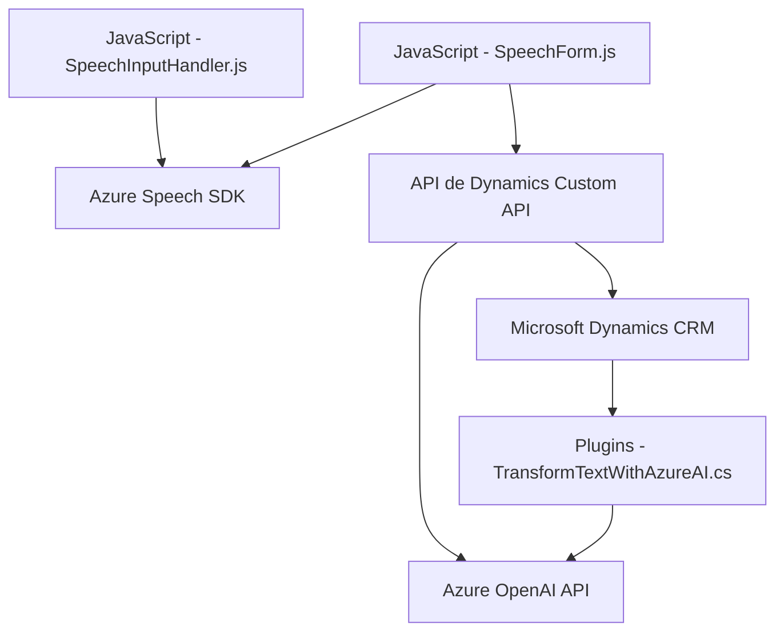

### Breve resumen técnico

El repositorio está diseñado para integrar soluciones de captura, procesamiento y vocalización de datos de formularios mediante Azure Speech SDK, en un entorno de CRM como Dynamics 365. Además, incluye un plugin en C# que aprovecha el Azure OpenAI GPT para transformar texto en formato JSON, proporcionando una estructura basada en reglas y adaptada para sistemas empresariales.

---

### Descripción de arquitectura

La arquitectura del sistema se define como un **monolito modular** orientado al uso de **n-capas** dado que las funciones y clases se agrupan adaptativamente por dominios específicos: manejo del frontend (JS archivos que manipulan funcionalidades de interacción del usuario), backend para procesamiento con IA (API Dynamics/Azure OpenAI), y plugin incorporado en el núcleo del diseño. La capa del frontend actúa como la interfaz directa con el usuario, mientras que la capa del backend permite la interacción con servicios externos.

Componentes específicos:
1. **Frontend**: Scripts JS que se encargan de la interacción con el usuario, procesando datos de formularios y realizando síntesis o transcripción de voz.
2. **Plugin Backend**: Código C# integrado en un CRM (Dynamics 365), configurado dentro de una estrategia SOA (Service-Oriented Architecture).
3. **Integración de API externas**: Se utiliza el SDK del cliente de Azure Speech y la API de Azure OpenAI.

---

### Tecnologías usadas

1. **Frontend:**
   - **JavaScript**: Para implementar la lógica del cliente y gestionar los formularios en la interfaz del CRM.
   - **Azure Speech SDK**: Para la síntesis de voz y transcripción.
   - **Promise-based Asynchronous Programming**: Para operaciones que dependen de servicios externos.
   - **Modularización**: Las funciones están claramente segregadas por un enfoque funcional.

2. **Backend Plugin:**
   - **C# y .NET Framework**: Lingua franca para el desarrollo de plugins en Microsoft Dynamics.
   - **Microsoft Dynamics SDK**: Manipulación de formularios y entidades dentro del entorno de CRM.
   - **Newtonsoft.Json & System.Text.Json**: Para el manejo de JSON (input/output de datos).
   - **Azure OpenAI Service**: Para la transformación de texto en modelos de procesamiento semántico (GPT).
   - **REST API Calls**: Actúa como cliente de servicios externos mediante peticiones HTTP.

### Patrones
1. **Modularidad** para separar funcionalidades independientes como síntesis de voz, transcripciones y lógica de plugins.
2. **Delegación** para descentralizar el procesamiento en terceros (por ejemplo, API externas).
3. **n-capas**: Separación de responsabilidades entre interfaz (JavaScript en frontend) y lógica empresarial (C# en plugin).
4. **Carga Condicional** (Dynamic Dependency Loading): Verificación y carga del Azure Speech SDK solo si es necesario en el entorno de ejecución.

---

### Dependencias o componentes externos

1. **Azure Speech SDK**:
   - Uso de texto a voz, transcripción de voz a texto y carga modal.
   - Necesita credenciales de Azure (Azure Key/Region).

2. **Azure OpenAI API**:
   - Implementación del modelo generativo GPT para la transformación semántica del texto.
   - Requiere API Key y configuración del endpoint.

3. **Dynamics CRM APIs**:
   - API personalizada para acceder a los datos del sistema.
   - Uso de servicios como `Xrm.WebApi.online.execute` y `Xrm.WebApi.retrieveMultipleRecords`.

4. **JavaScript en el frontend**:
   - Entorno browser layers que necesita crear funcionalidades interactuando dinamicamente las referencias SDK.

---

### Diagrama Mermaid  

---

### Conclusión final

Este repositorio representa una solución inteligente de integración entre un cliente web, un entorno CRM complejo (Dynamics 365), y servicios externos proporcionados por Azure (Speech y OpenAI). Su arquitectura modular contribuye a la separación de responsabilidades, mejorando la interpretación y síntesis bidireccional de información textual y de voz. Es un diseño potente y escalable, pero puede mejorar con la optimización de manejo asíncrono en el plugin, mayor dinámica para configurar servicios externos y una gestión más robusta de errores y seguridad en las llamadas API externas.