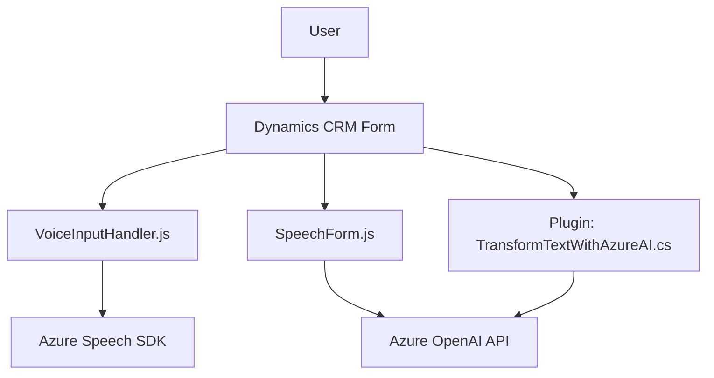

### Breve resumen técnico:
El repositorio presenta dos soluciones principales escritas en JavaScript y C#. Los archivos están destinados a integrar capacidades de reconocimiento de voz, síntesis de texto a voz, transformación de datos mediante IA y manipulación con formularios dinámicos (`Microsoft Dynamics CRM`).

- La solución global parece ser un **microservicio integrado con Dynamics CRM**, concentrado en el procesamiento de voz y texto mediante Azure Speech SDK y Azure OpenAI.
- **Front-end (JavaScript)**: Reconocimiento y síntesis de voz, transcripción de comandos, transformación y actualización de formularios del CRM.
- **Backend (C#)**: Transformación de texto con reglas específicas utilizando el servicio Azure OpenAI.

---

### Descripción de arquitectura:
La arquitectura se puede categorizar como **n-capas con integración de microservicios**. 

1. **Capas identificadas:**
   - **Capa de presentación** (Front-end/JavaScript): Maneja la interacción directa con el usuario final y los datos del formulario (UI dinámica en Dynamics CRM).
   - **Capa lógica** (Front-end/JavaScript): Contiene lógica (procesamiento de datos, síntesis de voz, reconocimiento de voz).
   - **Capa de servicios** (Backend/C#): Implementa reglas de negocio en formato de plugin para Dynamics CRM. Se conecta con Azure OpenAI.

2. **Interacción con servicios externos:**
   - Uso de SDKs (Azure Speech SDK y Dynamics API).
   - Consumo de servicios externos como Azure OpenAI para realizar procesamientos avanzados.

3. **Distribución basada en microservicios:**
   - Backend y front-end están coordinados y pueden funcionar como entidades independientes al estar interconectados mediante APIs y plugins.

---

### Tecnologías usadas:
- **Programación:** JavaScript para cliente y C# para el backend (Dynamics CRM plugin).
- **Servicios en nube:** 
  - Azure Speech SDK: Conversión de texto a voz, reconocimiento de comandos de voz.
  - Azure OpenAI API: Transformación de textos y procesamiento lógico mediante IA.
- **Frameworks y librerías:**
  - `Microsoft Dynamics CRM`: API para manejo de formularios y datos.
  - `Microsoft.Xrm.Sdk`: Para desarrollo de plugins en el backend.
  - `Newtonsoft.Json.Linq`: Manejo dinámico de datos JSON en C#.
- **Patrones:** 
  - Event-driven programming.
  - Modularización funcional.
  - Service Locator (integración con `IServiceProvider`).
  - Adaptador para consumo de SDKs y APIs externas.
  
---

### Diagrama Mermaid

---

### Conclusión final:
El sistema está desarrollado para funcionar como una solución n-capas con integración de microservicios. Se utiliza programación modular y desacoplada para coordinar varias tecnologías de Microsoft como Dynamics CRM, Azure Speech SDK y Azure OpenAI API. La arquitectura muestra un diseño que aprovecha mejor las capacidades de servicios en la nube para ampliar las funcionalidades de los módulos existentes.