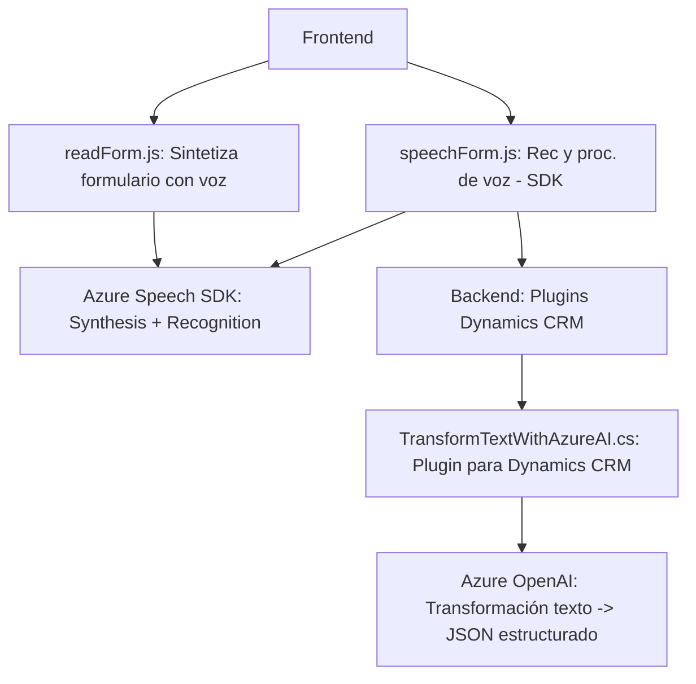

### Breve resumen técnico

La solución presentada es un **multicomponente** orientado principalmente al desarrollo de una **aplicación web**, consistente en varios módulos con diferentes tareas y responsabilidades:
- Una **interfaz frontend** (en JavaScript), encargada de gestionar formularios y funcionalidades de reconocimiento y síntesis de voz mediante **Azure Speech SDK**.
- Un **plugin backend** (en C#) diseñado para integrarse con Microsoft Dynamics CRM/Dataverse y utilizar **Azure OpenAI Service** para realizar transformaciones de texto basadas en reglas específicas.

### Descripción de arquitectura

La arquitectura general evidenciada es híbrida, con características de **arquitectura de n capas**:
1. **Frontend Layer**: Maneja la interacción entre el usuario y la aplicación, utilizando funciones de síntesis y reconocimiento de voz.
2. **Backend Plugin Layer**: Encargada de procesar datos y realizar integraciones con servicios externos basados en inteligencia artificial.
3. **Service Layer**: Consiste en llamadas externas al **Azure Speech SDK** y el **Azure OpenAI Service** para síntesis de voz y transformaciones de texto.

Además, la solución utiliza patrones de modularidad al dividir sus componentes en scripts de frontend y archivos de backend, con una clara separación de preocupaciones en cada capa. Así, se garantiza escalabilidad y mantenibilidad.

Respecto a la arquitectura de los componentes:
- **Frontend:** puede estar parte de una arquitectura cliente-servidor típica o formar parte de una arquitectura web moderna (se considera frontend en arquitectura n capas).
- **Plugin de Dynamics CRM/Dataverse:** sigue el patrón de arquitectura **plugin**, permitiendo interacción con eventos internos del CRM y delegando procesos de negocio a servicios externos mediante el API de OpenAI.

### Tecnologías usadas

1. **Frontend**:
   - Lenguaje: **JavaScript**.
   - SDK utilizado: **Azure Speech SDK** via `https://aka.ms/csspeech/jsbrowserpackageraw`.
   - Modelo de integración: Microsoft Dynamics CRM (`formContext`, `entity.model.data`).

2. **Backend**:
   - Lenguajes: **C#**.
   - Framework: Microsoft Dynamics CRM + Dataverse Plugin Infrastructure.
   - Dependencias: `Microsoft.Xrm.Sdk`, `System.Net.Http`, `Newtonsoft.Json`.
   - Integración API: Llamadas al **Azure OpenAI Service**.

### Posibles dependencias o componentes externos

1. **Azure Speech SDK**:
   - Componente esencial para interacción, reconocimiento y síntesis de voz.
   - Necesita una clave API y especificar la región del servicio configurado.

2. **Azure OpenAI Service**:
   - Usado en el plugin de C#.
   - Requiere clave y una configuración adecuada del servicio en Azure.

3. **Dynamics CRM/Dataverse**:
   - El plugin depende de las APIs y las clases del SDK relacionado.
   - Necesita implementación en la infraestructura de Dynamics para ejecutarse.

4. **Custom APIs (Integración manual)**:
   - El archivo `SpeechRecognition.js` menciona posibles interacciones con una API personalizada en Dynamics CRM.

### Diagrama Mermaid

### Conclusión final

La solución presentada tiene un enfoque basado en una división funcional clara entre frontend (interacción) y backend (procesamiento más complejo). El frontend facilita la interacción del usuario con formularios mediante capacidades de síntesis y reconocimiento de voz, mientras que el backend, integrado dentro de Dynamics CRM como plugins, se enfoca en transformar datos con la utilización de servicios avanzados de Azure OpenAI. Esta arquitectura puede ser considerada **híbrida**, dado que mezcla características propias de una arquitectura de n capas con integración de servicios en la nube y complementos dependientes de Dynamics.