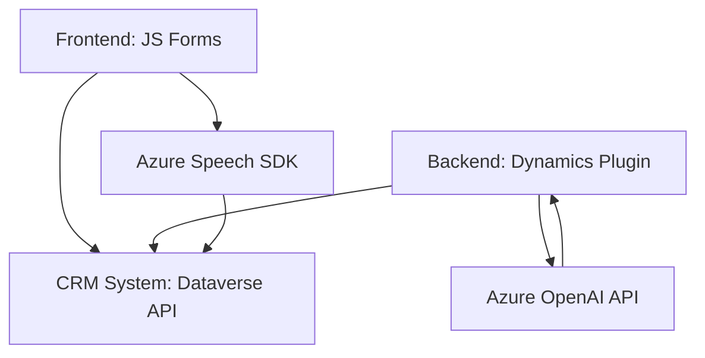

### Breve resumen técnico
Este repositorio contiene una solución altamente integrada que utiliza múltiples tecnologías para la interacción con un sistema CRM (Dynamics 365), síntesis y reconocimiento de voz (Azure Speech SDK), y un servicio de procesamiento de texto (Azure OpenAI API). La estructura de los archivos sugiere una arquitectura orientada a la integración entre distintas capas de software: frontend, backend, y servicios externos.

---

### Descripción de la arquitectura
La solución tiene una arquitectura híbrida de **arquitectura por capas** y **orientada a eventos**. Varios elementos son diseñados modularmente dentro de capas separadas:
1. **Frontend (JavaScript):** Scripts que trabajan con formularios dinámicos y comunicación directa con APIs, siguiendo los patrones de programación modular y de UI binding.
2. **Backend (.NET Plugin):** Funcionalidad desarrollada como parte de un plugin de Dynamics CRM mediante la arquitectura basada en eventos para procesar datos del usuario.
3. **Exposición a APIs externas:** La arquitectura se conecta con el **Azure Speech SDK** y la **Azure OpenAI API** para la síntesis y el procesamiento del lenguaje natural.

---

### Tecnologías usadas
- **Frontend:**
  - **JavaScript (Vanilla):** Desarrollo de scripts para formularios dinámicos y conectividad con SDKs/APIs.
  - **Azure Speech SDK:** Para síntesis de voz y reconocimiento de voz.
  - **Promises y callbacks:** Uso extensivo de programación asíncrona.
  - **Microsoft APIs:** Para conectar con Dataverse y sistemas CRM.
  
- **Backend:**
  - **C# (.NET Framework):** Desarrollo sobre el framework típico de Dynamics para plugins.
  - **Newtonsoft.Json:** Manejo de objetos JSON usados en la comunicación con APIs.
  - **Azure OpenAI API:** Para procesamiento avanzado de texto utilizando GPT-4.

- **Patrones arquitectónicos:**
  - **Lazy Loading:** Carga dinámica de dependencias como SDKs.
  - **Service Provider:** En el plugin de Dynamics para gestión de servicios.
  - **Facade:** Encapsulación del uso externo de OpenAI en una función clara.
  - **Modularidad:** División funcional en responsabilidades independientes.

---

### Dependencias o componentes externos
1. **Azure Speech SDK:** Para síntesis y reconocimiento de voz.
2. **Azure OpenAI:** Procesamiento avanzado del texto.
3. **Microsoft Dynamics Dataverse API:** Interacción directa con el CRM para lectura y escritura de datos.
4. **Newtonsoft.Json:** Manipulación de datos JSON.
5. **Sistema operativo:** Un entorno web compatible con CRM mediante el uso de API.
6. **Dependencias de terceros:** Comunicación sobre red mediante HTTP y Web API.

---

### Diagrama **Mermaid** válido para GitHub

---

### Conclusión final
La solución analizada se centra en una interacción robusta entre un sistema CRM y servicios externos ofrecidos por Azure. Combina:
- **Frontend:** Para recolección de datos en formulario y conectividad con APIs.
- **Backend:** Con procesamiento específico de texto mediante un plugin que sigue el modelo de eventos.
La arquitectura utiliza principios de modularidad, integración remota a SDKs y APIs, y diseño orientado a servicios. Aunque el diseño es eficaz para necesidades específicas de CRM y voz, puede beneficiarse de mejoras en el manejo de errores y estrategias de desacoplamiento.