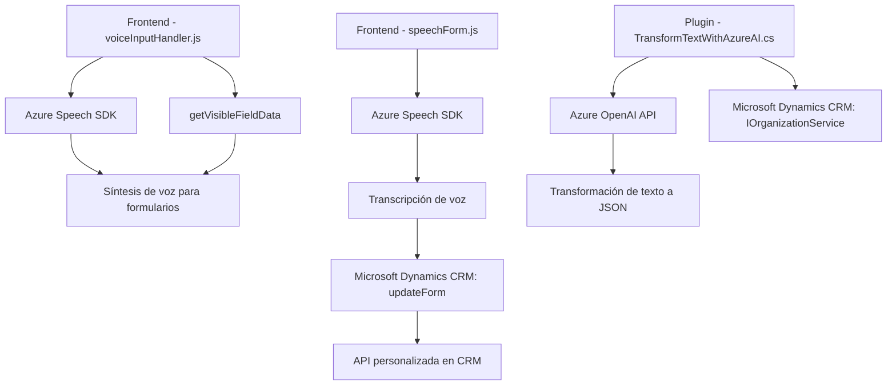

# Breve resumen técnico

El repositorio descrito parece ser una solución basada en **Microsoft Dynamics CRM**, extendida con funcionalidades que integran **Azure Speech SDK** y **Azure OpenAI API**. 

Se incluyen tres archivos principales:
1. **readForm.js**: Extrae datos visibles de un formulario en Dynamics CRM y los convierte en voz usando el Azure Speech SDK.
2. **speechForm.js**: Facilita el reconocimiento de voz ingresada por el usuario, interpretando comandos hablados para actualizar dinámicamente los campos de un formulario en Dynamics CRM.
3. **TransformTextWithAzureAI.cs**: Un plugin de Dynamics CRM que utiliza el servicio Azure OpenAI para convertir texto en estructuras JSON configuradas.

---

# Descripción de arquitectura

La solución tiene una arquitectura de integración extensible que sigue los principios de múltiples capas:
- **Frontend dinámico**: Los archivos JavaScript actúan como controladores que integran servicios externos (Azure Speech SDK, CRM APIs) para extender las capacidades de entrada y salida en un entorno de Dynamics CRM.
- **Plugin aislado**: El archivo `TransformTextWithAzureAI.cs` sigue el patrón propuesto por la arquitectura de plugins de Dynamics CRM, agregando capacidades de procesamiento de IA en el backend.
- **Patrón de integración directa**: Los archivos interactúan directamente con APIs (Azure Speech SDK y Azure OpenAI API), lo que reduce la complejidad pero también puede aumentar el acoplamiento.

---

# Tecnologías usadas

- **JavaScript**:
  - Para frontend interactivo en Dynamics CRM.
  - Complemento con Azure Speech SDK para entrada de voz, síntesis de voz y procesamiento dinámico.
- **Azure Speech SDK**:
  - Reconocimiento de voz.
  - Síntesis de texto a voz.
- **Microsoft Dynamics CRM**:
  - Contexto del formulario (`formContext` y `executionContext`) para gestionar datos y eventos.
- **Azure OpenAI API**:
  - Procesamiento del lenguaje natural para transformar texto a JSON.
- **C#.NET**:
  - Implementación del plugin `TransformTextWithAzureAI`.
  - Uso de `HttpClient` y `System.Text.Json` para las solicitudes API.
- **Microsoft.Xrm.Sdk**:
  - Framework específico de Dynamics CRM para personalización y extensibilidad.

**Patrones de diseño observados:**
1. **Observer**: Se gestiona la interacción dinámica en los formularios mediante controladores como el contexto del formulario (`executionContext`).
2. **Mapper**: Mapeo entre etiquetas visibles y atributos internos del formulario (`getFieldMap`) para interpretar comandos hablados.
3. **Asincronía**: Manejo de promesas con `async/await` tanto en JavaScript como en C# para integración con APIs externas.
4. **Arquitectura basada en plugins**: Extiende funcionalidades específicas del backend en Dynamics CRM.

---

# Diagrama Mermaid válido para GitHub

Este diagrama representa los principales componentes y su interacción:

---

# Conclusión final

Este repositorio describe una solución integrada para extender Microsoft Dynamics CRM con capacidades avanzadas de reconocimiento y síntesis de voz, así como procesamiento de texto mediante IA. La combinación de tecnologías como Azure Speech SDK y Azure OpenAI API muestra una arquitectura híbrida, donde el frontend maneja interacción dinámica y el backend complementa con procesos inteligentes mediante plugins.

### Puntos fuertes:
- Flexibilidad en la entrada/salida de datos utilizando voz e IA.
- Integración directa con servicios externos avanzados como Azure.

### Riesgos/Mejoras:
1. **Hardcoding**: Uso de claves como `azureKey` y `azureRegion` directamente en los archivos JS y C# representa un problema de seguridad. Recomendamos usar un sistema de configuración seguro.
2. **Validación y manejo de errores**: Hay manejo limitado de excepciones en funciones de integración externa.
3. **Desacoplamiento**: Aunque funcional, incrementar el desacoplamiento entre las capas presentes podría hacer más flexible y mantenible la solución.

Esta solución tiene una fuerte orientación hacia la interoperabilidad con Microsoft Dynamics CRM y cubre interacciones del usuario (voz) y procesamiento avanzado (IA).