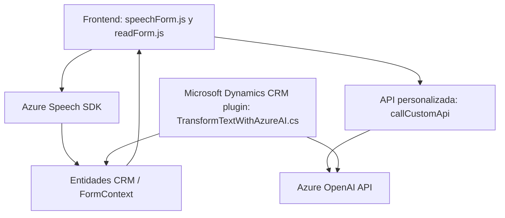

### Breve Resumen Técnico:
El repositorio implementa una solución que combina servicios de **entrada y síntesis de voz**, reconocimiento avanzado de voz, e integración con inteligencia artificial (IA) para el procesamiento de texto. Además, utiliza plugins en Microsoft Dynamics CRM para extender las funcionalidades de interacción con formularios y entidades, empleando SDKs de Azure y APIs personalizadas.

---

### Descripción de Arquitectura:
La arquitectura general del sistema presenta características de una **arquitectura n-capas híbrida**:
1. **Capa de presentación (Frontend):** Maneja la interacción del usuario con funcionalidades de entrada y síntesis de voz.
2. **Capa lógica (Negocio):** Procesa la lógica pesada, incluyendo la interacción con APIs personalizadas y el SDK de Azure Speech.
3. **Capa de acceso a datos:** Representada por los plugins de Dynamics CRM, que interactúan directamente con el modelo de datos del CRM y una API externa basada en Azure OpenAI.

Además, existe un **patrón cliente-servidor**, con integración RESTful para microservicios externos como **Azure OpenAI API** y el Azure Speech SDK.

---

### Tecnologías Usadas:
1. **Frontend/JavaScript:**
   - **Azure Speech SDK:** Para entrada y síntesis de voz.
   - Formularios dinámicos (compatibles con entornos como Dynamics CRM).
   - Uso de APIs de entidad y llamadas remotas (`REST API`).

2. **Microsoft Dynamics CRM:**
   - **Plugins (using IPlugin):** Extensión de entidades y procesamiento interno del CRM.

3. **Azure OpenAI API:** Procesamiento avanzado de texto con modelos GPT.

4. **Framework .NET:** Desarrollo del plugin en C# para integrar servicios externos.

5. **Patrones más destacados:**
   - **Dynamic Script Loading:** Garantiza la disponibilidad de Azure Speech SDK antes de su uso.
   - **Factory Pattern:** Creación lógica de configuraciones (ej. `SpeechSettings`).
   - **Encapsulación Modular:** Métodos encapsulan funcionalidad específica.
   - **Plugin Pattern:** Extensión de eventos dentro de Dynamics CRM.

---

### Diagrama **Mermaid**:

Este diagrama describe la interacción entre los componentes del sistema y sus dependencias.

---

### Conclusión Final:
El repositorio representa una solución integrada para interacción avanzada entre sistemas de entrada/salida de voz y procesamiento automatizado de texto con IA. Utiliza Microsoft Dynamics CRM como núcleo de gestión empresarial, complementado por Azure APIs para funcionalidades avanzadas. Proporciona un ejemplo claro de arquitectura híbrida entre n-capas y microservicios externos, con alta modularidad y escalabilidad. Ideal para entornos empresariales que busquen automatización e integración avanzada de IA.