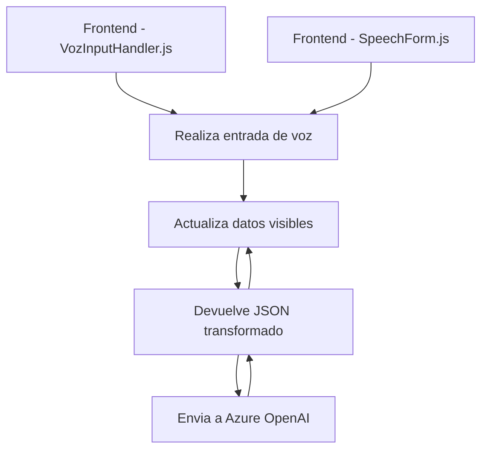

# Breve resumen técnico

Este repositorio implementa una solución que utiliza **Azure Speech SDK** y **Microsoft Dynamics 365 CRM** para trabajar con formularios en tiempo real. Las funcionalidades incluyen la entrada de voz (captura y procesamiento), síntesis de texto a voz, y transformación avanzada de texto mediante Azure OpenAI, todo integrado dentro del entorno Dynamics 365. Es una solución diseñada para facilitar la interacción con formularios mediante voz y utilizar inteligencia artificial para dinamizar flujos de datos en una aplicación empresarial.

---

# Descripción de arquitectura

La arquitectura de este proyecto sigue una **estructura modular** con una orientación hacia **n capas**. Se organiza en:
1. **Frontend**: Encargado de la captura y síntesis de voz utilizando Azure Speech SDK.
   - Funciones organizadas para entrada y salida de voz, procesamiento de datos del formulario, y conectividad con APIs externas.
2. **API personalizada**: Dinámica dentro de Dynamics CRM que transforma texto utilizando servicios externos de IA.
3. **Plugin en Dynamics CRM**: Implementado en .NET para interactuar con datos del sistema y realizar transformaciones avanzadas con Azure OpenAI.

El componente principal es una **arquitectura orientada a servicios** que utiliza múltiples APIs, SDKs externos, y plugins de Dynamics 365 con diseño **event-driven**. Esto asegura una interacción fluida y escalabilidad al integrar sistemas en la nube.

---

# Tecnologías, frameworks y patrones usados

1. **Tecnologías:**
   - **Azure Speech SDK**: Captura voz, convierte texto a voz, y realiza reconocimiento para extraer datos de entrada.
   - **Microsoft Dynamics 365 CRM**: Entorno empresarial para manejar datos de formularios y ejecutar lógica personalizada.
   - **Azure OpenAI Service**: Transformación avanzada de texto utilizando modelos GPT para generación de respuestas.

2. **Frameworks:**
   - **Microsoft.Xrm.Sdk**: Interacción con entidades CRM dentro de Dynamics.
   - **System.Net.Http**: Comunicación HTTP necesaria para consumir recursos de Azure OpenAI.

3. **Patrones arquitectónicos:**
   - **Plugin Architecture (Dynamics 365)**: Definición de eventos y lógica personalizada dentro del CRM.
   - **Service-Oriented Architecture (SOA)**: Integración con servicios externos como Azure Speech SDK y Azure OpenAI.
   - **DTO (Data Transfer Object)**: Usado para procesar datos en transcripciones y APIs.
   - **Event-driven**: Los flujos son disparados por eventos como la interacción del usuario.

---

# Possible dependencies or external components

1. **Azure Speech SDK**:
   - Configuración de claves y región para usar reconocimiento/síntesis de voz.
2. **Azure OpenAI Service**:
   - Dependencia crítica para procesamiento de texto, configurada en el plugin.
3. **Microsoft Dynamics 365 platform**:
   - Entidad principal para manejar formularios y ejecutar la lógica.
4. **Microsoft.Xrm.Sdk libraries**:
   - Necesarias para implementar plugins dentro de Dynamics.

---

# Diagrama Mermaid válido para GitHub

---

# Conclusión final

Este repositorio combina tecnologías de servicios en la nube y soluciones empresariales para implementar una solución completa de interacción mediante voz e inteligencia artificial. Su arquitectura modular facilita la escalabilidad y el mantenimiento, mientras que su enfoque en integración con Microsoft Dynamics 365 asegura una experiencia de usuario dinámica en el ámbito empresarial.

Tiene un diseño sólido orientado a servicios, con fuerte dependencia en SDKs externos como **Azure Speech SDK** y **Azure OpenAI Service**, que proveen procesamiento de voz y transformación de texto respectivamente.