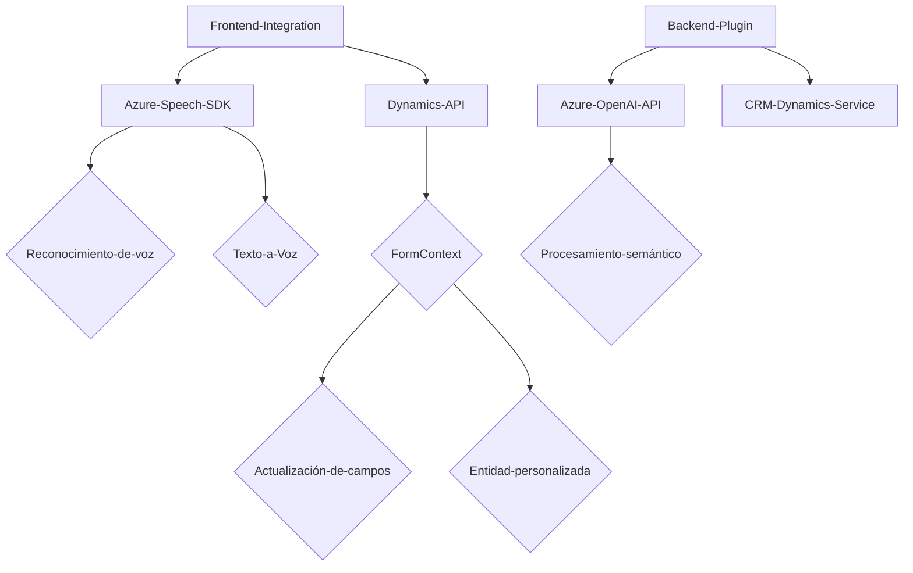

### Resumen técnico

Este repositorio está orientado a integrar capacidades avanzadas de procesamiento de voz y texto utilizando servicios de Azure en aplicaciones front-end y Microsoft Dynamics CRM. Las soluciones implementan la síntesis de voz, reconocimiento de voz, procesamiento semántico y generación de contenido estructurado en JSON con inteligencia artificial. Los archivos sugieren la coexistencia de más componentes dentro de la arquitectura global.

---

### Descripción de arquitectura

1. **Tipo de solución:**  
   La solución parece ser una integración entre un **frontend** (en JavaScript) y un **CRM backend plugin** (en C#), respaldados por servicios de inteligencia artificial basados en **Azure Speech SDK** y **Azure OpenAI API**.

2. **Arquitectura utilizada:**  
   - **Híbrida:** Brinda interacción efectiva entre el frontend del cliente (para captura de voz y mapeo de datos) y los plugins backend del CRM, con comunicación mediante APIs como Azure Speech y OpenAI.  
   - Mezcla de modularidad (en el frontend) con la arquitectura de **plugins de Microsoft Dynamics CRM**, que es extensible y compatible con eventos definidos por el entorno del CRM.

---

### Tecnologías usadas

1. **Frontend:**  
   - **JavaScript** como lenguaje principal.  
   - **Azure Speech SDK** para reconocimiento y síntesis de voz.  
   - **HTML DOM** para gestión dinámica de scripts.  
   - Integración de lógica con **Xrm.WebApi** para trabajar con entidades del CRM.

2. **Backend:**  
   - **C#** como lenguaje principal.  
   - **Plugin Architecture** de Microsoft Dynamics CRM.  
   - **Azure OpenAI API** para procesamiento semántico.  
   - **Newtonsoft.Json** para procesamiento de datos JSON.  
   - **System.Net.Http** para consumir servicios externos.  

---

### Dependencias o componentes externos  
1. **Azure Speech SDK:** Para reconocimiento de voz, síntesis de texto a voz y análisis de audio.  
2. **Azure OpenAI API:** Procesamiento semántico avanzado con IA.  
3. **Dynamics 365 Web API:** Para integración de datos del formulario y mapeo de datos en el backend.  
4. **Newtonsoft.Json:** Para interpretar y manejar datos JSON en el backend.  
5. **HttpClient:** Para gestionar solicitudes HTTP hacia servicios externos (e.g., OpenAI).  

---

### Diagrama Mermaid

---

### Conclusión final

Este repositorio representa una integración que aprovecha tecnologías modernas como Azure AI (Speech y OpenAI) para enriquecer la experiencia de usuario en un sistema CRM. Implementa funciones avanzadas como reconocimiento de voz para facilitar el ingreso de información y procesamiento semántico mediante IA para estructurar contenido. La arquitectura se basa en una solución híbrida, modular en el frontend y orientada a servicios en el backend. Si bien se apoya en dependencias externas, está bien estructurada para garantizar una separación de responsabilidades y facilitar mantenimiento y escalabilidad. Esto es especialmente útil en escenarios empresariales que buscan automatizar procesos y mejorar la accesibilidad.