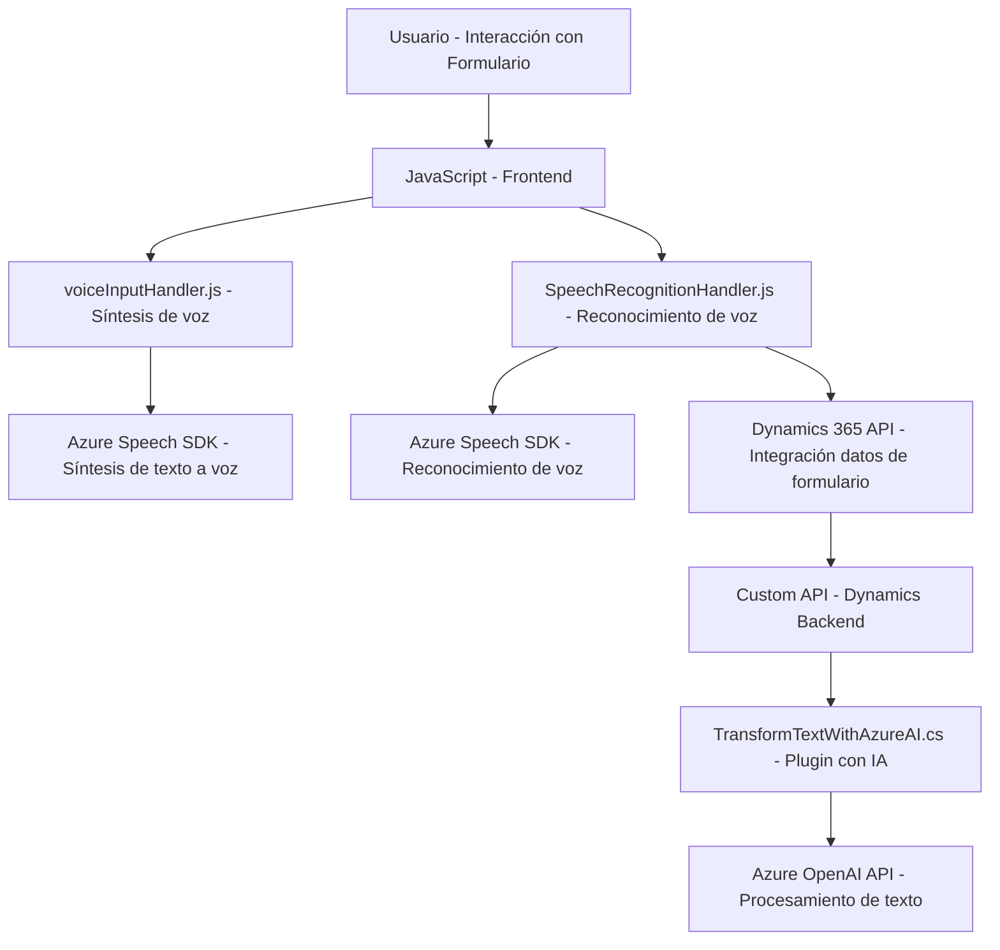

### Breve resumen técnico
Este repositorio contiene componentes que integran la funcionalidad de **síntesis de voz**, **reconocimiento de voz** y **procesamiento de texto mediante IA** con tecnologías como **Azure Speech SDK** y **Azure OpenAI**, junto con integraciones específicas para **Microsoft Dynamics 365**. Posee archivos de frontend (`JavaScript`) para el manejo de formularios y plugins backend (`C#`) para realizar transformaciones con IA.

---

### Descripción de arquitectura
La arquitectura observada es un híbrido entre **n capas** y componentes enfocados. Los archivos JavaScript, alojados en la carpeta **FRONTEND**, representan una capa de presentación orientada al usuario para habilitar la interacción con reconocimiento y síntesis de voz mediante Azure Speech SDK. Por otro lado, los archivos C# en **Plugins** actúan como extensiones del backend de Dynamics 365, siguiendo el diseño específico de **plugins en CRM**.

**Elementos de la arquitectura:**
1. **Frontend (UX/Services)**: Manejo de la interfaz de usuario y traducción de voz/texto con interacción directa a APIs externas.
2. **Backend Plugins**: Extensiones del núcleo de Dynamics 365, con lógica para transformar texto mediante **Microsoft AI Platforms** o interactuar con el modelo de datos de CRM.

El conjunto aborda una arquitectura **orientada a servicios**: cada componente tiene una función única y bien definida, lo que sugiere escalabilidad y modularidad.

---

### Tecnologías usadas
1. **Frontend:**
   - **JavaScript/ES6**: Lenguaje base para los archivos de frontend.
   - **Azure Speech SDK**: Para síntesis y reconocimiento de voz.
   - **Dynamics 365 SDK (Xrm.WebApi)**: Interacción con datos del sistema CRM.

2. **Backend:**
   - **C#/.NET Framework**: Para crear plugins personalizados en Dynamics 365.
   - **Azure OpenAI API**: Usada en el plugin para transformar texto con IA.
   - **Newtonsoft.Json / System.Text.Json**: Manejo de estructuras JSON para solicitudes HTTP.

3. **Servicios externos:**
   - **Azure Speech Service (SDK)**: Reconocimiento y síntesis de voz.
   - **Azure OpenAI APIs**: Procesamiento de texto avanzado mediante IA.
   - **HTTP/RPC layers**: Para comunicación entre las capas e interacción con APIs externas.

---

### Diagrama Mermaid válido para GitHub Markdown

---

### Conclusión final
El repositorio representa una solución de integración avanzada que utiliza servicios en la nube para mejorar la accesibilidad y automatización en formularios de Dynamics 365. Los módulos frontend proporcionan experiencia de usuario mediante síntesis y reconocimiento de voz, mientras que los plugins backend extienden la funcionalidad del sistema CRM utilizando inteligencia artificial (IA). Aunque la arquitectura está orientada a servicios, es parcialmente centralizada debido al uso conjunto de APIs de Dynamics y Azure, combinando capacidades de **n capas** con componentes dedicados.

El diseño es técnicamente sólido, aunque dependerá de configuraciones específicas de los servicios externos (Azure y Dynamics). Esto garantiza modularidad, pero introduce desafíos asociados con la gestión de dependencias remotas.