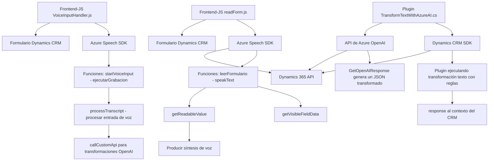

### **Análisis técnico del repositorio**

#### **1. Breve resumen técnico**
El repositorio implementa una solución para aplicaciones integradas con Azure Speech SDK y Dynamics CRM, cuya funcionalidad principal incluye:
- Procesamiento de entrada y salida de voz para formularios.
- Transcripción de voz, transformación de texto y síntesis de voz.
- Utilización de servicios como Azure Speech SDK y Azure OpenAI para potenciar la experiencia de usuario.
- Aplicación de datos al formulario basado en la entrada de voz o texto procesado en ambientes Dynamics 365.

#### **2. Tipo de solución**
La solución se centra en tres componentes principales:
1. **Frontend**: Scripts que integran funcionalidades de voz con formularios visibles (JavaScript).
2. **Plugins**: Extensiones del backend de Dynamics CRM basadas en C# para transformación de texto con APIs externas.
3. **Integración con APIs**: Uso extensivo de Azure Speech SDK y Azure OpenAI para funcionalidades de reconocimiento, síntesis y transformación de texto.

#### **3. Tecnologías y frameworks usados**
- **Frontend**:
  - JavaScript y librerías estándar para manipulación DOM y formularios.
  - Azure Speech Services SDK para entrada y salida de voz.
- **Backend (Plugins)**:
  - C# (.NET Framework)
  - Dynamics CRM SDK, incluyendo API de consultas y manejo de operaciones en entidades.
  - Azure OpenAI API para procesamiento y transformación de texto.

#### **4. Arquitectura**
El diseño arquitectural es modular y se encuentra dividido en las siguientes partes:
- **Frontend**: Diseño basado en capas que separa lógica de captura de voz, procesamiento y síntesis de voz.
- **Plugins**: Plugin específico para Dynamics CRM construido con arquitectura basada en el patrón de extensibilidad (u orientación a eventos) usando la interfaz `IPlugin`.
- **Integración con APIs externas**: Representa un estilo de arquitectura orientada a servicios (SOA), donde las principales funcionalidades dependen de SDKs y APIs como Azure Speech Services y Azure OpenAI.

La arquitectura general puede considerarse mixta:
- **Frontend** sigue un modelo de capas.
- **Backend** se orienta hacia plugin/eventos como parte de Dynamics CRM.
- **Desacoplamiento por servicios externos**: Utilizan SDKs de Azure para extender funcionalidades, sin concentrar lógica compleja en los componentes propios.

#### **5. Dependencias externas identificadas**
- **Azure Speech SDK**: Para reconocimiento, síntesis y transcripción de voz.
- **Azure OpenAI API**: Para transformación avanzada y enriquecida de texto.
- **Dynamics CRM SDK/API**: Para manipulación de formularios y entidades del sistema CRM.
- **Bibliotecas estándar .NET**:
  - `System.Net.Http`, `System.Text.Json`, `System.Linq`, etc., usadas en los plugins.
- **Newtonsoft.Json**: Para manejo de objetos JSON en procesamiento con OpenAI.

---

#### **6. Diagrama Mermaid**

---

#### **7. Conclusión final**
El repositorio presenta una solución integrada para mejorar la experiencia de usuario en Dynamics CRM mediante interacción basada en voz y transformación de texto. Su diseño refleja una arquitectura modular que encapsula múltiples capas:
1. **Frontend**: Permite manipular formularios con funcionalidades de síntesis y entrada de voz.
2. **Backend (Plugins)**: Extiende la lógica de negocio en el CRM aprovechando APIs enriquecidas como Azure OpenAI para transformar datos.
3. **Servicios externos**: Desacopla la complejidad de tareas avanzadas delegándolas hacia Azure Speech Services y OpenAI.

La solución es limpia, extensible y alineada al manejo de eventos y servicios externos, propia de integraciones en sistemas empresariales como Dynamics CRM. Se puede considerar una arquitectura adaptativa que adopta patrones de modularidad, servicios, y carga dinámica para escalar sus funcionalidades fácilmente conforme la evolución del sistema.

