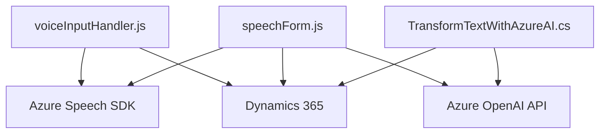

### Breve resumen técnico

Este repositorio representa componentes relacionados con la integración de formulación y síntesis de voz, generación de datos y un plugin de Dynamics CRM que usa Azure OpenAI API. Los archivos están orientados hacia la interacción con formularios de Dynamics 365 y la transformación de datos a través de servicios Azure Speech SDK y Azure OpenAI, creando una funcionalidad completa para capturar voz, transformarla en datos, y operar con dichos datos en un contexto CRM.

---

### Descripción de arquitectura

La solución tiene una arquitectura **híbrida de capas y servicios desacoplados**. El frontend (JavaScript) sigue un patrón de diseño modular orientado a servicios. Divide responsabilidades tales como:
- Captura de datos de presentación (del formulario).
- Conversión de voz a texto usando Azure Speech.
- Simbiosis entre el frontend y la API de Dynamics 365.

Por otro lado, el plugin de CRM usa la **arquitectura por plugins de Dynamics 365**. Este define una lógica específica implantada en el contexto del CRM mediante la interfaz `IPlugin`, permitiendo una transformación avanzada por medio de servicios externos como Azure OpenAI API.

Las dos piezas trabajan juntas para admitir:
1. Captura de voz, texto y valores numéricos para transformar las entradas del usuario.
2. Proceso dinámico/realtimista en el lado cliente (JavaScript).
3. Integración y extensibilidad a nivel de backend en Dynamics 365 (C#, Plugin SDK).

En general, la arquitectura se asemeja a un patrón de n capas donde el frontend interactúa directamente con APIs (Azure y Dynamics) y el backend centraliza la gestión avanzada de datos mediante lógica de plugin.

---

### Tecnologías usadas

1. **Frontend (JavaScript):**
   - Framework: Como base se utiliza código de JavaScript plano. 
   - **Azure Speech SDK**: Para reconocimiento y síntesis de voz.
   - Lógica basada en la interacción con formularios de **Dynamics 365**.

2. **Plugin (C#):**
   - Lenguaje: C#.
   - **Dynamics 365 SDK**: Para interacción directa con la plataforma CRM.
   - **Azure OpenAI API**: Para transformación textual avanzada usando IA.
   - **Newtonsoft.Json** y **System.Text.Json** para manipulación de JSON.
   - **System.Net.Http** para solicitudes HTTP.

3. **Patrones aplicados:**
   - **Callback Design**: Cargadores dinámicos y procesamiento basado en eventos asincrónicos (JavaScript).
   - **Service Layer**: Encapsulación modular por funciones para cada tarea específica.
   - **Dependency Injection (DI)**: Uso del servicio de inyección de dependencias en el plugin de Dynamics CRM.
   - **Plugin-based Architecture**: Para extensibilidad del backend de Dynamics CRM.
   - **API Integration Pattern**: Consumo de servicios externos como Azure Speech y OpenAI desde el frontend y backend.

---

### Dependencias o componentes externos

- **Azure Cloud Services**:
  - **Azure Speech SDK**: Generación de audio desde texto y reconocimiento de voz.
  - **Azure OpenAI API**: Capacidades de generación y transformación de texto.
  
- **Dynamics 365 CRM**:
  - Formularios en Dynamics 365.
  - Manejador de Plugins (Componentes extendibles).

---

### Diagrama **Mermaid** compatible con **GitHub Markdown**

---

### Conclusión final

La solución representa un sistema híbrido con un frontend basado en JavaScript que interactúa integralmente con formularios de Dynamics 365 y utiliza el SDK de Azure Speech para implementar reconocimiento y síntesis de voz. En paralelo, el backend, desarrollado en C#, amplía la funcionalidad mediante un plugin `IPlugin` que interactúa directamente con Dynamics 365 para transformar datos con Azure OpenAI.

La arquitectura muestra características tanto de **n capas** como de **servicios desacoplados**, ya que los distintos componentes tienen responsabilidades bien definidas y están orientados a interactuar con APIs externas. Esta solución aprovecha servicios de nube avanzada para crear una experiencia enriquecida de interacción por voz y procesamiento automatizado de textos con IA.