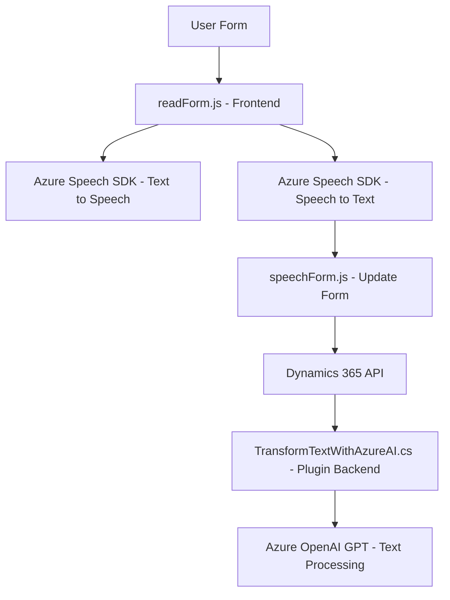

### Breve Resumen Técnico
El repositorio parece centrarse en aplicaciones basadas en interacciones de voz y procesamiento de texto, utilizando infraestructura de Microsoft Dynamics 365 y Azure, además de integrar inteligencia artificial y configuración dinámica. Los archivos analizados sugieren que se trata de una solución híbrida, compuesta de un frontend interactivo y componentes backend para la integración con APIs externas como Azure Speech y Azure OpenAI.

---

### Descripción de Arquitectura
La arquitectura es **modular** y **híbrida**, basada en componentes que interactúan mediante diferentes capas:
1. **Capa de Presentación (Frontend)**:
   - Archivos JavaScript (e.g., `readForm.js`, `speechForm.js`) que manejan interacciones de usuarios dentro de formularios web en Dynamics 365.
   - Procesamiento de datos de voz y asignación dinámica en la interfaz.
2. **Capa de Integración con APIs externas**:
   - Uso de Azure Speech (para síntesis y reconocimiento de voz).
   - Conexión directa con servicios de Inteligencia Artificial como Azure OpenAI en el backend.
3. **Capa de Servicios Backend**:
   - Plugins específicos (`TransformTextWithAzureAI.cs`) implementados en Dynamics 365 para extender la funcionalidad del CRM.
   - Transformación de datos en el servidor utilizando la infraestructura de IA.

La arquitectura tiene influencias de patrones como **n capas**, delegando responsabilidades específicas:
- Presentación.
- Business Logic (mediante plugins, procesamiento en backend).
- Comunicación con servicios externos (Azure SDKs, OpenAI).

---

### Tecnologías Usadas
- **Frontend**:
  - JavaScript: Interacción directa con el SDK de speech.
  - Dynamics 365 Client API: Extensión del modelo basado en formularios.
  - Promesas y Async/Await para manejo de asíncronos.
- **Backend**:
  - .NET Framework para implementación de plugins.
  - Librerías estándar de Dynamics (`Microsoft.Xrm.Sdk`), JSON (`Newtonsoft.Json` y `System.Text.Json`) y solicitudes HTTP (`System.Net.Http`).
- **Servicios Externos**:
  - Azure Speech SDK: Integración para síntesis de voz y reconocimiento de audio.
  - Azure OpenAI GPT: Procesamiento avanzado basado en IA.
- **Patrones de Diseño**:
  - Delegación de tareas por funciones (modularidad).
  - Client-API: Uso de Azure SDK como intermediario hacia servicios externos.
  - Plugin Design Pattern: En backend para Dynamics CRM (transformación textual).

---

### Diagrama Mermaid
A continuación, se genera un diagrama que describe los componentes clave y su interacción:

---

### Conclusión Final
Este repositorio implementa una solución híbrida que combina **frontend interactivo**, **capas de negocio mediante plugins**, y **servicios externos basados en IA**. Su propósito principal es habilitar interacciones naturales mediante voz (síntesis y reconocimiento) dentro de Dynamics 365, optimizando el procesamiento de datos con Azure AI. La arquitectura modular y la conexión con servicios de Microsoft la hacen escalable y adaptable. Sin embargo, podría beneficiarse de una capa adicional de pruebas y validaciones en el frontend para robustez operativa.