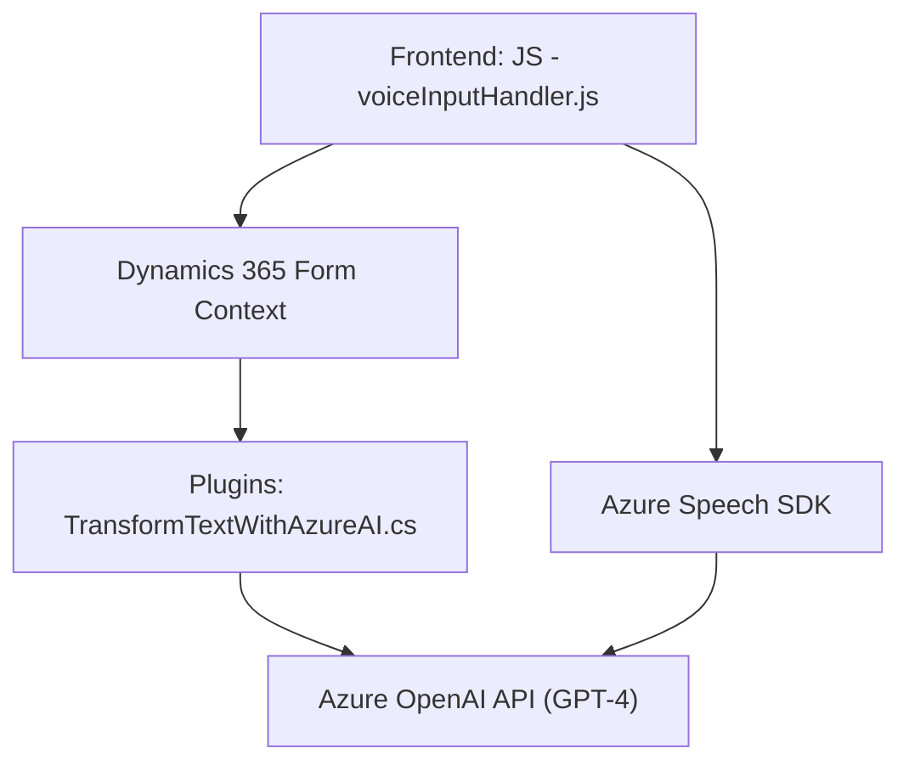

### Breve Resumen Técnico:
El repositorio contiene tres componentes principales:  
1. **Frontend JavaScript:** Maneja interacciones con el usuario relacionadas con entrada de voz y procesamiento para lectura de formularios mediante Azure Speech SDK.  
2. **Plugins CRM:** Un plugin escrito en C# integrado en Microsoft Dynamics 365 que utiliza Azure OpenAI API (GPT-4) para transformar texto basado en reglas.  
3. **Arquitectura Modular y Extensibilidad:** Cada archivo realiza una tarea específica y puede interactuar con servicios externos como Azure Speech y Azure OpenAI APIs.

---

### Descripción de Arquitectura:
La solución tiene una arquitectura **modular basada en n capas**, con una separación clara de funcionalidades:  
1. **Capa frontend:** Programada en JavaScript, implementa entrada de voz y reconocimiento de datos visuales de formularios.  
2. **Capa back-end:** Representada por un plugin de Dynamics 365 ejecutado dentro del contexto CRM, gestionando las integraciones con Azure AI.  
3. **Integración con servicios externos:** Azure Speech SDK y Azure OpenAI API potencian funcionalidades clave, convirtiendo la arquitectura en una implementación **orientada a servicios (SOA)**.  
Las distintas capas, aunque independientes, se comunican para ofrecer una solución unificada.

#### Detalles:
- El frontend utiliza patrones de **modularidad** y **responsabilidad única**.
- El plugin CRM sigue un patrón de **plugin architecture**, característico de Dynamics 365.
- La solución general está diseñada para facilitar extensibilidad mediante la inclusión de la interacción con servicios distribuidos (Azure).

---

### Tecnologías Usadas:
1. **Frontend:**
   - Lenguaje: JavaScript
   - SDK: Azure Speech SDK
   - Herramientas: Xrm Framework para manipulación de formularios CRM
   - Patrones: Modularidad y SOA en el frontend

2. **Back-end Plugin:**
   - Lenguaje: C#
   - Frameworks:
     - Dynamics CRM SDK (Microsoft.Xrm.Sdk)
     - Sistema Net.Http para llamadas a APIs
   - Servicio Externo: Azure OpenAI GPT-4
   - JSON Parsing: Newtonsoft.Json y System.Text.Json

---

### Dependencias y Componentes Externos:
1. **Azure Speech SDK:** Manejo de síntesis de voz e interacción desde formularios a datos hablados.  
   - Carga dinámica del SDK desde un URL proporcionado por Azure.  
2. **Azure OpenAI API (GPT-4):** Transforma texto CRM según reglas avanzadas.  
3. **Microsoft Dynamics SDK:** Base para el plugin de integración CRM usado en la capa back-end.  
4. **Frameworks estándar:** Newtonsoft.Json para trabajar con JSON en el plugin.

---

### Diagrama Mermaid Válido para GitHub:

---

### Conclusión Final:
Esta solución representa una arquitectura distribuida centrada en n capas donde el frontend y la capa de plugins que operan sobre Dynamics 365 están desacoplados y orquestados mediante servicios de Azure. La integración con Azure Speech SDK y Azure OpenAI API añade una capa significativa de funcionalidad avanzada. Es extensible, modular y alineada con principios de diseño moderno como SOA y responsabilidad única. Sin embargo, la inclusión de claves sensibles en el código puede ser un riesgo; el uso de configuraciones seguras como variables de entorno es altamente recomendado.