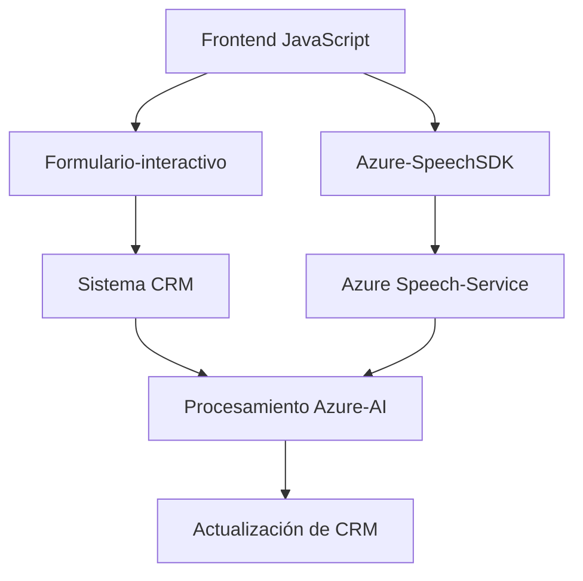
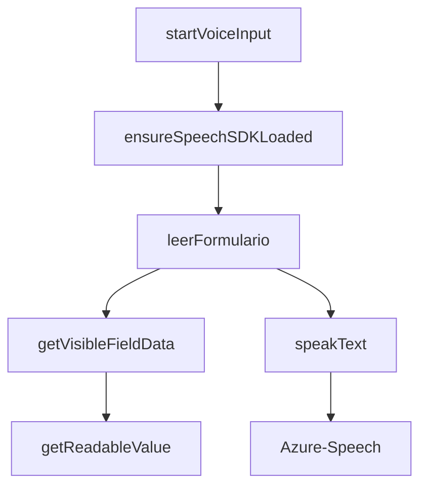
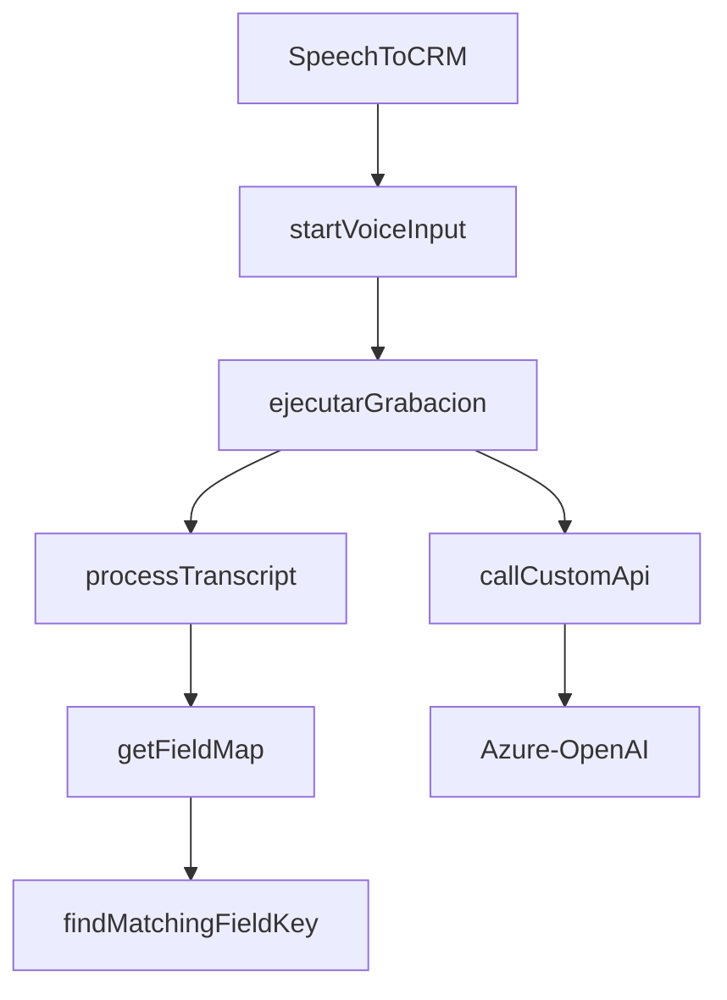
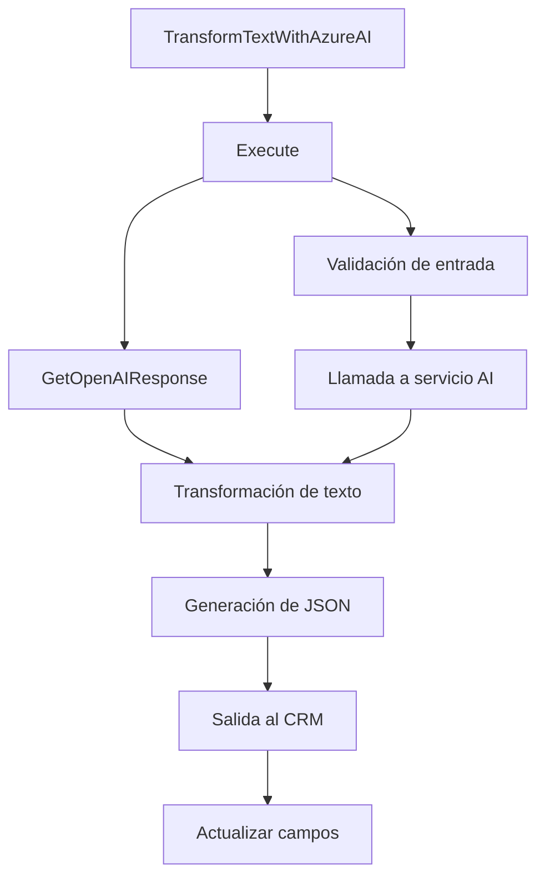

### Resumen Técnico
El repositorio analiza cómo diferentes componentes interactúan con el Azure Speech SDK y Azure OpenAI para implementar funcionalidades en un sistema CRM (Microsoft Dynamics). Incluye archivos para una solución de frontend y un plugin desarrollado para integrarse directamente con Dynamics CRM. Los conceptos en el código muestran integración de reconocimiento de voz, síntesis de texto hablado, transformación de datos con AI, y manejo de formularios.

---

### Descripción de la Arquitectura
- **Tipo de solución:** Aproximadamente **orientado a servicios**, aunque todo está centrado en funcionalidad y dependencias específicas del ecosistema de Microsoft Dynamics CRM. Realiza un procesamiento modular en diferentes capas.
- La arquitectura general parece segmentarse en **tres áreas principales**:
  1. **Frontend:** Procesamiento en JavaScript para la parte cliente (Sistemas que interactúan con formularios).
  2. **Backend:** Implementación específica como plugin de Dynamics CRM.
  3. **Dependencias externas (Azure Speech SDK y Azure OpenAI)** utilizadas como pasarelas para reconocimiento de voz y transformaciones.
- **Patrones utilizados:** 
  - **Modular:** El código se organiza en funciones reutilizables y específicas de un propósito único.
  - **Callback Pattern:** Usado para manejar la asincronía.
  - **Facade:** Simplificación de operaciones complejas (Azure Speech SDK).
  - **Mapping and Transformation:** Interacción dinámica mediante mapeo y normalización de datos del frontend al sistema CRM.

---

### Tecnologías Usadas
1. **JavaScript (Node.js)**: A través de funciones en el frontend se interactúa con formularios y el SDK de Azure Speech.
2. **Azure Speech SDK y OpenAI Services**:
   - Reconocimiento de voz, conversión de texto a voz, y síntesis de habla.
   - API para transformar texto, utilizando IA alojada en Azure.
3. **Microsoft Dynamics CRM SDK (C#)**:
   - Interacción con entidades y flujos de CRM usando plugins integrados.
4. **Newtonsoft.Json:** Librería para serialización/deserialización de JSON en C#.
5. **System.Net.Http:** Para realizar solicitudes RESTful a la API de Azure.

---

### Diagramas **Mermaid**

#### Arquitectura Principal del Sistema

---

#### Flujo de procesamiento de voz y datos (Frontend)

---

#### Flujo del reconocimiento de voz en CRM

---

#### Flujo del Plugin TransformTextWithAzureAI (backend)

---

### Conclusión Final
La solución implementada en el repositorio utiliza una arquitectura modular y orientada a servicios, sustentada en el uso de tools avanzados como Azure Speech SDK y OpenAI, además de estar diseñada para integrarse específicamente con Microsoft Dynamics CRM. Esto facilita una automatización avanzada de tareas de reconocimiento de voz, transformación de datos mediante IA, y actualización dinámica de campos en formularios de CRM.

Aunque el código es funcionalmente modular, ciertamente podría evolucionar hacia una arquitectura más segmentada (por ejemplo, **hexagonal** o **microservicios**) si se necesitará mayor escalabilidad y desacoplamiento. Sin embargo, su diseño actual cumple con los estándares para integración dinámica en ecosistemas CRM.