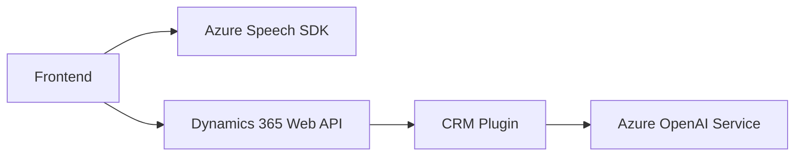

### Breve resumen técnico
Este repositorio contiene tres archivos organizados en distintas carpetas, donde cada archivo juega un rol específico:
- **Frontend**: Integra funcionalidades de entrada y salida de voz con Azure Speech SDK y APIs de Dynamics 365.
- **Plugin CRM**: Implementación de un plugin para Dynamics CRM encargado de transformar texto usando Azure OpenAI.

### Descripción de arquitectura
El sistema completo combina una arquitectura de cliente-servidor para el frontend junto con plugin-based en Dynamics CRM. Utiliza:
- **Frontend**: Modularización con integración a APIs externas (Azure Speech SDK y Dynamics 365).
- **Backend**: Plugin en Dynamics CRM que adopta principios de microservicios para delegar la transformación de datos (a través de Azure OpenAI).

**Archivo Frontend:**
- Operación CRUD de datos de formularios mediante reconocimiento de voz y síntesis en el cliente.
- Interacción directa con servicios externos (Azure Speech SDK y Dynamics 365 frontend APIs).

**Archivo Plugin Backend:**
- Diseño basado en eventos del CRM que ejecuta lógica de transformación de texto delegada a servicios externos (Azure OpenAI).

### Tecnologías usadas
- **Frontend:**
  - JavaScript.
  - Azure Speech SDK.
  - APIs del navegador y Dynamics 365 Web API.
  - Patrón modular para las funciones.
- **Backend (Plugin):**
  - Azure OpenAI API.
  - .NET Framework y C#.
  - Microsoft Dynamics CRM SDK.
  - Librerías de manejo de JSON (`Newtonsoft.Json.Linq` y `System.Text.Json`).

### Dependencias o componentes externos presentes
1. **Azure Speech SDK**: Utilizado para reconocimiento y síntesis de voz en el cliente (frontend).
2. **Dynamics API**: Exposición y manipulación de datos del CRM mediante APIs como `Xrm.WebApi`.
3. **Azure OpenAI Service**: Integración directa en el plugin para procesamiento de IA.
4. **Framework C#/.NET**: Librerías básicas para implementación del plugin en Dynamics CRM.
5. **HTTP requests**: Consumo de servicios externos mediante solicitudes HTTP.

### Diagrama Mermaid

### Conclusión final
Esta solución muestra una integración bien estructurada entre frontend y backend. En el cliente, funciones modulares manejan la entrada y salida de voz con el apoyo del Azure Speech SDK y las APIs del navegador. En el backend, el sistema se apoya en plugins de Dynamics CRM para permitir interacciones con IA, delegando la lógica más compleja al servicio Azure OpenAI. La arquitectura implementada favorece la escalabilidad y externalización de lógica crítica mediante servicios de terceros, pero puede mejorarse en su seguridad y configuración, especialmente en la gestión de credenciales de la API y potencial optimización de flujo.