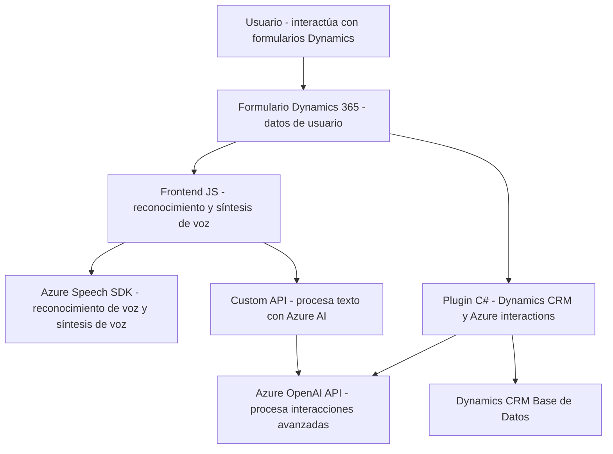

### Breve resumen técnico
El repositorio contiene código relacionado con la integración de una solución para formularios interactivos y accesibles mediante reconocimiento de voz y síntesis de texto hablado, con foco en Microsoft Dynamics 365 y Microsoft Azure. El código está dividido en frontend (JavaScript scripts) y backend (Dynamics CRM plugin en C#).

---

### Descripción de arquitectura
1. **Frontend**: 
   - Utiliza tecnologías como Azure Speech SDK para las capacidades de reconocimiento de voz y síntesis de texto hablado. Los scripts están estructurados como módulos autónomos.
   - Los scripts interactúan directamente con Dynamics forms (modelo de datos de Dynamics CRM) y una API personalizada para transformar transcripciones de voz usando inteligencia artificial (Azure AI).

2. **Backend**:
   - Implementa un plugin en Dynamics CRM desarrollado en .NET. Este plugin interactúa con el entorno de Dynamics CRM usando la interfaz `IPlugin`, centrado en la lectura y escritura de datos hacia la base de datos de Dynamics y envía solicitudes al servicio de Azure OpenAI para realizar transformaciones de texto complejas.

**Arquitectura completa**: Aunque la solución es semidistribuida, no se trata completamente de un microservicio. El código sigue una arquitectura híbrida, donde el frontend interactúa con el usuario y el servicio, pero delega operaciones específicas a un plugin basado en la arquitectura extendida de Dynamics CRM. La combinación de event-driven development y la integración de APIs externas para tareas específicas es consistente con una **arquitectura basada en servicios**.

---

### Tecnologías usadas

- **Frontend**:
  - JavaScript con módulos para organizar funcionalidades.
  - Azure Speech SDK: reconocimiento de voz y síntesis de texto hablado.
  - Dynamics 365 SDK (para formularios y datos relacionados).
  
- **Backend/Plugin**:
  - C#/.NET Framework: para la implementación del plugin.
  - Microsoft Dynamics SDK (interacción con CRM).
  - NewtonSoft.Json y System.Text.Json: para manejar datos en JSON durante llamadas a APIs.
  - API de Azure OpenAI y Speech.
  - HTTPClient para la comunicación HTTP con Azure APIs.

**Patrones usados**: 
- Modularidad y separación de responsabilidades.
- Lazy loading (carga diferida del Azure Speech SDK en el frontend).
- Plugin architecture para extensibilidad de Dynamics CRM.
- Integration API pattern para interacción con servicios externos (Speech SDK y OpenAI).
- Layered architecture: Dividido entre lógica de negocio (plugin y scripts frontend), interfaz de usuario (Dynamics formularios) y servicios externos (APIs).

---

### Dependencias externas
1. **Frontend**:
   - **Azure Speech SDK** (JavaScript CDN).
   
2. **Backend (Plugin)**:
   - **Microsoft Dynamics SDK**.
   - **Azure OpenAI Service**.
   - **Newtonsoft.Json**, **System.Text.Json**, **System.Net.Http**.

---

### Diagrama Mermaid

---

### Conclusión final
La solución centraliza funcionalidades como la síntesis de voz y reconocimiento de voz basándose en tecnologías de Microsoft Azure y Dynamics 365, con una arquitectura orientada a servicios que separa claramente la lógica del frontend y backend. Esto permite la escalabilidad y la integración con APIs externas (Azure SDK y OpenAI API) para la automatización de tareas basadas en datos de formularios. La implementación utiliza prácticas modernas como modularidad, lazy loading y patrones de integración. Sin embargo, podría beneficiarse de una mejora en las validaciones de entrada y gestión de errores más robusta tanto en el frontend como en el backend.