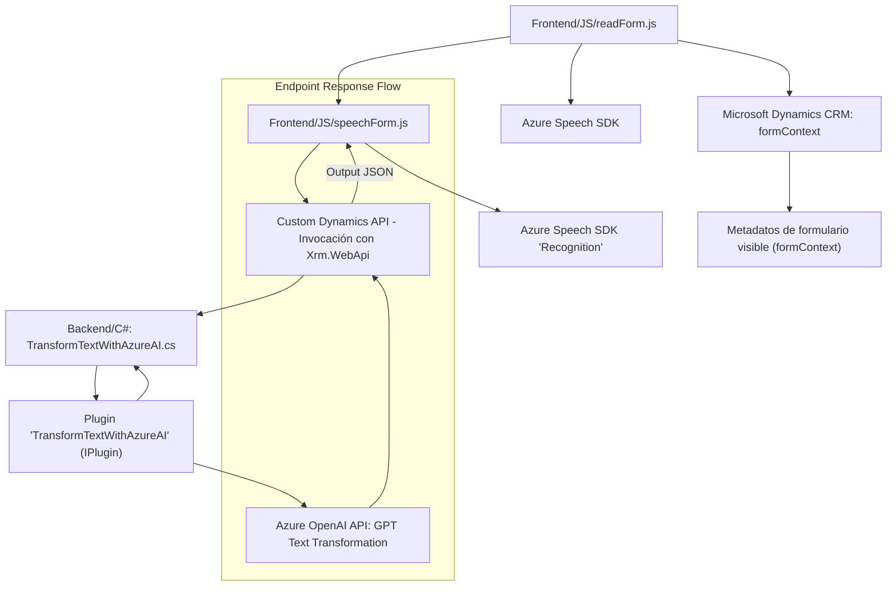

# Análisis Técnico de Arquitectura de Software

A continuación se realiza un análisis técnico de la arquitectura, dependencias, tecnologías involucradas y un diagrama **Mermaid** que resume la estructura y relaciones del repo.

---

### Breve Resumen Técnico
El repositorio contiene tres archivos que trabajan en conjunto para crear un sistema interactivo de entrada y salida de datos mediante voz. La solución emplea servicios de Microsoft Azure (Speech SDK y OpenAI) y está diseñada para integrarse con Microsoft Dynamics CRM, lo que indica un entorno altamente especializado y corporativo.

---

### Descripción de la Arquitectura
1. **Tipo de solución**: Es una solución híbrida que combina un **frontend basado en un sistema CRM**, una **integración de inteligencia artificial con Azure OpenAI** alojada en la nube, y una **infraestructura de plugins de Dynamics CRM** para extender la funcionalidad del backend.

2. **Capas arquitectónicas**: 
   - Probable **arquitectura de n capas**:
     - **Capa de presentación**: Archivos de frontend (JavaScript), integrados en la interfaz web del CRM.
     - **Capa de lógica de negocio**: Plugin de Dynamics implementado como una clase que interactúa con el CRM y servicios externos.
     - **Capa de integración**: Comunicación con Azure Speech SDK y Azure OpenAI para síntesis y procesamiento de datos con IA.

3. **Estructura modular**:
   - Enfoque modular para el manejo de funciones específicas en los archivos **JavaScript** (por ejemplo, lectura de formularios, síntesis de voz, reconocimiento de voz y manipulación dinámica de datos del formulario).
   - Uso de un **patrón Plugin** en el archivo `TransformTextWithAzureAI.cs` para responder a eventos personalizados del CRM backend.

---

### Tecnologías Usadas
1. **Frontend (JavaScript)**:
   - Uso de funciones como `startVoiceInput`, `speakText`, y `applyValueToField` para manipulación dinámica de formularios y gestión de interacción de voz.
   - Integración del **Azure Speech SDK**:
     - Reconocimiento de voz y síntesis de voz.
   - APIs internas de Dynamics CRM (`formContext`, `Xrm.WebApi`) para gestión del estado del formulario y llamadas a APIs personalizadas.
   - Manipulación dinámicas del DOM para carga de scripts.

2. **Backend (C#)**:
   - **Microsoft Dynamics CRM SDK**:
     - Implementación de Plugins.
     - Manipulación del contexto y ejecución de lógica de negocio.
   - **Azure OpenAI**:
     - Transformación de datos a través del modelo GPT.
     - Generación de JSON estructurado con base en reglas personalizadas.
   - Uso de dependencias como `Newtonsoft.Json`, `HttpClient`, y `System.Text.Json`.

3. **Patrones Arquitectónicos**:
   - **Modularidad**: Separación de lógica en funciones con tareas específicas organizadas para garantizar claridad y reutilización.
   - **Callback**: Uso de funciones callback en el frontend para garantizar la carga correcta de SDKs.
   - **Adapter**: Implementado para convertir valores de formularios a representaciones textuales (en JavaScript).
   - **DTO**: Para estructurar datos JSON enviados y recibidos desde Azure OpenAI.

---

### Dependencias y Componentes Externos
1. **Azure Speech SDK**:
   - Funcionalidad principal de este SDK para síntesis y reconocimiento de voz.
   - Se utiliza mediante carga dinámica con `<script>`.

2. **Azure OpenAI Service**:
   - Utilizado en el backend para transformar texto con reglas personalizadas definidas en Dynamics CRM.

3. **Microsoft Dynamics CRM Web API**:
   - Utilizado para acceder al estado de los formularios, actualizar campos y ejecutar operaciones en el backend.

4. **Frontend y frameworks**:
   - Presentación con DOM API sin uso de frameworks específicos (es código puro de JS).

5. **Librerías y dependencias del backend**:
   - `Newtonsoft.Json` para parseo y manipulación de JSON.
   - `System.Net.Http` para la ejecución de solicitudes al servicio de OpenAI.
   - SDK específico de Microsoft Dynamics para la integración con el entorno del CRM.

---

### Diagrama Mermaid

El siguiente diagrama representa las interacciones entre los componentes y partes de la solución propuesta, mostrándose en un flujo de datos entre frontend, backend y los servicios externos de Azure.

---

### Conclusión Final

El repositorio describe una solución integrativa que utiliza procesamiento de voz (Azure Speech SDK) y modelos IA avanzados (Azure OpenAI) para enriquecer interacciones con formularios de Dynamics CRM. 

Emplea una arquitectura de **n capas**, con una clara separación entre frontend, backend, y servicios externos. La modularización del código y la implementación de plugins en Dynamics CRM reflejan una correcta estructuración de responsabilidades, mientras que el uso de SDKs y APIs externos agrega valor funcional mediante integración con servicios en la nube.

Aunque la solución está bien estructurada, se debe considerar mejorar la gestión de configuraciones sensibles (e.g., claves API) almacenándolas fuera del código fuente, como en un archivo de configuración protegido o Vault. Además, se podría mejorar la documentación del repo incluyendo información más detallada sobre los requisitos de entorno, la configuración de servicios de Azure y opciones de ejecución.