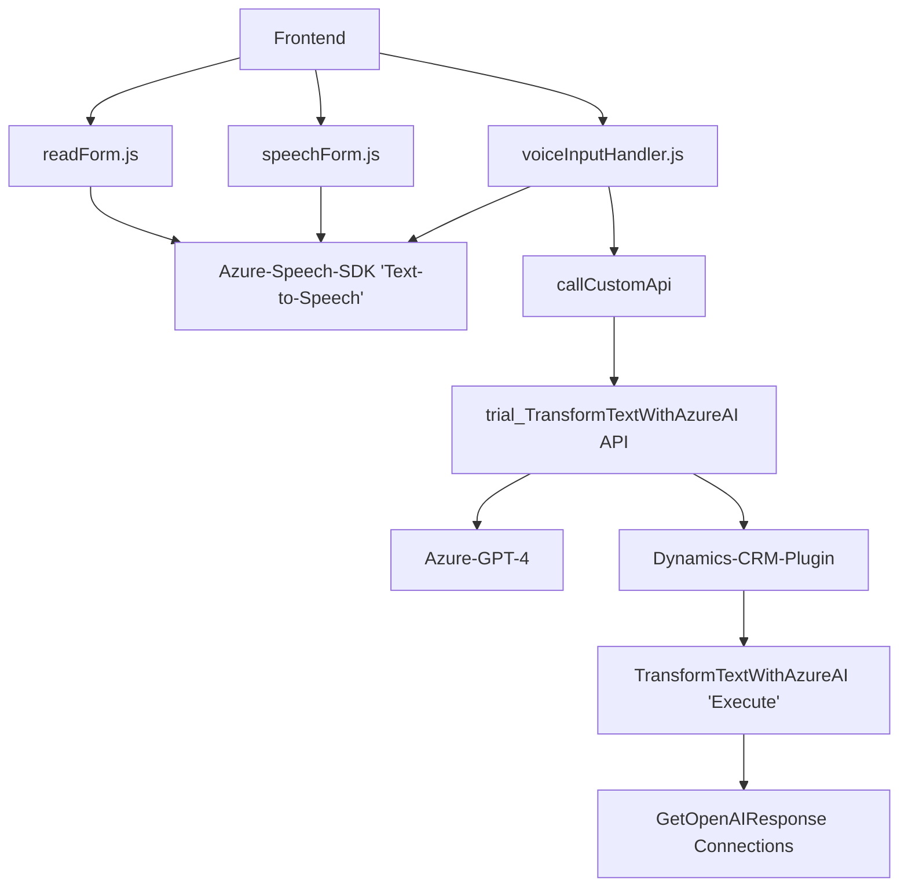

### Breve resumen técnico

La solución es una implementación híbrida que combina funcionalidades frontend (interacción con el usuario) y backend (plugins para extender capacidades de Dynamics CRM mediante Azure OpenAI). En términos generales, permite una interacción centrada en formularios dinámicos que integran reconocimiento de voz y textos verbales con procesamiento avanzado mediante IA. 

---

### Descripción de la arquitectura

La solución está formada por dos grandes componentes:

1. **Frontend**: 
   - Implementa funciones para manipular formularios, realizar reconocimiento de voz con **Azure Speech SDK**, y llamar APIs externas (Microsoft Dynamics 365 y Custom APIs) para procesar los datos obtenidos verbalmente.
   - Sigue el patrón de **event-driven programming**, ya que las funciones se desencadenan por eventos del usuario (ej. botones o formularios).
   - Utiliza **asynchronous programming** extensivamente para manejar la dinámica de SDKs y APIs externas.
   - Emplea el patrón **Façade** al encapsular la lógica del SDK y la manipulación de formularios en funciones específicas.

2. **Plugins para Dynamics CRM**: 
   - Implementan la lógica backend mediante el patrón **plugin** de Dynamics CRM. Permiten transformar datos de formularios y delegar tareas al servicio Azure OpenAI.
   - Hacen uso de **request-reply patterns** para la interacción con el modelo GPT-4 de Azure OpenAI.
   - Aprovechan **DI (Dependency Injection)** proporcionado por `IServiceProvider` para desacoplar contextos del CRM.

La arquitectura general de la solución puede clasificarse como **event-driven architecture** para toda la interacción funcional y comunicación basada en APIs. Si extendemos el enfoque en múltiples puntos de integración, se podría considerar hacia una **arquitectura orientada a servicios (SOA)**.

---

### Tecnologías usadas

1. **Frontend**:
   - **Azure Speech SDK** (JavaScript): Para reconocimiento de voz.
   - **Microsoft Dynamics 365 Web API**: Usado para interacciones con el CRM (ej. actualizar formularios).
   - **JavaScript**: Para manejo de funciones del frontend (modular y orientado a eventos).

2. **Backend (Plugins)**:
   - **Microsoft Dynamics SDK**: Ampliación de funciones del CRM mediante el contrato `IPlugin`.
   - **System.Net.Http**: Para realizar solicitudes REST al servicio externo Azure OpenAI.
   - **Azure OpenAI API + GPT-4**: Interpretación avanzada del texto basado en IA.
   - Gestión JSON con **Newtonsoft.Json** y **System.Text.Json**.

3. **General**:
   - Comunicación basada en APIs (AJAX via `fetch` en el frontend y HttpClient en backend).

---

### Diagrama Mermaid válido para GitHub

---

### Conclusión final

La solución implementa una integración dinámica entre un frontend que maneja interacciones del usuario y una robusta lógica backend que utiliza Azure OpenAI para transformaciones avanzadas. El uso de tecnologías modernas, sistemas distribuidos y modelos de IA la ubican como una solución híbrida orientada hacia **SOA (Service-Oriented Architecture)**. Sin embargo, se evidencia que las credenciales o claves del servicio (ej. Azure Speech SDK y Azure OpenAI) están hard-coded, lo cual puede generar vulnerabilidades. Se sugiere migar estas configuraciones sensibles hacia un sistema seguro como **Key Vault** de Azure.