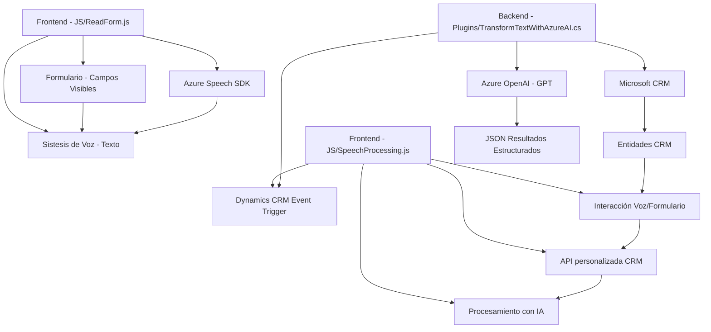

### Breve Resumen Técnico

Este repositorio contiene tres archivos que forman parte de un sistema de software relacionado con interacción por voz y procesamiento de datos en formularios, probablemente integrado en un entorno de CRM, utilizando servicios de Microsoft Dynamics y Azure. La solución incluye lógica de frontend (JavaScript) y backend (C# plugin en Dynamics CRM), con una notable dependencia de Azure Speech SDK y Azure OpenAI para capacidades avanzadas de reconocimiento, síntesis y manipulación de datos de voz.

---

### Descripción de Arquitectura

1. **Tipo de solución:**  
   La solución parece ser un sistema híbrido compuesto por un frontend (JavaScript) y un backend (C#), utilizado en el contexto de Microsoft Dynamics CRM. Se estructura como una funcionalidad complementaria que realiza tareas de entrada de datos mediante reconocimiento de voz y procesamiento con inteligencia artificial.

2. **Arquitectura:**  
   La arquitectura combina elementos **n-capas** para el backend, con implementación modular en el frontend. El backend utiliza el patrón de **plugins**, típico en la arquitectura de extensibilidad de Dynamics CRM, y se conecta con un servicio externo RESTful (Azure OpenAI). El frontend aprovecha el Azure Speech SDK para interactuar directamente con el navegador y utiliza un diseño modular independiente.

3. **Patrones:**
   - **Modular Programming:** Tanto el frontend como el backend están claramente organizados en funciones o métodos con responsabilidades específicas.
   - **SDK-based Approach:** El frontend confía en Azure Speech SDK para la síntesis y procesamiento de voz, implementando un patrón de delegación de eventos.
   - **Plugin Pattern:** En el backend, el diseño sigue el patrón típico de plugins para eventos de CRM.
   - **External API Integration:** RESTful API para conectar con Azure OpenAI desde el backend.

4. **Dependencias y componentes externos:**  
   - **Azure Speech SDK:** Utilizado para reconocimiento y síntesis de voz en el frontend. Cargado dinámicamente en el entorno del cliente.
   - **Azure OpenAI:** Procesa texto según normas específicas y devuelve JSON con datos estructurados en el backend.
   - **CRM APIs (Microsoft Xrm.WebApi y Microsoft.Xrm.Sdk):** Utilizadas para interactuar con entidades y datos de Microsoft Dynamics.

---

### Tecnologías Usadas
1. **Frontend:**
   - JavaScript.
   - **Azure Speech SDK**: Para operaciones de síntesis y reconocimiento de voz.
   - Client-side modular architecture.

2. **Backend:**
   - C#.
   - **Microsoft Dynamics CRM APIs**: Para manejo de entidades en CRM.
   - **Azure OpenAI**: Llamada de API para procesamiento de texto avanzado.
   - Librerías .NET como `Newtonsoft.Json` y `System.Net.Http`.

---

### Diagrama Mermaid

---

### Conclusión Final

Este repositorio implementa soluciones que integran **tecnologías de reconocimiento de voz e inteligencia artificial** con Microsoft Dynamics CRM, mostrando una arquitectura híbrida de **n-capas y plugin-based**. El frontend está basado en JavaScript con dependencias del SDK de Azure Speech para interacción directa con el usuario, mientras que el backend, desarrollado en C#, utiliza el patrón de plugins para extender las funcionalidades del CRM y conecta con el servicio de Azure OpenAI para realizar tareas de procesamiento inteligente. La solución es robusta, modular, y extensible, adecuada para entornos empresariales y su integración con servicios inteligentes modernos.