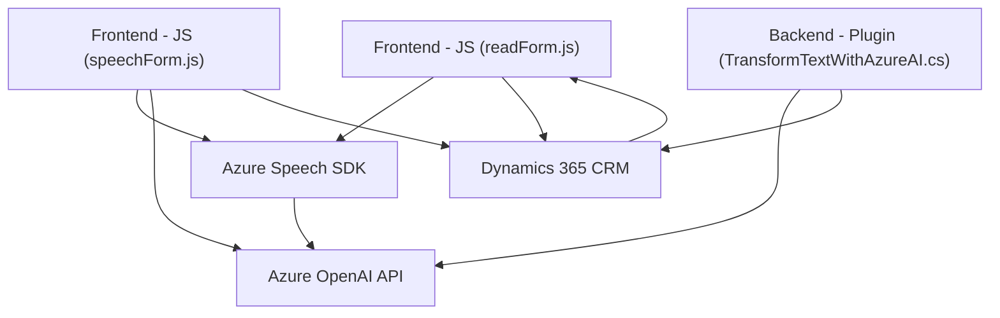

### Breve resumen técnico
El repositorio implementa una solución integral que incluye un **frontend**, componentes **backend** y una integración con servicios externos como **Azure Speech SDK**, **Dynamics 365 CRM**, y **Azure OpenAI Service**. La funcionalidad principal se centra en convertir datos textuales en voz y viceversa, así como procesar estos datos mediante inteligencia artificial para aplicarlos en formularios o sistemas relacionados.

---

### Descripción de arquitectura
La solución presenta una arquitectura **n-capas**, donde cada componente (frontend, backend y servicios externos) cumple una función específica y se integra para formar un sistema cohesivo. Existen componentes que operan de manera desacoplada:
1. **Frontend**: Maneja captura, lectura y síntesis de voz.
2. **Backend (Plugins)**: Procesa datos dentro de Dynamics CRM y transforma texto usando Azure OpenAI.
3. **Servicios externos**: Incluyen SDKs y APIs que manejan síntesis de voz (Azure Speech SDK) y procesamiento avanzado basado en AI (Azure OpenAI).

Además, la solución utiliza patrones:
- **Event-driven design** para manejar procesos asíncronos, como la carga de SDKs o ecosistemas externos.
- **Integración con APIs externas**, facilitando escalabilidad y delegación de responsabilidades.
- **Separación de responsabilidades**, dividiendo las tareas entre frontend, backend y servicios externos.
- **Modularidad**, organizando funcionalidades en bloques separados.

---

### Tecnologías usadas
- **Lenguaje de programación**: JavaScript (para el frontend) y C# (para el plugin de Dynamics CRM).
- **Frameworks/Librerías**:
  - **Azure Speech SDK**: Utilizado para síntesis de voz y reconocimiento de texto.
  - **Azure OpenAI API**: Para procesamiento de texto y generación de respuestas estructuradas mediante GPT.
  - **Dynamics WebApi (XRM)**: API para interactuar con los datos del sistema Dynamics CRM.
  - **Newtonsoft.Json**: Parseo y manipulación de datos en formato JSON.
  - **REST API integration**: Comunicación entre componentes de la aplicación y servicios Azure.
- **Diseños y Patrones**:
  - Modularidad
  - Event-driven design
  - Arquitectura n-capas
  - Programación orientada a APIs

---

### Diagrama Mermaid válido para GitHub Markdown

---

### Conclusión final
El repositorio implementa una solución basada en la interacción entre datos de formularios, reconocimiento de voz, conversión de texto en audio, y transformación de texto mediante un modelo avanzado de IA (Azure OpenAI). Presenta una arquitectura **n-capas** que organiza diferentes responsabilidades por sección: frontend, backend y servicios externos.

El uso de SDKs y APIs externas como **Azure Speech SDK** y **Azure OpenAI** permite una mayor escalabilidad y potencia en las funcionalidades sin tener que desarrollar implementaciones complejas desde cero. Adicionalmente, el código demuestra buenas prácticas como modularidad, separación de responsabilidades y uso de patrones de diseño como **event-driven design** y la integración con servicios externos, lo que asegura un sistema eficiente y adaptable.