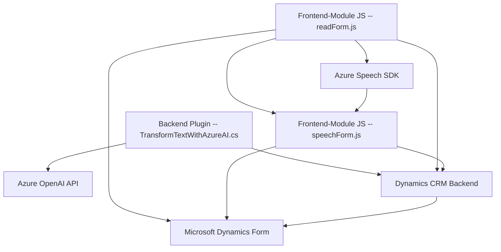

### Breve resumen técnico:

Este repositorio parece estar diseñado para integrar funcionalidades avanzadas de procesamiento de voz y texto con Microsoft Dynamics CRM. Utiliza servicios de Microsoft Azure (como Speech SDK y Azure OpenAI) para transformar datos hablados en texto, sintetizar texto en voz y estructurar textos mediante inteligencia artificial. Organiza estas funcionalidades en módulos JavaScript para frontend e integraciones de plugins en C# para el backend.

---

### Descripción de arquitectura:

1. **Tipo de solución**:  
   Este repositorio es una **solución policapa** que combina funcionalidades de frontend (en JavaScript), integraciones backend (en C#) y servicios externos mediante API, ofreciendo capacidades específicas de accesibilidad y procesamiento automatizado (incluyendo síntesis de voz y transformación de texto). 

2. **Tipo de arquitectura**:  
   Principalmente sigue una **arquitectura de n capas**:  
   - **Capa de presentación**: Archivos como `readForm.js` y `speechForm.js` interactúan directamente con formularios de usuarios.  
   - **Capa lógica o dominio**: Plugins como `TransformTextWithAzureAI.cs` procesan datos desde formularios.  
   - **Capa de servicios externos**: Azure Speech SDK y Azure OpenAI son servicios externos integrados para procesamiento avanzado.

   Además, explota patrones **Service-Oriented Architecture** (SOA) para separar la lógica entre servicios internos y APIs externas.

---

### Tecnologías usadas:

1. **Frontend**:  
   - **JavaScript**:
     - Gestión de eventos de formularios en Microsoft Dynamics CRM.

2. **Backend**:  
   - **C#**:
     - Implementación de plugins para Dynamics CRM usando la interfaz `IPlugin`.

3. **Servicios externos**:  
   - Azure Speech SDK: Para reconocimiento y síntesis de voz.  
   - Azure OpenAI API: Para transformación avanzada de texto en base al modelo GPT-4.

4. **Frameworks/Librerías**:  
   - Microsoft.Xrm.Sdk: Para interactuar con datos y lógica de Dynamics CRM.  
   - System.Net.Http: Para comunicación REST con Azure APIs.  
   - System.Text.Json: Para manipular JSON.

---

### Patrones usados:

1. **Modularidad**:  
   Funcionalidades específicas se organizan en funciones independientes en los módulos JavaScript y métodos en el plugin C#.  

2. **Control de flujo asíncrono**:  
   Las partes de frontend cargan servicios como Azure Speech SDK dinámicamente y utilizan `async/await` para manejar procesos extensos.  

3. **Service-Oriented Architecture (SOA)**:  
   Dependencia de servicios externos como Azure Speech SDK y Azure OpenAI API para procesar datos especializados.

4. **Adapter Pattern**:  
   La función `GetOpenAIResponse` en el plugin actúa como un adaptador en la comunicación entre Dynamics CRM y OpenAI API.

---

### Dependencias:

1. **Externas**:  
   - Azure Speech SDK: Configuración de región, clave de acceso y voz sintetizada.  
   - Azure OpenAI API: Procesamiento de texto dinámico con GPT-4.  

2. **Internas**:  
   - Elementos del repositorio, como funciones JavaScript que interactúan con campos del formulario (`applyValueToField`, `processTranscript`).  
   - Microsoft Dynamics CRM APIs y `Xrm.WebApi.online`.

---

### Diagrama Mermaid válido para GitHub:

---

### Conclusión final:

Este repositorio ofrece una solución híbrida para procesar texto y voz en integración con Microsoft Dynamics CRM. Sigue patrones de arquitectura de n capas con una fuerte orientación a servicios externos mediante SOA, destacando el uso de tecnologías Microsoft y Azure para garantizar un manejo avanzado de datos y accesibilidad. Aunque modular en términos de frontend y backend, se pueden identificar áreas de mejora en términos de configuración externa de claves y mayor uso de seguridad en el plugin backend.