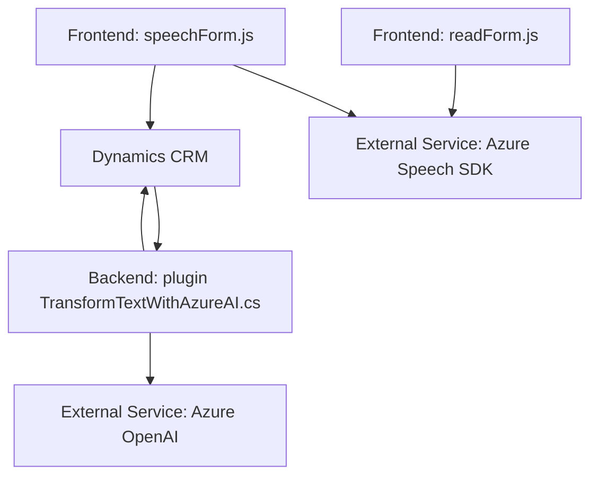

### Breve Resumen Técnico
Este repositorio está diseñado principalmente para integrar funcionalidades avanzadas de procesamiento de voz y texto en entornos como **Dynamics CRM**, empleando tecnologías como el **Azure Speech SDK** y **Azure OpenAI**. El objetivo es transformar la interacción dinámica de formularios y entradas de voz en acciones estructuradas con el uso de APIs externas y servicios de inteligencia artificial.

---

### Descripción de Arquitectura
La solución sigue un diseño multicapa que combina:
- **Presentación (Frontend)**: Contiene lógica para recoger datos de los formularios dinámicos y procesarlos mediante APIs externas (Azure Speech SDK) para síntesis de voz o transcripción.
- **Procesamiento (Backend)**: Consta de plugins personalizados en **Microsoft Dynamics 365** que conectan la plataforma con servicios de **Azure OpenAI** para transformación avanzada de datos.
- **Servicios Externos**:
  - **Azure Speech SDK** para funcionalidades text-to-speech y voice-to-text.
  - Integra una API personalizada para procesar transcripciones dinámicas en Dynamics CRM, permitiendo mapeos y validaciones específicas según el contexto.
  - **Azure OpenAI** para el procesamiento de texto avanzado y su estructuración como JSON.

La solución tiene componentes distribuidos que enfatizan modularidad y desacoplamiento, aproximándose a una **arquitectura de microservicios**.

---

### Tecnologías Utilizadas
1. **JavaScript**: En la capa de presentación para ejecutar lógica de formularios y conectarse a servicios externos.
2. **Microsoft Dynamics CRM SDK**: Proporciona el contexto y las interacciones con los datos del sistema para los formularios.
3. **Azure Speech SDK**: Ofrece síntesis de voz y reconocimiento de voz en los formularios, integrándose directamente a través de JavaScript en el frontend.
4. **Azure OpenAI**: Se utiliza en plugins del backend para la transformación avanzada del texto en JSON estructurado.
5. **C# (.NET)**: En los plugins del backend para lógica empresarial como mapeo de datos, conexión API y procesamiento avanzado.
6. **Patrones**:
   - Modularidad y separación de responsabilidades (presentación y lógica de negocio).
   - Factory Pattern: Usado en la configuración dinámica del SDK en la capa presentación.
   - Strategy Pattern: Implementado en el procesamiento de transcripciones con y sin IA.

---

### Dependencias y Componentes Externos
El repositorio depende de:
1. **Azure Speech SDK**: Procesamiento de voz.
2. **Azure OpenAI**: Servicios de inteligencia artificial para transformación y análisis.
3. **Dynamics CRM APIs**: Entorno dinámico del formulario y acceso a datos mediante `Xrm.WebApi.online`.
4. **Newtonsoft.Json**: Manejo de JSON para operaciones relacionadas con el API de Azure OpenAI.
5. **HttpClient**: Para conectarse a servicios externos como Azure OpenAI desde C# en el backend.

---

### Diagrama Mermaid
El diagrama muestra la interacción entre componentes principales: Frontend, Backend y los servicios externos.

---

### Conclusión Final
La solución implementa una arquitectura distribuida orientada a microservicios, aunque no alcanza una separación completa por servicios totalmente independientes. El frontend procesa voz y texto directamente en el navegador usando servicios externos, mientras que el backend gestiona transformaciones avanzadas mediante un plugin conectado a Dynamics CRM y a la API de Azure OpenAI. Esta integración representa una base sólida para aplicaciones dinámicas de voz y texto en entornos empresariales que requieren interoperabilidad y capacidades de IA.