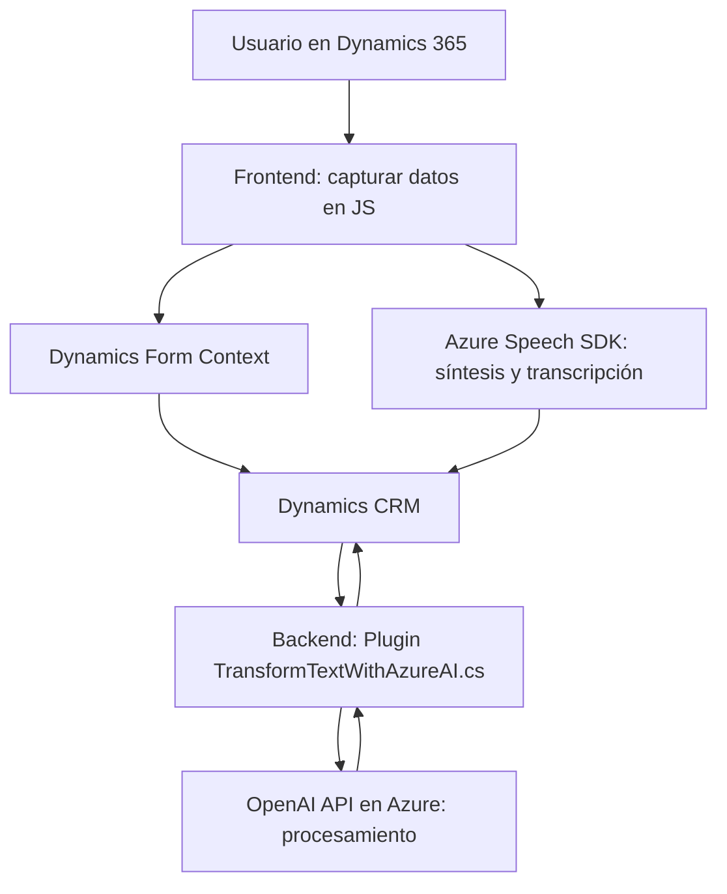

# Análisis técnico de las soluciones proporcionadas

A continuación, se analizan los archivos del repositorio y se describen en detalle los aspectos técnicos, la arquitectura, las tecnologías utilizadas y se genera un diagrama **Mermaid** para representar las interacciones entre los componentes.

---

### **Breve resumen técnico**
Este repositorio define una solución híbrida: combina módulos frontend y backend enfocados en la síntesis, transcripción de voz, integración con formularios basados en Dynamics 365, y procesamiento avanzado mediante APIs externas (Azure Speech y OpenAI). Los componentes son:
1. **Frontend (JavaScript)**: Módulos responsables de interacción con el usuario, captura de movimientos y datos mediante voz, y procesamiento orientado a formularios.
2. **Backend (C# Plugin)**: Plugins que actúan sobre eventos ejecutados en Dynamics CRM, utilizando la API de OpenAI para transformación avanzada de texto.

---

### **Descripción de la arquitectura**

La arquitectura detectada es **n-capas** con integración de servicios externos. Los componentes clave son:
1. **Frontend**: Manejo del flujo de datos entre el usuario, la API de Azure Speech y los formularios en Dynamics 365.
   - Modularidad clara en el código: Cada función aborda una tarea específica dentro del flujo de captura, procesamiento o síntesis de voz.
   - **Event-driven architecture**: Uso de eventos como la activación de funciones en respuesta a dinámicas del usuario.
2. **Backend (Plugins)**: Parte del sistema Dynamics CRM que opera en una capa de negocio y extensión.
   - **Cliente-Servidor**: Los plugins actúan como mediadores entre Dynamics y APIs externas (Azure OpenAI).
   - **Eventos CRM**: Lógica ejecutada específicamente bajo eventos como actualizaciones de registros.

El diseño muestra una clara separación de preocupaciones (frontend: presentación/interacción; backend: procesamiento/negocio).

---

### **Tecnologías usadas**
#### **Frontend**:
1. **JavaScript**:
   - Dinámico y con manipulación del DOM (cargar SDK de Azure Speech de forma dinámica).
2. **Azure Speech SDK**:
   - Reconocimiento y síntesis de voz en tiempo real.
   - Configuración de idioma y actores de voz (ej: `es-ES-AlvaroNeural`).
3. **Microsoft Dynamics Form Context**:
   - Organiza y controla los datos visibles o modificables del formulario en Dynamics.

#### **Backend**:
1. **C#**: Base para la extensión de Dynamics CRM (Excelencia en el uso de contextos de servicio y manipulación JSON).
2. **Azure OpenAI API**:
   - Hace solicitudes HTTP POST para transformar texto bajo reglas específicas.
3. **Microsoft.Xrm.Sdk**:
   - Core para la manipulación de datos en Dynamics CRM a nivel de negocios.
4. **JSON Libraries**:
   - Manejo y manipulación dinámica de respuestas JSON (Newtonsoft y System.Text.Json).

---

### **Diagrama Mermaid**

El siguiente diagrama representa las interacciones del sistema y la integración con dependencias externas.

---

### **Conclusión final**

1. **Tipo de solución**:
   - Predominantemente **orientada a servicios** con componentes frontend para interacción directa y backend que potencia las capacidades del sistema CRM.

2. **Arquitectura**:
   - Basada en **n-capas** donde cada módulo tiene roles definidos:
     - Capa de presentación (Frontend).
     - Capa de negocio y lógica basada en plugins.
     - Capa de integración de servicios externos (Azure APIs).

3. **Fortalezas**:
   - Modularidad y separación clara de lógica.
   - Uso eficiente de APIs externas (Azure Speech y OpenAI).
   - Capacidades dinámicas con formulación de voz y texto altamente configurable.

4. **Aspectos a mejorar/consideraciones**:
   - Seguridad: Las claves de Azure/OpenAI deben ser externalizadas (con variables de entorno u otros métodos seguros).
   - Validaciones adicionales: Robustez frente a errores transitorios de API o SDK debe ser mejorada en ambos componentes.
   - Gestión de dependencias: Podría implementarse un sistema de gestión más estructurado para librerías JS externas.

Esta solución presenta una estructura adaptable y modular, especialmente útil para sistemas orientados a la integración de APIs y extensiones de CRM.