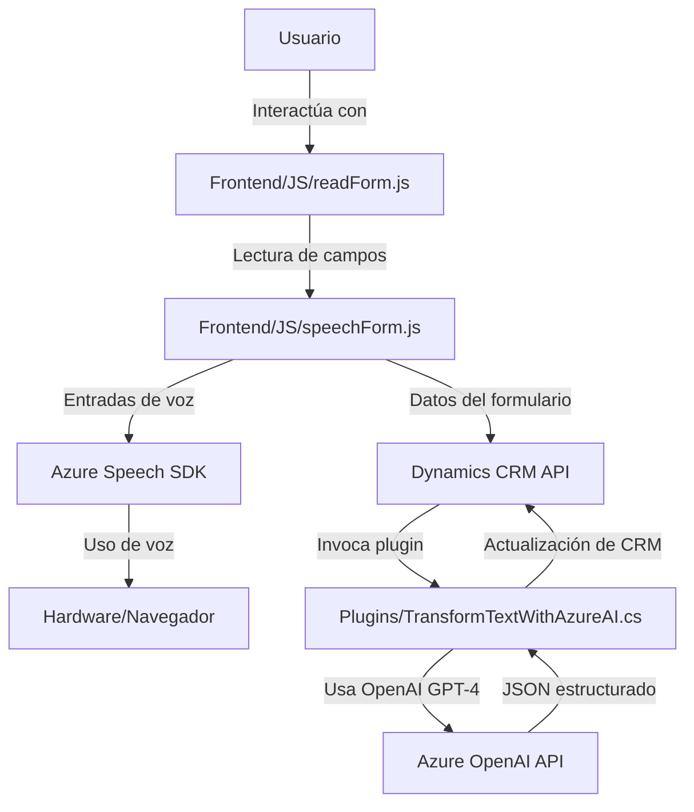

### Breve Resumen Técnico
El repositorio presenta varias funcionalidades orientadas a la interacción entre usuarios y formularios, utilizando reconocimiento y síntesis de voz, así como integración con servicios externos como **Azure Speech SDK**, **Dynamics CRM APIs**, y **Azure OpenAI API**. Los archivos reflejan una estructura modular que combina desarrollo frontend (JavaScript) y backend (C# plugins para Dynamics CRM). 

---

### Descripción de Arquitectura
La arquitectura utiliza el patrón **en capas**, donde cada archivo tiene una responsabilidad específica: 
- **Frontend** maneja interacción del usuario, procesando formularios y voz mediante el navegador.
- **Backend** extiende funcionalidades de Dynamics CRM mediante plugins en C#.

Aunque no es completamente independiente, hay integración con microservicios externos como **Azure Speech SDK** y **Azure OpenAI API**, lo que introduce elementos distribuidos en la solución.

---

### Tecnologías Usadas
1. **Frontend (JavaScript):**
   - Azure Speech SDK (JS).
   - APIs de Dynamics CRM (`Xrm.WebApi.online`).
   - Gestión de dependencias y módulos con carga dinámica.
   - Carga de SDK mediante `window` (script injection).

2. **Backend (C#):**
   - Dynamics CRM (`Microsoft.Xrm.Sdk`).
   - Azure OpenAI API (GPT-4).
   - Manipulación de JSON (`Newtonsoft.Json`, `System.Text.Json`).
   - HTTP requests (`System.Net.Http`).

3. **Servicios externos:**
   - Azure Speech SDK.
   - Azure OpenAI API.

4. **Patrones:**
   - Modularidad: Separación de funciones específicas en ambos lados.
   - Integración API: Utilización de servicios REST externos.
   - Carga Dinámica: En el Frontend para reducir dependencias iniciales.

---

### Diagrama Mermaid Compatible con GitHub

---

### Conclusión Final
La solución está orientada hacia la integración de capacidades de inteligencia artificial y procesamiento de voz en formularios, combinando un enfoque modular en el Frontend con extensiones de funcionalidad en el Backend mediante plugins para Dynamics CRM. Se apoya en tecnologías modernas (Azure Speech SDK y OpenAI API) para manejar capacidades avanzadas como reconocimiento y síntesis de voz y procesamiento de texto estructurado.

La arquitectura es híbrida: combina un patrón **monolítico extendido con plugins** en el backend y una ligera dependencia hacia **servicios distribuidos**. Esto es ideal para proyectos que operan dentro del ecosistema Dynamics CRM con necesidades modernas de interacción por voz, accesibilidad, y procesamiento inteligente.