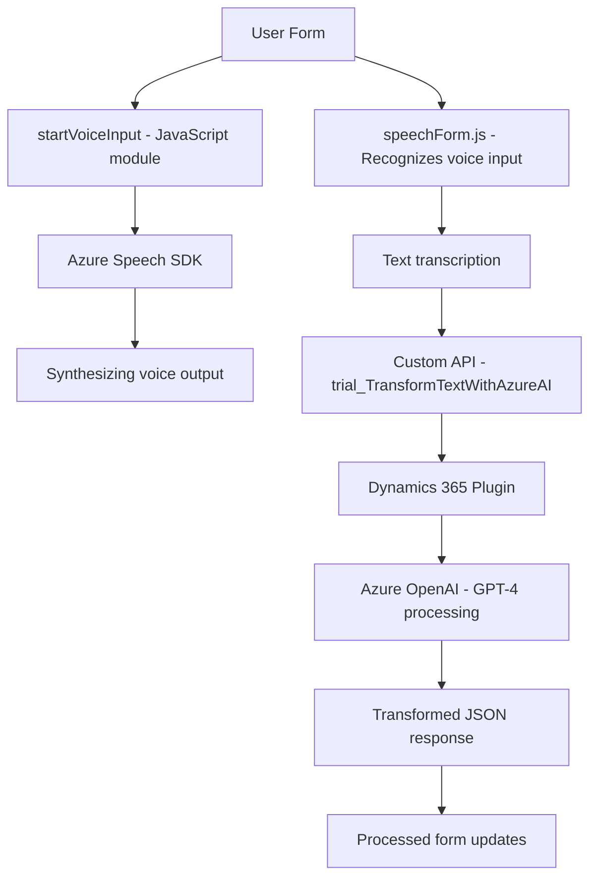

## Breve resumen técnico

La solución descrita integra funcionalidades avanzadas de reconocimiento de voz, procesamiento de datos formulados y transformación automatizada de texto a través de servicios en la nube. Combina componentes frontend en JavaScript que interactúan con user inputs (formularios), APIs internas (Dynamics 365), y servicios externos, como Azure Speech SDK y Azure OpenAI.

---

## Descripción de arquitectura

La solución está diseñada bajo una arquitectura de **n capas**, donde:

1. **Front-end (capas de presentación)**:
   - Utiliza JavaScript para capturar y procesar datos de formularios.
   - Incorpora Azure Speech SDK para reconocimiento de voz y síntesis de texto hablado.

2. **Capas de negocio o middleware**:
   - Implementada como plugins en C# dentro de Dynamics CRM.
   - Los plugins ejecutan lógica personalizada y llaman a servicios de Azure OpenAI para transformar texto según reglas específicas.

3. **Capas de integración o acceso a datos**:
   - Interactúa con APIs (e.g., `trial_TransformTextWithAzureAI`) para integrar funcionalidades con Dynamics CRM.
   - Consume servicios externos como Azure Speech SDK y Azure OpenAI via protocolos REST.

---

## Tecnologías usadas

- **Frontend**:
  - JavaScript
  - Azure Speech SDK
  - Dynamics 365 context APIs (`Xrm.WebApi`)
  
- **Backend/plugin**:
  - Microsoft Dynamics CRM SDK (C#)
  - Azure OpenAI API (GPT-4)
  - REST APIs
  - JSON libraries (`Newtonsoft.Json`, `System.Text.Json`)
  
- **Otros patrones**:
  - **Facade** para simplificar la interacción entre diversas APIs y módulos.
  - **Plugin Architecture** para extensibilidad en Dynamics CRM.
  - **Delegación** y **promesas** para manejar flujos asincrónicos en JavaScript.

---

## Diagrama Mermaid válido para GitHub Markdown

---

## Conclusión final

Esta solución representa una integración de sistemas orientada a mejorar la interacción entre usuario y aplicaciones empresariales utilizando inteligencia artificial y tecnologías de la nube. Con una arquitectura **n capas**, aborda múltiples flujos de datos (formulario, transcripción, transformación) de manera organizada y extensible. Esto habilita un uso efectivo de herramientas modernas (Azure Speech SDK y Azure OpenAI) dentro de un ecosistema como Dynamics 365.