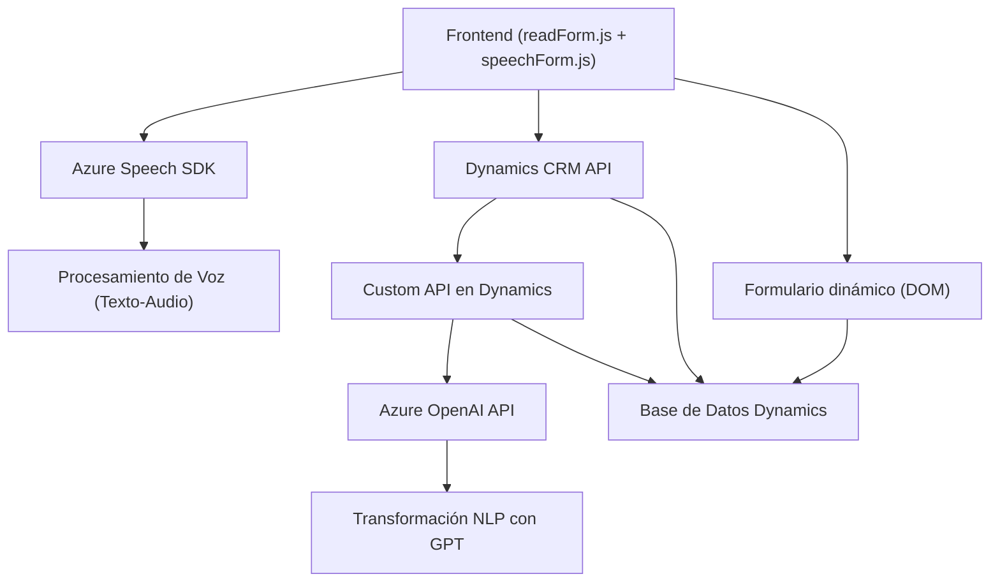

### Breve resumen técnico

El repositorio tiene varios archivos que implementan funcionalidades basadas en la integración de servicios de Azure (especialmente Azure Speech SDK y Azure OpenAI), junto con manipulación de formularios en interfaces web (Dynamics 365 CRM). La solución parece dirigida hacia habilitar capacidades de voz (input y output) e interacción con IA para procesar y transformar texto dinámicamente. Además, se integra con el sistema CRM de Dynamics a nivel de frontend y plugin/servidor.

---

### Descripción de arquitectura

La solución corresponde a un **sistema híbrido** que combina:
- **Frontend orientado a formularios interactivos**: Utiliza JavaScript para capturar voz, procesar texto y manipular elementos DOM dinámicos en formularios del CRM.
- **Plugins del servidor (Dynamics CRM)**: Amplían la lógica del backend mediante integraciones con **Azure OpenAI API**, precedidas por la ejecución de métodos de sistema (`IPlugin`).

El enfoque del proyecto sugiere una **arquitectura de n capas**:
1. **Presentación (Frontend)**: Captura de voz y manipulación de formularios con JavaScript.
2. **Lógica de negocio**:
   - Procesamiento de voz (Azure Speech SDK).
   - Mapeo de texto en formularios.
   - Transformación avanzada con APIs de Azure OpenAI.
3. **Acceso a datos**: A través de Dynamics CRM para la gestión y consulta de entidades del sistema.

Se evidencia el uso de patrones como "SDK Loader", middleware, modularidad, y Fascade para simplificar la interacción con servicios.

---

### Tecnologías usadas

#### Frontend:
1. **JavaScript**:
   - Manipulación del DOM para formularios dinámicos.
   - Integración con el **Azure Speech SDK** para síntesis y reconocimiento de voz desde el navegador.
2. **Azure Speech SDK**:
   - Procesamiento de voz integrado con el frontend a través de CDN (https).
   - Funciones relacionadas con configuración, síntesis (texto a voz) o reconocimiento (voz a texto).

#### Backend:
1. **Microsoft Dynamics CRM Plugins**:
   - Utilización de lógica de negocio extensible mediante `IPlugin` en C#, asimilando operaciones comerciales automatizadas.
   - Integración profunda con entidades y APIs de Dynamics CRM.
2. **Azure OpenAI Services**:
   - Procesamiento de lenguaje natural (NLP) con **GPT** para transformar texto según reglas aplicadas.

---

### Dependencias o componentes externos

1. **Dependencias externas usadas**:
   - **Azure Speech SDK**: Usado para reconocimiento y síntesis de voz en frontend.
   - **Azure OpenAI Services (GPT)**: Utilizado en el backend (plugin) para procesamiento avanzado.
   - **Dynamics 365 CRM Custom API**: Funcionalidades específicas implementadas como Custom APIs integradas en el CRM.

2. **Dependencias internas**:
   - `Microsoft.Xrm.Sdk`: Framework tradicional de Dynamics para comunicación entre el plugin y el CRM.
   - `Newtonsoft.Json.Linq` y `System.Text.Json`: Para manejar estructuras JSON transformadas.

3. **Otros componentes externos en uso**:
   - APIs de navegación (`navigator.mediaDevices`) en el navegador para configuración de micrófonos y acceso a audio en frontend.
   - Servicios web basados en REST para interactuar con Azure Speech y OpenAI Services.
   - CDN **https://aka.ms/csspeech/jsbrowserpackageraw**: Recurso dinámico para cargar el SDK de voz desde Azure.

---

### Diagrama Mermaid válido para GitHub Markdown

---

### Conclusión final

Este repositorio implementa una solución avanzada para mejorar la interacción hombre-máquina en entornos de CRM, permitiendo funcionalidades como procesamiento de voz, captura de audio desde el cliente (frontend) y transformación del texto mediante AI en el backend. La arquitectura es modular y utiliza capacidades de Azure, integrándose profundamente con Microsoft Dynamics CRM. Ideal para aplicaciones empresariales orientadas a la productividad y accesibilidad.