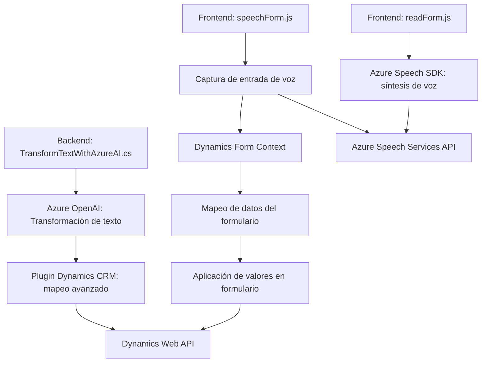

### Breve resumen técnico
El proyecto integra funcionalidades relacionadas con voz e inteligencia artificial (IA) en una solución basada en Dynamics 365. Utiliza Azure Speech SDK para la síntesis y el reconocimiento de voz, Dynamics Web API para manipular datos del CRM, y Azure OpenAI para transformaciones avanzadas de texto. Los archivos analizados reflejan una solución híbrida que combina lógica de backend y frontend con componentes externos.

---

### Descripción de arquitectura
Este proyecto presenta una **arquitectura de múltiples capas**:
1. **Frontend**: Controla la entrada/salida de voz y la integración con formularios mediante Azure Speech SDK.
2. **Backend**: Plugin desarrollado en C# para realizar transformaciones de texto mediante Azure OpenAI en el contexto de Dynamics 365.
3. **Interacción con servicios externos**:
   - Azure Speech Services: Síntesis y reconocimiento de voz.
   - Azure OpenAI: Transformación avanzada de texto.
   - CRM Dynamics Web API: Manipulación y mapeo de datos dentro de formularios.

Se implementa una arquitectura **modular** donde cada archivo tiene funcionalidades específicas que contribuyen al flujo global del sistema.

---

### Tecnologías usadas
1. **Frontend**:
   - **JavaScript** para implementar lógica de voz y procesamiento de datos.
   - **Azure Speech SDK** para síntesis y reconocimiento de voz.
   - **Dynamics 365 Web API** para manipulación de formularios.
2. **Backend**:
   - **C# .NET Framework** (Microsoft.Xrm.Sdk para integrar plugins en Dynamics).
   - **Azure OpenAI** para transformaciones inteligentes de texto.
   - **Newtonsoft.Json** para procesamiento JSON.

3. **Patrones utilizados**:
   - **Plugin pattern**: Flujo configurado para ejecutar extensiones basadas en Dynamics (C#).
   - **Callback pattern**: Garantiza la carga controlada del SDK en el frontend.
   - **Adapter**: Encapsula la interacción con Azure Speech y OpenAI.
   - **Delegación de responsabilidades**: Separación entre acceso al SDK, procesamiento, mapeo y aplicación de datos.

---

### Diagrama Mermaid

---

### Conclusión final
La solución combina un frontend enfocado en la interacción de voz y formularios con un backend que aplica inteligencia artificial avanzada. La arquitectura modular permite que cada componente sea reutilizable y favoriza la separación de preocupaciones. La integración con servicios externos como Azure Speech y OpenAI posiciona esta solución como una herramienta robusta para automatización en entornos Dynamics 365. Es adecuada para escenarios empresariales donde la entrada y salida de voz integrada con CRM son esenciales. Sin embargo, es importante mejorar la seguridad de la configuración para la clave API y garantizar buenas prácticas de gestión de claves.