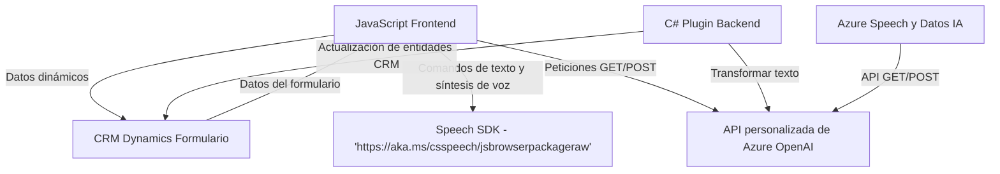

### Breve Resumen Técnico
El repositorio contiene archivos distribuidos entre frontend (JavaScript) y funcionalidades backend (Plugins en C#). Está centrado en la integración con **Azure Speech SDK** y **Azure OpenAI** para habilitar capacidades de texto a voz, voz a texto, y manipulación de datos en formularios de un sistema CRM, probablemente Dynamics 365.

---

### Descripción de Arquitectura
La arquitectura es una mezcla de capas distribuidas típicas de aplicaciones empresariales con dependencia directa de servicios externos:
- **Frontend:** Archivos JS controlan la interacción del usuario y los datos en el formulario del CRM. Procesos como lectura por síntesis de voz y llenado de formularios basado en comandos hablados están separados por módulos independientes.
- **Backend:** Plugins en C# implementan lógica específica como procesamiento avanzado mediante Azure OpenAI para normalizar y estructurar texto de entrada.
- **Servicio externo:** SDK de Azure Speech y servicios OpenAI están perfectamente integrados en ambas capas para el procesamiento de datos y enriquecimiento inteligente.

En conjunto, esta solución se organiza como una **arquitectura de capas (n Capas)** para el CRM: la capa de presentación (frontend) se comunica directamente con APIs externas y backend (lógica de negocio definida en los plugins).

---

### Tecnologías Usadas
**Lenguajes y Frameworks:**
- Frontend: JavaScript (para manejar interacción y lógica en formularios CRM).
- Backend: C# con **Microsoft Dynamics SDK**.
  
**Servicios Externos:**
1. **Azure Speech SDK:** Para texto a voz y reconocimiento de voz.
2. **Azure OpenAI Service:** Procesamiento de texto con métricas avanzadas de AI y generación de datos JSON estructurados.

**Patrones Arquitectónicos:**
1. **Modularidad:** Archivos contienen funciones acotadas con responsabilidad única y manejo independiente de dependencias.
2. **Callback/Programación asíncrona:** Uso frecuente de `async/await` y patrones de manejo de promesas para extraer datos de servicios externos.
3. **Service-Oriented Architecture (SOA):** Integración con APIs externas (Azure).
4. **Modelo Vista Controlador (MVC):** Aunque es de naturaleza estrechamente acoplada en el contexto de CRM, las capas de representación visual, control y acceso a datos están diferenciadas.

---

### Dependencias o Componentes Externos Presentes
1. **Azure Speech SDK**: Utilizado para funcionalidades de texto a voz y reconocimiento de voz, con carga dinámica desde `"https://aka.ms/csspeech/jsbrowserpackageraw"`.
2. **Azure OpenAI API**: Comunicación con Azure para transformar texto con inteligencia artificial.
3. **Dynamics CRM SDK**: Para realizar interacciones con entidades, formularios y lógica de negocio del sistema CRM.
4. **Xrm.WebApi**: API propia de Dynamics para ejecutar peticiones CRUD sobre entidades.
5. **HTTP y Json)**: Para manejar solicitudes HTTP integrándose con servicios online y para manipulación estructurada del texto.

---

### Diagrama Mermaid

---

### Conclusión Final
La solución está diseñada para enriquecer la experiencia del usuario final mediante la integración de capacidades de voz y texto en aplicaciones CRM, específicamente Dynamics 365. Se organiza en una arquitectura de capas que conecta un frontend modular con servicios backend y APIs externas. Las dependencias externas (Azure Speech SDK y Azure OpenAI) refuerzan el enfoque **asíncrono y orientado a servicios**.