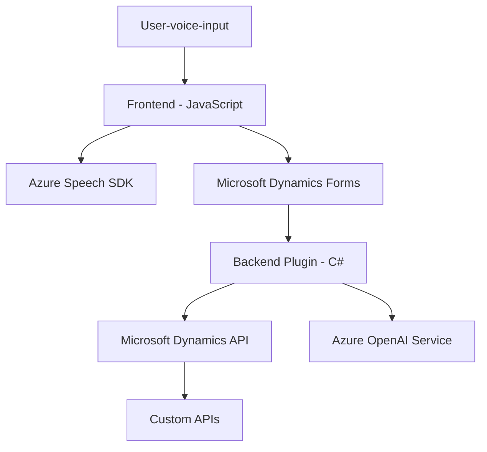

### Breve Resumen Técnico

El repositorio presenta una solución orientada a integraciones avanzadas con Microsoft Dynamics CRM mediante el uso de entrada y salida por voz y procesamiento de texto con servicios de Azure Speech SDK y Azure OpenAI. La solución utiliza archivos de frontend desarrollados en JavaScript (integrados en Dynamics) y un plugin de backend en C#, diseñado exclusivamente para extender las capacidades del CRM.

---

### Descripción de Arquitectura

La arquitectura corresponde a un **modelo híbrido dividido en capas**, donde se delega la interacción directa con usuarios al frontend y la ejecución de lógica de negocio avanzada al backend. Los componentes principales son:
1. **Frontend**: Implementación de funcionalidades basadas en voz y transcripciones en formularios de Dynamics CRM, utilizando el Azure Speech SDK y APIs locales de Dynamics.
2. **Backend (Plugin)**: Procesamiento avanzado de texto con integración a Azure OpenAI, ejecutado mediante un plugin que extiende la funcionalidad predeterminada de Dynamics CRM.

Estos elementos interactúan bajo un enfoque de integración directa con servicios externos (Azure Speech y OpenAI).

---

### Tecnologías Utilizadas

1. **Frontend (JavaScript)**:
   - **Azure Speech SDK** para entrada y salida de voz.
   - **Microsoft Dynamics Web APIs** (`Xrm.WebApi`) para manipulación de formularios.
   - Modularización basada en funciones independientes y carga dinámica de dependencias (`ensureSpeechSDKLoaded`).

2. **Backend (C#)**:
   - **Microsoft.Xrm.Sdk**: Framework para el desarrollo de plugins CRM.
   - **Azure OpenAI Service** (GPT) para transformación de texto.
   - Librerías adicionales:
     - `System.Text.Json` y `Newtonsoft.Json.Linq` para manipular JSON.
     - `System.Net.Http` para realizar solicitudes HTTP a Azure OpenAI.

3. **Patrones de diseño**:
   - **Cliente-API**: El frontend actúa como cliente de servicios externos (Azure Speech SDK y Dynamics APIs), lo que deja la lógica de procesamiento avanzada al backend.
   - **Capa de servicios**: Backend como plugin CRM que procesa texto con una lógica encapsulada.
   - **Carga condicional de dependencias**: El frontend carga dinámicamente el Azure Speech SDK solo cuando es necesario.

---

### Diagrama Mermaid

---

### Conclusión Final

La solución usa una arquitectura híbrida de **frontend y backend modular**, altamente dependiente de Microsoft Dynamics CRM y servicios de Azure. El uso del SDK de Azure Speech y servicios OpenAI refuerza su enfoque hacia la interacción por voz e inteligencia artificial, mientras que la separación entre cliente y lógica backend permite escalabilidad y mantenimiento eficiente.

Aunque la solución está anclada en un ecosistema cerrado (Microsoft Dynamics y Azure), su diseño modular y su integración flexible con servicios externos la hace extensible para futuras necesidades de IA o interacciones de usuario más avanzadas.