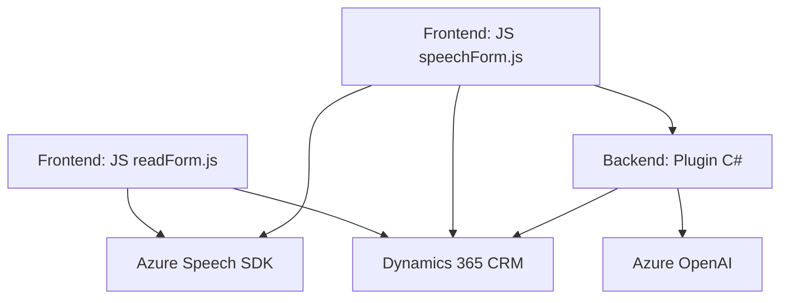

### Resumen técnico
Este repositorio alberga una solución híbrida compuesta por integraciones con servicios de Azure y Dynamics 365 CRM. En particular, combina componentes de frontend (en JavaScript) con un plugin backend desarrollado en C#. La arquitectura está diseñada para interactuar con servicios externos (Azure Speech SDK y Azure OpenAI) para implementar funcionalidades avanzadas como reconocimiento de voz, síntesis de voz y transformación de texto.

---

### Descripción de arquitectura
La solución presenta una **arquitectura por capas**:
1. **Frontend:**
   - Manejo de la interfaz y procesamiento preliminar de datos del formulario CRM.
   - Implementación crucial en JavaScript para interactuar con SDKs de Azure Speech dinámicamente.
2. **Backend:**
   - Un plugin en C# que extiende la funcionalidad del CRM Dynamics para integrar con Azure OpenAI, transformando datos según reglas predefinidas.
3. **Servicios externos:**
   - Uso de **Azure Speech SDK** para reconocimiento y síntesis de voz.
   - Interacción con **Azure OpenAI** para transformación avanzada de texto.

Dado el uso modular de archivos y separación clara de responsabilidades, este sistema se asemeja a un **modelo n-capas**, aunque con integración de servicios externos (lo que también le da elementos de microservicios).

---

### Tecnologías usadas
1. **Frontend:**
   - **JavaScript**: Implementación de lógica de reconocimiento y síntesis de voz.
   - **Azure Speech SDK**: Proporciona API para entrada y salida de voz.
   - **Dynamics 365 Web API**: Usada para interactuar con entidades del CRM.
   - **DOM**: Se utiliza para manipulación básica de HTML.
   
2. **Backend:**
   - **C#** con **.NET Framework**: Código de plugin compatible con Dynamics CRM.
   - **Azure OpenAI**: Motor de transformación avanzada de texto usando modelos como GPT.
   - **Newtonsoft.Json**, **System.Net.Http**: Para manejo de solicitudes HTTP y JSON.

3. **Servicios externos:**
   - **Dynamics 365 CRM**: Middleware central del sistema.
   - **Azure Speech SDK y Azure OpenAI**: Fuentes principales para las capacidades cognitivas.

4. **Patrones de diseño:**
   - **Gestión dinámica de dependencias** (carga a demanda de SDK).
   - **Separación de responsabilidades** (lo lógico está separado entre frontend y backend).
   - **Integración orientada a servicios** (comunicación con Azure).

---

### Diagrama Mermaid

---

### Conclusión final
La solución implementada en este repositorio es **híbrida**, con una arquitectura de **n-capas** que combina un frontend en JavaScript con un backend en C#. El foco principal es integrar servicios de Azure (Speech SDK y OpenAI) para potenciar las capacidades en Dynamics 365 CRM. El diseño promueve modularidad y extensibilidad, facilitando la interacción contextual y en tiempo real con datos CRM a través de voz y transformaciones de texto. Gracias a su uso de tecnologías modernas, esta solución aborda casos de uso avanzados en automatización de formularios y experiencias de usuario basadas en IA.