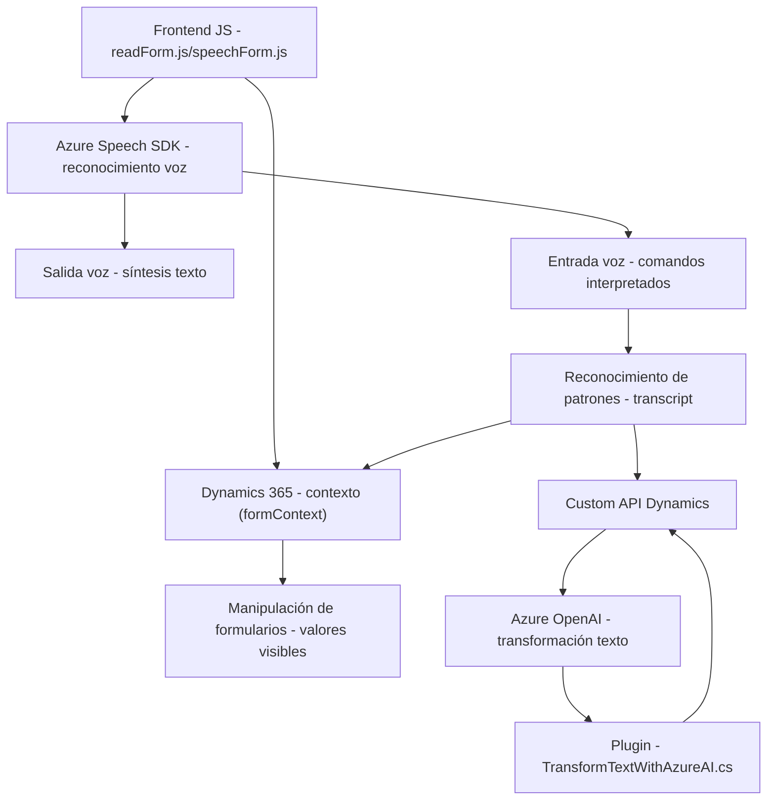

### Breve Resumen Técnico
El repositorio implementa funcionalidades centradas en la integración entre sistemas basados en formularios de Dynamics 365 y servicios de inteligencia, como Azure OpenAI y Azure Speech SDK. Incluye archivos para habilitar **entrada y salida de voz**, así como transformación avanzada de texto mediante servicios externos. Es una solución híbrida que combina frontend con plugins para interacción más avanzada y enriquecida, proporcionando accesibilidad y automatización.

---

### Descripción de Arquitectura
La arquitectura combina varios estilos:
- **N Capas**: La solución tiene componentes separados como frontend (archivos `.js`) y backend (plugin `.cs`) que interactúan con diferentes servicios y capas de la arquitectura empresarial.
- **Integración de Servicios Externos**: Se emplean APIs de inteligencia artificial y speech-to-text (Azure OpenAI, Azure Speech SDK) que integran capacidades avanzadas sin procesamiento local.
- **Event-Driven Design**: En el frontend, se identifican patrones que verifican eventos asincrónicos (p. ej., carga dinámica del SDK).
- **Microservicios (parcial)**: El plugin `TransformTextWithAzureAI.cs` muestra un enfoque hacia interacción con microservicios externos (Azure OpenAI).
- **Modularidad**: Organización lógica de funciones y clases independientes que garantizan separación de preocupaciones.

---

### Tecnologías y Frameworks Usados
1. **Frontend**:
   - **JavaScript/ES6+**: Para manipulación del contexto de formulario (`executionContext`) y generación de voz.
   - **Azure Speech SDK**: Usado para entrada y salida de voz.
   - **Dynamics 365 SDK (Xrm)**: Acceso y manipulación de formularios desde JavaScript utilizando el contexto de Dynamics.

2. **Backend**:
   - **C#**: Uso en plugin `TransformTextWithAzureAI.cs` para procesamiento del texto.
   - **Azure OpenAI API**: Transformación y análisis de texto estructurado mediante inteligencia artificial.
   - **Newtonsoft.Json**: Formateo y manipulación de datos JSON.

3. **Infraestructura**:
   - **REST APIs**: Uso de API externas para reconocimiento y procesado de voz/texto.
   - **Dynamics Web Services**: Para comunicación segura entre componentes del sistema.

4. **Patrones de Diseño**:
   - **Callback/Event-Driven**: Para cargar dinámicamente SDK y asegurar la disponibilidad de dependencias externas.
   - **Adapter Pattern**: Uso implícito en `TransformTextWithAzureAI.cs` para integrar Dynamics con Azure OpenAI.

---

### Diagrama Mermaid Válido para GitHub

---

### Conclusión Final
La solución es una combinación de un **frontend enriquecido** y **backend inteligente**, integrados con servicios externos de Microsoft Azure para habilitar funcionalidades avanzadas como interacción por voz y análisis semántico. Su diseño modular y el uso de APIs de inteligencia y reconocimiento lo hace ideal para sistemas CRM empresariales donde hay foco en accesibilidad y procesamiento automatizado. Además, emplea un enfoque arquitectónico flexible (n-capas y microservicios parciales) que puede escalar según las necesidades del entorno.