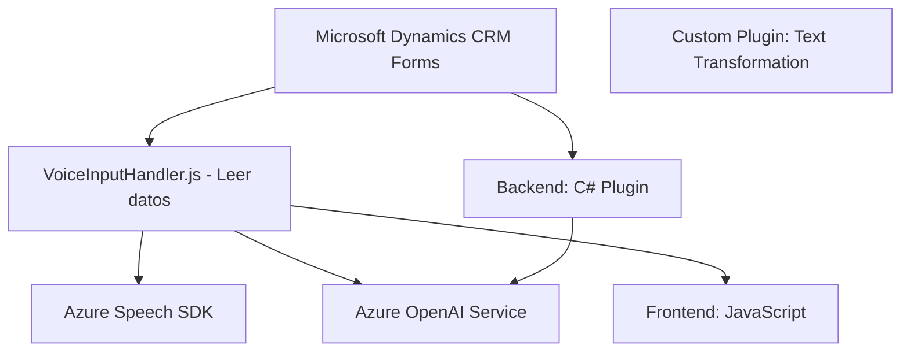

### Breve resumen técnico
El repositorio combina tres componentes dentro de una solución que transforma y procesa datos en un entorno de Microsoft Dynamics CRM. Los archivos analizados resuelven funcionalidades de integración entre formularios del CRM, entrada de voz mediante Azure Speech SDK, y procesamiento de texto con un plugin que aprovecha capacidades de Azure OpenAI.

---

### Descripción de arquitectura
La solución tiene una arquitectura modular con integración de servicios externos, siguiendo un enfoque de múltiples capas. Se utiliza Dynamics CRM como núcleo, complementado por servicios de Azure para entrada de voz y procesamiento de inteligencia artificial. El diseño mezcla el patrón **N capas** con un enfoque de integración orientado a servicios, dado que los diferentes archivos tienen roles específicos pero dependen de conexiones externas.

1. **Frontend (JavaScript):** Implementa el manejo de datos en formularios de Microsoft Dynamics CRM mediante eventos y APIs de entrada de voz (Speech SDK).
2. **Plugin Backend (.NET):** Extiende Dynamics CRM al integrar un microservicio alojado en Azure OpenAI para procesamiento de texto.
3. **Servicios Externos:** Múltiples integraciones, como Azure Speech SDK y OpenAI, para habilitar funciones avanzadas sobre el CRM.

---

### Tecnologías usadas
1. **Frontend:**
   - **JavaScript**: Lenguaje principal para operar sobre formularios y gestionar entrada de datos.
   - **Azure Speech SDK**: Para reconocimiento y síntesis de voz.
   - **Microsoft CRM Frameworks**: API dinámica de extensibilidad (`executionContext` y `Xrm.WebApi`).
   
2. **Plugin Backend:**
   - **C# (.NET Framework)**: Implementación de plugins basados en `IPlugin` para Dynamics CRM.
   - **Azure OpenAI Service**: Llamadas REST para el procesamiento de textos estructurados.
   - **JSON Utils**: Manejo avanzado de estructuras JSON con `Newtonsoft.Json` y `System.Text.Json`.

3. **Frameworks y Patrones aplicados:**
   - **Carga dinámica**: SDK y APIs cargados bajo demanda según contexto de ejecución.
   - **Integración de servicios (SOA)**: Acoplamiento flexible entre servicios externos (Azure Speech y OpenAI).
   - **Plugin Architecture**: Usando `IPlugin` para extender las capacidades de Dynamics CRM.

---

### Diagrama Mermaid

Este diagrama muestra los flujos principales y dependencias.

---

### Conclusión final
La solución es un ecosistema centrado en Microsoft Dynamics CRM, diseñado para mejorar la interacción de los usuarios con los formularios usando tecnologías innovadoras como reconocimiento de voz (Azure Speech SDK) y procesamiento de inteligencia artificial (Azure OpenAI). La arquitectura está compuesta por componentes frontend y backend organizados en una estructura modular, con patrones como integración de servicios y orientación a eventos. Se puede ampliar fácilmente para incluir nuevas funcionalidades y servicios, aunque mejoraría con una gestión más segura de credenciales y configuraciones sensibles.