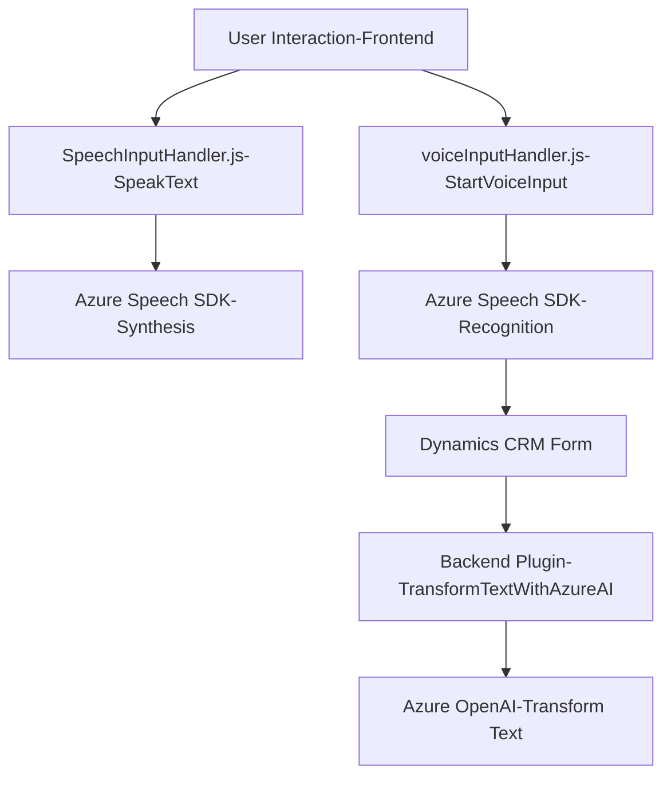

### Breve resumen técnico
El repositorio contiene tres tipos de archivos altamente relacionados que integran funcionalidades de reconocimiento y síntesis de voz con formularios dinámicos en Microsoft Dynamics CRM, apoyándose en Microsoft Azure (Speech SDK y OpenAI). La solución combina la interacción front-end con JavaScript para la gestión de voz y el back-end con plugins en C# para procesamiento contextual avanzado.

---

### Descripción de arquitectura
1. **Tipo de solución:** Esta solución mezcla componentes **front-end** (interacción directa con el usuario a través de voz) y **back-end** (plugins procesando lógica del servidor).
2. **Arquitectura implementada:**
   - **N capas:** Se observan claramente al menos dos capas principales:
     - Una capa cliente (front-end) que opera mediante funciones de gestión de voz (lectura y captura de valores del formulario).
     - Una capa servidor (back-end) representada por un plugin que consume servicios de Azure OpenAI para el procesamiento avanzado de texto.
   - **Componentes asincrónicos:** Las partes del sistema como el reconocimiento de voz y transformaciones por IA dependen de servicios externos (Azure Speech SDK y OpenAI), lo cual le otorga rasgos de **microservicio externo**.

---

### Tecnologías utilizadas
1. **Front-End:**
   - Lenguaje: JavaScript.
   - Frameworks: 
     - Azure Speech SDK.
     - Dynamics CRM API (`formContext`, `WebApi`).
   - Patrones aplicados:
     - Modularidad funcional: Cada función tiene un propósito claro.
     - Integración cliente-servicio: Comunicación directa con Azure Speech SDK.

2. **Back-End:** 
   - Lenguaje: C#.
   - Frameworks/Librerías:
     - Microsoft Dynamics SDK (`IPlugin`, `IOrganizationService`).
     - Azure OpenAI API.
     - Newtonsoft.Json para manipulación de JSON.
     - `System.Net.Http` para llamadas HTTP REST.
   - Patrones aplicados:
     - Plugin Pattern: Implementación específica para ampliar las capacidades de Dynamics CRM.
     - Microservicios: Uso de Azure OpenAI como servicio externo.

---

### Diagrama Mermaid

---

### Conclusión final
La solución presentada es una arquitectura mixta basada en n capas que se apoya en servicios externos (Azure Speech SDK para reconocimiento y síntesis de voz y Azure OpenAI para procesamiento de texto avanzado). Está diseñada para ser modular y extensible, utilizando dinámicamente APIs y SDKs de Microsoft Dynamics CRM y Azure. Potencia la interacción usuario-tecnología mediante voz a texto y automatiza la conversión de texto en formularios dinámicos, lo que crea una experiencia avanzada para usuarios empresariales y posibilita la integración con IA.