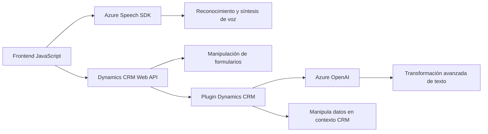

### Análisis Técnico del Repositorio

#### 1. **Tipo de solución**
La solución es un sistema que ofrece una funcionalidad basada en servicios de Azure (Azure Speech SDK y Azure OpenAI) para habilitar la interacción por voz e inteligencia artificial con formularios en una plataforma CRM (Dynamics 365). Combina varios componentes:
- **Frontend**: Scripts JavaScript para interactuar con el SDK y la API de Dynamics 365.
- **Backend (Plugin)**: Un complemento que se ejecuta en el contexto de Dynamics CRM y aprovecha el servicio Azure OpenAI para manipulación avanzada de texto.
- **Servicios externos**: La solución hace uso activo de APIs en la nube como Azure Speech y Azure OpenAI.

---

#### 2. **Tecnologías, frameworks y patrones usados**
1. **Tecnologías y frameworks**:
   - **Frontend (JavaScript)**:
     - `Azure Speech SDK`: Implementado en el navegador para síntesis de voz y reconocimiento de voz.
     - Dynamics 365 Web API: Manipulación de formularios y datos CRM desde los scripts con funciones como `Xrm.WebApi.online.execute`.
   - **Backend (C#)**:
     - **Microsoft Dynamics CRM SDK**: Para la creación de plugins que interactúan con el modelo de entidades de CRM.
     - **Azure OpenAI Service**: Realiza transformaciones de texto avanzadas.
     - **System.Net.Http & System.Text.Json**: Para hacer llamadas REST al servicio OpenAI y manejar JSON.
   - **Servicios externos**:
     - Integración directa con Azure Speech y OpenAI.
   
2. **Patrones de diseño y arquitectura**:
   - **Modularización**: A cada función se le asigna un rol bien definido, como lógica de reconocimiento de voz, manejo de errores y transformación de datos.
   - **Patrón Lazy Loading** para cargar el SDK de manera dinámica y eficiente, sólo cuando sea necesario.
   - **Event-driven programming**: Actividades como comenzar grabaciones, aplicar valores al formulario y ejecutar la transformación de texto se disparan a partir de eventos de usuario.
   - **Plugin Dynamics CRM**: Arquitectura clásica en extensiones que se encapsulan dentro de la ejecución de eventos del sistema CRM.
   - **Microservicio AI**: Uso de una API externa (Azure OpenAI) como solución desacoplada para procesamiento avanzado.

---

#### 3. **Arquitectura general**
La solución sigue un **modelo híbrido de arquitectura**:
- **N-capas**: Teniendo el frontend (interacción con el SDK y el usuario), el backend (plugin CRM) y el servicio externo (Azure Speech y OpenAI).
- **Cliente-Servidor**:
   - Frontend: JavaScript interactivo que utiliza el SDK de Azure Speech.
   - Backend: Plugin en C# que accede a datos y contexto de Dynamics CRM.
   - Servicios externos: APIs en la nube para procesamiento de voz y texto.
- **Integración de servicios en la nube**:
   - La solución se basa en recursos Cloud (Azure Speech y Azure OpenAI) para proporcionar una experiencia mejorada.

---

#### 4. **Dependencias externas**
1. **Servicios externos**:
   - Azure Speech SDK: Reconocimiento y síntesis de voz.
   - Azure OpenAI Service: Transformaciones avanzadas de texto.
2. **Librerías**:
   - `Newtonsoft.Json.Linq` (en backend): Procesamiento dinámico de JSON.
   - Dynamics 365 Web API: Métodos como `Xrm.WebApi.online.execute` y `Xrm.WebApi.retrieveMultipleRecords`.
3. **Infraestructura de Dynamics CRM**:
   - Contexto de ejecución (`IServiceProvider`).
   - Manipulación de entidades y atributos (`IOrganizationService`).

---

### Diagrama de Arquitectura Mermaid

---

### Conclusión Final
Este repositorio ofrece una solución integrada para mejorar la interacción entre usuarios y sistemas CRM mediante reconocimiento de voz, procesamiento de texto y servicios en la nube. Está diseñado para escenarios donde la accesibilidad y la automatización son clave (como CRM basado en Dynamics 365). La arquitectura aprovecha principios modernos como la modularización, desacoplamiento con APIs externas y extensibilidad en cloud computing.