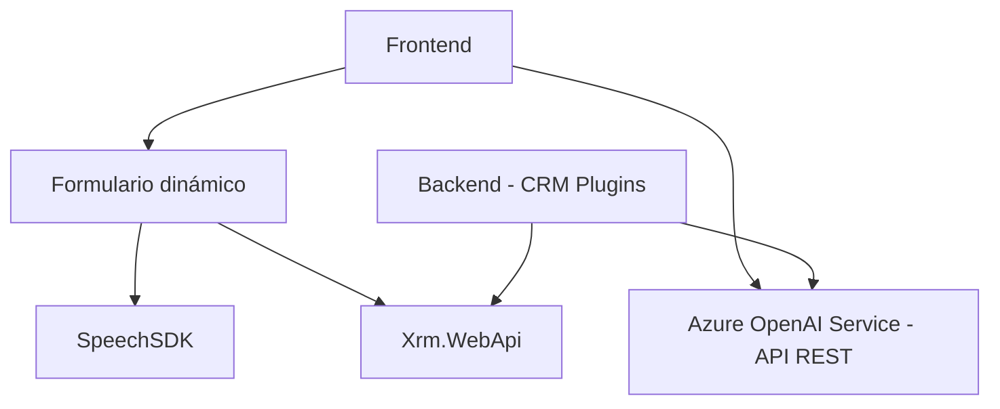

### Breve resumen técnico

La estructura del repositorio muestra una solución integrada que combina funcionalidades frontend y plugins de extensibilidad para Microsoft Dynamics CRM. Utilizando tecnologías y servicios de Azure, la solución implementa síntesis de voz, reconocimiento de voz y procesamiento de texto mediante Inteligencia Artificial y APIs REST de Azure OpenAI Service. Las tecnologías involucradas apuntan hacia una arquitectura híbrida orientada a servicios con integración directa entre frontend y backend.

---

### Descripción de arquitectura

1. **Tipo de solución**
   - La solución es **una aplicación híbrida**:
     - **Frontend:** Capacidad de procesamiento de formularios y síntesis de voz interactiva mediante Azure Speech SDK.
     - **Backend:** Un plugin basado en el SDK de Microsoft Dynamics CRM para transformación de datos con Azure OpenAI.

2. **Arquitectura**
   - **Frontend:** 
     - **Multicapa simple:** Organización modular separando la lógica de negocio y las interacciones con el usuario.
     - Servicios externos como el Speech SDK son utilizados para funcionalidades avanzadas (reconocimiento y síntesis de voz).
   - **Backend:** 
     - **Modelo de Plugin**: Implementación basada en la arquitectura de extensibilidad para CRM (Microsoft Dynamics), con comunicación con un servicio IA externo.
     - **Orientación a servicios:** Implemente servicios externos mediante integraciones REST.

---

### Tecnologías y patrones usados

**Frontend**
- **JavaScript:** Lenguaje utilizado para implementar la lógica de procesamiento del DOM y los formularios dinámicos.
- **Azure Speech SDK:** Utilizado para reconocimiento y síntesis de voz.
- **Xrm.WebApi:** API para interactuar con formularios y datos en entornos CRM.
- **Modularización por funciones pequeñas:** El código para el frontend está bien estructurado, con funciones independientes.

**Backend**
- **C#:** Lenguaje utilizado para desarrollar plugins.
- **Microsoft Dynamics CRM SDK:** Utilizado para integrar operaciones con el entorno CRM.
- **Azure OpenAI Service API:** Implementación de procesamiento de texto con modelos avanzados de GPT.

**Patrones de diseño**
- **Integración de servicios:** La solución se adapta al uso de SDKs y APIs externos.
- **Extensibilidad (CRM Plugins):** Los plugins amplían directamente la funcionalidad del entorno Microsoft CRM.
- **Modularidad:** Funciones bien definidas tanto para el frontend como para el backend.

---

### Dependencias o componentes externos presentes
1. **Backend:**
   - Microsoft Dynamics CRM SDK: Para implementar plugins.
   - Azure OpenAI Service (REST API): Para transformación de texto con modelos como GPT.
   - Bibliotecas estándar de C# (`System.Net.Http`, `Newtonsoft.Json`).

2. **Frontend:**
   - Speech SDK de Azure (integrado de manera externa vía script).
   - Xrm.WebApi: API de Microsoft para manipular el contexto de formularios en CRM.
   - Funcionalidades del navegador (DOM para interacción dinámica con el SDK).

---

### Diagrama Mermaid

Aquí el diagrama refleja la interacción principal entre los componentes del frontend, backend y servicios externos:

---

### Conclusión final

La solución está diseñada como un sistema híbrido que combina funcionalidades de frontend y backend, integrando servicios externos como Azure Speech SDK y Azure OpenAI Service. La arquitectura está orientada a **servicios modulares** y **extensibilidad**, aprovechando el SDK de Microsoft Dynamics CRM para personalizar el entorno y añadir capacidades avanzadas de reconocimiento y transformación de texto mediante IA.

Las áreas clave de mejora incluyen:
- **Seguridad:** La clave de API y las configuraciones sensibles deberían manejarse a través de variables de entorno.
- **Documentación:** Explicaciones adicionales sobre las reglas de transformación y los datos manejados por los plugins.

La solución muestra un buen nivel de cohesión en términos técnicos y estructuras usadas, logrando conectividad fluida entre los componentes integrados.