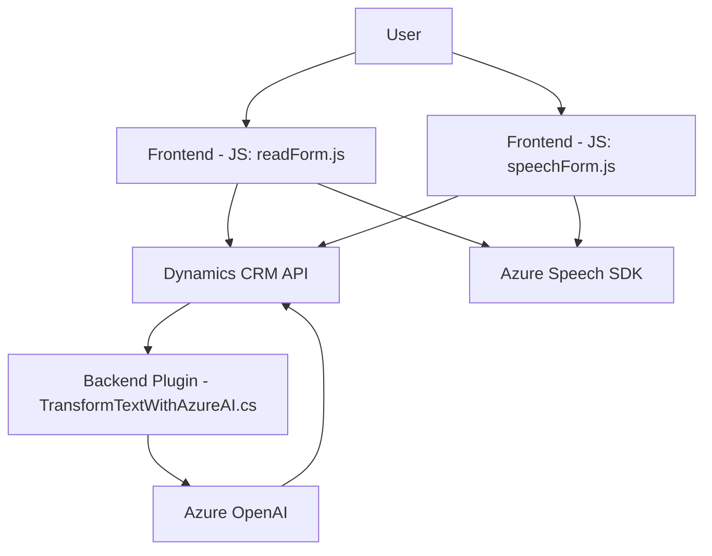

### Breve Resumen Técnico:

La solución presentada en el repositorio muestra varios archivos diseñados a partir de integraciones con Microsoft Dynamics CRM y el Azure SDK. Se trata de una arquitectura orientada a formularios con capacidad de entrada de voz, transcripción y procesamiento dinámico mediante servicios externos. Además, integra servicios de Azure OpenAI y Azure Speech para mejorar la experiencia del usuario.

---

### Descripción de Arquitectura:

La solución sigue una arquitectura de **n capas** con integración modular entre componentes. Esto incluye:

1. **Presentación (Frontend):** Archivos JS (`readForm.js`, `speechForm.js`) orientados a formularios CRM.
2. **Lógica de Aplicación:** Plugins como `TransformTextWithAzureAI.cs` que implementan la lógica de negocios en Dynamics CRM.
3. **Servicios Externos:** Azure Speech SDK (para síntesis y reconocimiento de voz) y Azure OpenAI (para transformación de texto), actuando como microservicios o APIs auxiliares.

---

### Tecnologías Usadas:

1. **Frontend:**
   - JavaScript.
   - Dynamics CRM API (`formContext`, `Xrm.WebApi`).
   - Azure Speech SDK (cargado dinámicamente desde CDN).

2. **Backend:**
   - C# (.NET Framework).
   - Dynamics CRM Plugin SDK (`IPlugin`, `IOrganizationService`).
   - Azure OpenAI.

3. **Patrones Observados:**
   - **Lazy Loading:** SDK cargado dinámicamente en JS para optimizar recursos.
   - **Callback/Event-driven Execution:** Flujo asíncrono en funciones JS.
   - **Dependency Injection:** En plugins, mediante `IServiceProvider`.

---

### Dependencias o Componentes Externos:

1. **SDKs y APIs:**
   - **Azure Speech SDK**: Reconocimiento y síntesis de voz.
   - **Azure OpenAI Service:** Transformación avanzada de texto.
   - **Dynamics CRM:** API de manejo y entrada de datos desde formularios contextuales.

2. **Librerías:**
   - `Newtonsoft.Json` (para manipulación de JSON en plugins).
   - `System.Text.Json` y otras estándar de .NET.

---

### Diagrama Mermaid:

Este diagrama refleja la estructura y flujo general entre los componentes de la solución.

---

### Conclusión Final:

La solución es híbrida y combina tecnologías frontend (JavaScript for Dynamics CRM forms) y backend plugins en C#, integrando servicios externos de Azure para manejo de voz y procesamiento de datos. Su arquitectura es **n capas** basada en sistemas Dynamics CRM, que comunica módulos frontend con lógica backend y servicios externos como Azure OpenAI y Speech. Esto proporciona una experiencia dinámica en tiempo real para el usuario, optimizando el flujo de datos entre formularios y servicios IA.