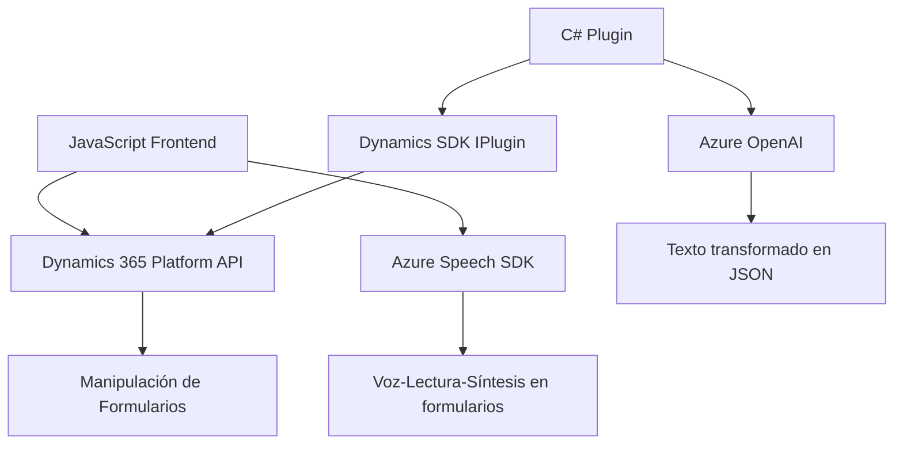

### Breve resumen técnico

El repositorio contiene componentes para un **Dynamics 365** integrado con **Azure Services**, enfocados en la accesibilidad de aplicaciones empresariales (entrada/salida de voz para formularios) y procesamiento avanzado de texto mediante inteligencia artificial. Incluye archivos de frontend y plugins backend.

---

### Descripción de arquitectura

1. **Arquitectura general**:
   - **Multicapa Client/Server**:
     - **Frontend**: Compuesto por archivos JavaScript que manejan la accesibilidad (voz) utilizando **Azure Speech SDK**.
     - **Backend/Plugins**: Implementa lógica personalizada en eventos del sistema de Dynamics 365, comunicándose con Azure OpenAI para procesamiento de datos.

2. **Arquitectura por capas**:
   - **Capa de presentación (Frontend)**: Maneja interacción del usuario y procesos accesibles. Usa SDKs en capa Client.
   - **Capa de lógica empresarial (Plugins)**: Define reglas, transformaciones de texto y envía/recibe datos desde APIs externas.
   - **Capa de servicios externos**: APIs de Azure Speech y Azure OpenAI procesan la lectura/transformación de texto.

3. **Patrones usados**:
   - **Callback/Delegation Pattern**: Delegación de procesos según la carga de SDKs (Azure Speech en Frontend).
   - **Modularización**: Separación de funciones en Frontend y métodos en Plugin.
   - **API Gateway**: Dynamics 365 como punto central de integración entre datos empresariales y servicios externos.
   - **Async Integration**: Uso de promesas para manejar flujos asincrónicos con Azure Services.

---

### Tecnologías utilizadas

1. **Frontend**:
   - **JavaScript**: Procesos de voz/lectura para accesibilidad.
   - **Azure Speech SDK**: Manejo de entrada y salida de datos de voz.
   - **Dynamics Platform API**: Manipulación de formularios.

2. **Backend**:
   - **C# (Plugins)**: Lógica empresarial dinámica.
   - **Microsoft Dynamics SDK (`IPlugin`)**: Personalización de eventos y datos.
   - **Azure OpenAI Services**: Transformación e inteligencia artificial aplicada al texto.
   - **JSON Manipulation**: NewtonSoft.Json y System.Text.Json para procesar datos estructurados.

3. **Integración**:
   - **HTTP Client**: Comunicación con las APIs externas.

---

### Diagrama **Mermaid** válido para GitHub

---

### Conclusión final

La solución propuesta integra servicios de accesibilidad para formularios empresariales con inteligencia artificial y reconocimiento de voz. La arquitectura es **multicapa**, con componentes frontend y backend claramente diferenciados. El uso de SDKs como Azure Speech y OpenAI habilitan funciones avanzadas, como accesibilidad por voz, transcripciones dinámicas y procesamiento de texto con IA. 

Es excelente para entornos empresariales que requieren accesibilidad y automatización avanzada, pudiendo ser ampliado mediante APIs adicionales y arquitecturas desacopladas (microservicios).