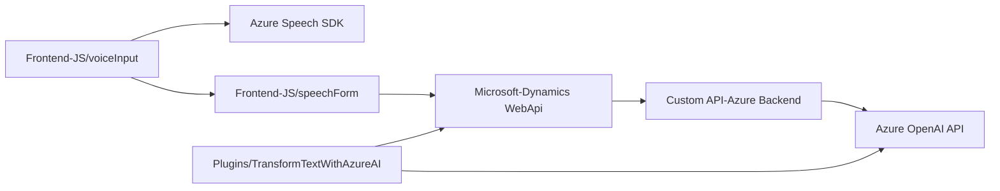

### Resumen técnico
El repositorio contiene una solución multifacética que integra procesamiento de formularios, reconocimiento de voz y transformación basada en inteligencia artificial. Está diseñado para interactuar con formularios web y un sistema CRM (Dynamics), aprovechando Azure Speech SDK y Azure OpenAI para síntesis de voz y transformación de texto.

### Descripción de arquitectura
La solución parece implementar una arquitectura **modular de capa intermedia**, donde los componentes interactúan con diferentes servicios (Azure Speech SDK, Dynamics CRM, Azure OpenAI). En términos generales:
- **Frontend:** Contiene scripts en JavaScript segmentados para la captura de datos en formularios y reconocimiento/síntesis de voz.
- **Backend:** Incluye un plugin en C# para Dynamics CRM que procesa texto utilizando Azure OpenAI.
- **Integración de servicios externos:** Los scripts de frontend y el plugin están configurados para comunicarse con APIs externas (Azure Speech SDK y OpenAI).

La solución utiliza una combinación de patrones, incluyendo **event-driven architecture**, modularidad, y **integración basada en servicios externos**.

### Tecnologías usadas
#### Frontend:
1. **JavaScript:** Manejo de lógica para la interfaz de usuario y comunicación con servicios externos.
2. **Azure Speech SDK:** Reconocimiento y síntesis de voz.
3. **Dynamics CRM JS API (`Xrm.WebApi`):** Interacción con datos del CRM.
4. **Promesas y métodos asíncronos:** Manejo de procesos dependientes de servicios externos.

#### Backend:
1. **C# Plugin para Dynamics CRM:**
   - Extiende `IPlugin` para personalizar el manejo de eventos dentro del CRM.
   - **HttpClient** para comunicación con el servicio de OpenAI.
   - **Newtonsoft.Json** para manipulación y transformación de datos en JSON.
   - Lógica escalable mediante reglas definidas por el usuario (normas personalizadas).

#### Servicios Externos:
1. **Azure Speech SDK:** Para transcripción de voz y síntesis en tiempo real.
2. **Azure OpenAI API:** Para procesamiento y transformación avanzada de texto.

### Dependencias o componentes externos
1. **Azure Speech SDK:** Carga dinámica durante la ejecución y empleado para síntesis y transcripción de voz.
2. **Azure OpenAI API:** A través del plugin en Dynamics CRM para procesamiento de texto avanzado.
3. **Microsoft Dynamics CRM API:** Para integrarse con datos y funcionalidades del CRM.
4. **Newtonsoft.Json.JSON.Net & System.Text.Json:** Manipulación y serialización de datos JSON (empleado en el plugin).

---

### Diagrama Mermaid

---

### Conclusión final
La solución está compuesta por componentes frontend y backend que se integran con APIs externas para alcanzar funcionalidades avanzadas. La arquitectura es **modular con capas claramente definidas**, donde los scripts en el frontend gestionan la interacción del usuario y la síntesis/reconocimiento de voz, y el plugin de backend procesa las transformaciones avanzadas del texto, comunicándose con Azure OpenAI. La utilidad de esta solución es evidente en escenarios donde el reconocimiento de voz, junto con el análisis de datos y uso de IA, puede optimizar procesos en CRMs y sistemas de entrada de datos transaccionales.

Se sigue un enfoque efectivo de modularidad y delegación para garantizar escalabilidad y mantenibilidad en entornos altamente interdependientes.