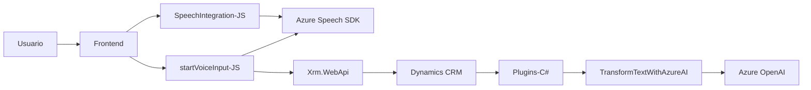

### Análisis técnico y estructural del repositorio

#### Breve resumen técnico
El repositorio implementa una solución híbrida que integra procesamiento de texto y voz usando Azure Speech SDK, manipulación de formularios en el contexto de Dynamics 365 CRM (Frontend), y enriquecimiento de datos mediante Azure OpenAI a través de un plugin en el backend de Dynamics 365. La solución está orientada a mejorar la interacción usuario-formulario mediante interfaces avanzadas de reconocimiento de voz, síntesis de voz, y transformación inteligente de datos.

---

### Descripción de arquitectura
La arquitectura presente se puede desglosar en tres partes principales:
1. **Frontend** (JavaScript):
   - Implementa funcionalidades de voz a texto y texto a voz usando Azure Speech SDK.
   - Manejo de datos del formulario con mapeo y transformación de atributos.
   - Comunicación con APIs personalizadas en Dynamics 365.
   - Utiliza patrones modulares y carga dinámica de dependencias.

2. **Backend** (Plugins en C#):
   - Implementa plugins personalizados para integrar Azure OpenAI en Dynamics CRM.
   - Patrones de consumo de API y serialización de datos JSON.
   - Uso de la API de Dynamics (`Microsoft.Xrm.Sdk`) y su ecosistema para manipular base de datos CRM.

3. **API Externa (Azure OpenAI y Speech SDK)**:
   - Transformación de texto usando modelos de aprendizaje profundo (GPT-4).
   - Síntesis y reconocimiento de voz para mejorar la experiencia del usuario.

#### Tipo de arquitectura
La solución está basada en una **arquitectura de capas**:
- **Capa de presentación** (Frontend): Controla la interacción con el usuario y utiliza componentes del navegador para audio y formularios. Usa Azure Speech SDK como capa externa.
- **Capa lógica de negocio** (Backend): Realizada mediante plugins para lógica específica usando Dynamics 365 CRM.
- **Capa de servicios externos**: Servicios en la nube (Azure Speech SDK y OpenAI).

Aunque la arquitectura es de capas, también incluye integración de servicios externos, lo que le da características propias de arquitectura híbrida.

---

### Tecnologías, frameworks y patrones observados
#### Tecnologías usadas
1. **Frontend**:
   - JavaScript (modular structure).
   - Azure Speech SDK.
   - Dynamics CRM WebApi (Xrm.WebApi).
2. **Backend**:
   - C# (.NET Framework).
   - Dynamics SDK (`Microsoft.Xrm.Sdk`).
   - Azure OpenAI.
   - Newtonsoft.Json para manejo de JSON.
3. **Servicios externos**:
   - Azure Speech y OpenAI.

#### Patrones observados
1. **SDK Loader Pattern**: Dinámica de cargar SDK en tiempo de ejecución, visto en la función `ensureSpeechSDKLoaded`.
2. **Modular Design**: Funcionalidades en el frontend y backend están divididas por responsabilidades específicas.
3. **Service Locator**: Uso de `IServiceProvider` en el backend para obtener servicios.
4. **Plugin-based architecture**: Ampliación funcional mediante implementación de `IPlugin` en Dynamics CRM.

---

### Dependencias o componentes externos presentes
1. **Azure Speech SDK**: Para reconocimiento y síntesis de voz.
2. **Azure OpenAI**: Para transformación avanzada de texto mediante modelos GPT.
3. **Xrm.WebApi**: API de Dynamics CRM para manipulación de datos y lógica de negocio personalizada.
4. **Newtonsoft.Json**: Para procesamiento eficiente de respuestas JSON.
5. **Servicios del navegador**: Manipulación de scripts y gestión de atributos del DOM.

---

### Diagrama Mermaid válido para GitHub Markdown

---

### Conclusión final
La solución descrita combina capacidades de frontend y backend para crear una experiencia enriquecida alrededor de formularios en plataformas CRM. Usa tecnologías modernas como Azure Speech SDK y Azure OpenAI para potenciar la interacción basada en voz y la transformación inteligente de información. La arquitectura es modular y flexible, lo que permite integrar dinámicamente SDKs y consumir servicios externos. Sin embargo, el éxito en la implementación depende de la correcta configuración de claves y dependencias externas en el entorno de producción.