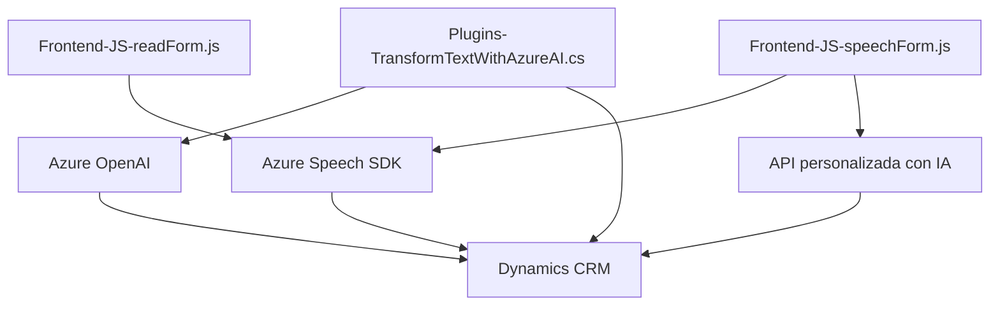

### Breve resumen técnico
El repositorio presenta tres archivos organizados en diferentes áreas funcionales:
1. **Frontend/JS/readForm.js**: Procesa datos visibles del formulario y los convierte en audio sintetizado usando **Azure Speech SDK**.
2. **Frontend/JS/speechForm.js**: Maneja entrada de voz, interpreta transcripciones y aplica valores a formularios en Dynamics CRM utilizando Azure Speech y APIs personalizadas.
3. **Plugins/TransformTextWithAzureAI.cs**: Plugin basado en **Dynamics 365** que interactúa con **Azure OpenAI** para transformar texto según reglas definidas y devolver una estructura JSON.

---

### Descripción de arquitectura
La arquitectura se organiza en tres capas principales:
1. **Frontend**:
   - Dos archivos JavaScript manejan la entrada y salida de datos (voz y texto), interactuando con servicios externos (Azure Speech SDK y API personalizada).
2. **Backend**:
   - Un archivo C# actúa como un plugin en Dynamics CRM que interactúa con Azure OpenAI para procesamiento y transformación de texto.
3. **Externo**:
   - Dependencias en APIs de Azure (Azure Speech SDK y OpenAI) y Dynamics CRM.

De manera general:
- **Frontend**: Modular y procedural en diseño, con enfoque en la interacción dinámica con APIs.
- **Backend**: Plugin basado en la arquitectura extensible de Dynamics CRM y diseño orientado a eventos.
- **Patrón General**: Una arquitectura de **integración de servicios** basada en APIs externas (SaaS) para funcionalidades avanzadas.

---

### Tecnologías utilizadas
1. **Frontend**:
   - Lenguaje: JavaScript.
   - Servicio: Azure Speech SDK.
   - Entorno: Formularios Dynamics CRM (para entrada y salida).

2. **Backend**:
   - Lenguaje: C#.
   - Framework: Dynamics CRM SDK.
   - Servicios: Azure OpenAI (procesamiento de texto), Dynamics CRM API.

---

### Diagrama Mermaid

---

### Conclusión final
El repositorio muestra una integración de varias tecnologías para manejar la entrada y salida de voz/texto en Dynamics CRM. Utiliza una arquitectura híbrida donde las capas frontend interactúan directamente con usuarios, mientras que plugins backend conectan servicios externos como Azure OpenAI. Los patrones de diseño siguen un enfoque modular y orientado a eventos, destacándose por aprovechar servicios SaaS para extender la funcionalidad del sistema CRM.