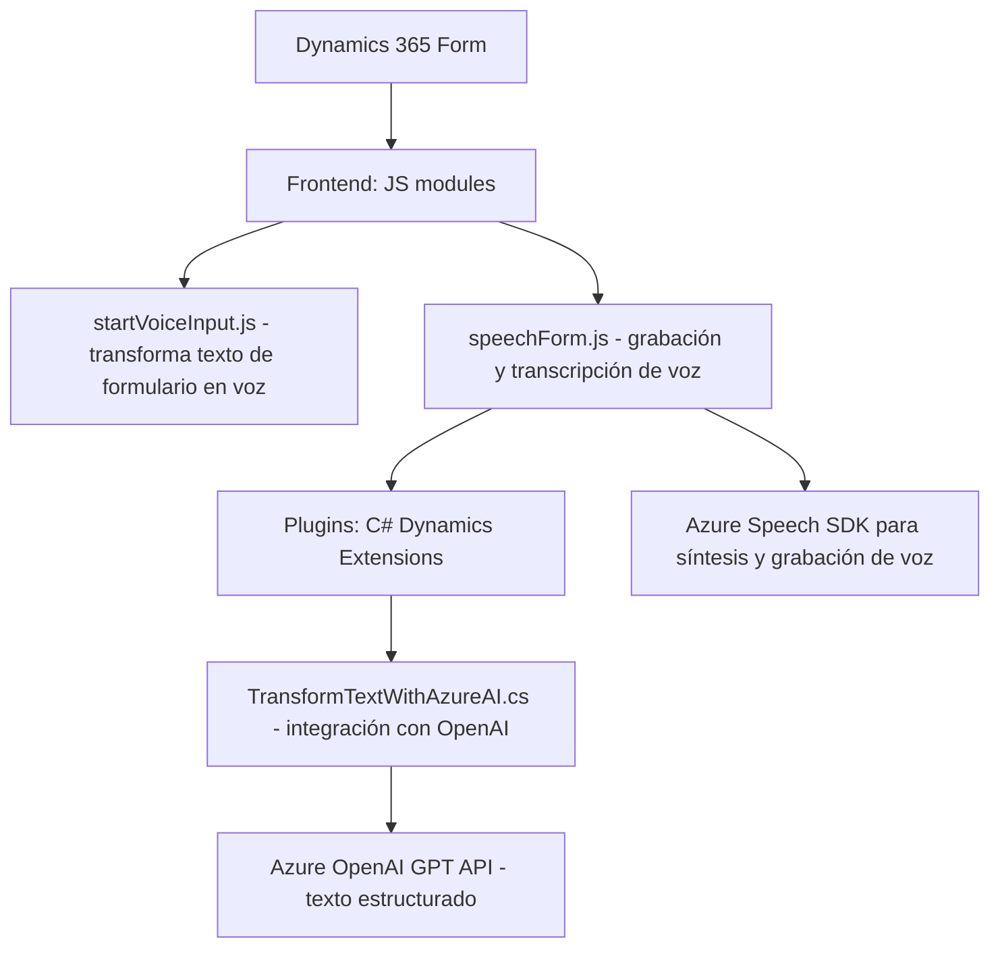

#### Breve resumen técnico
El repositorio define funcionalidades relacionadas con accesibilidad y procesamiento de texto en un entorno de Microsoft Dynamics 365. Los módulos principales incluyen interacción con formularios, síntesis de voz, grabación de audio, y procesamiento de texto con inteligencia artificial mediante Azure Speech SDK y Azure OpenAI.

---

#### Descripción de arquitectura
Por los archivos analizados, se trata de una arquitectura híbrida:
1. **Frontend con capacidades procedural-modular**: Los módulos en `JS` interactúan directamente con los formularios visibles en Dynamics 365. Esto lo hace adecuado para un entorno altamente ligado a CRM.
2. **Plugins basados en eventos**: El archivo `.cs` (C#) utiliza el patrón **Plugin-based Architecture** dentro de Dynamics 365 para añadir lógica personalizada en eventos del pipeline de la plataforma.
3. **Servicios externos**: Uso de SDKs y APIs de Microsoft Azure (Speech y OpenAI) para procesamiento de voz y texto por IA.

El diseño general se puede considerar una solución **n-capas**:
- **Capa de presentación (Frontend)**: Interactúa con usuarios para síntesis de voz y registro de audio.
- **Capa lógica de negocio (dentro de Dynamics 365 y plugins)**: Gestiona el procesamiento de datos y validación conforme a reglas.
- **Servicios externos (Azure)**: Completa la arquitectura para tareas específicas como procesamiento de texto y síntesis.

---

#### Tecnologías usadas
1. **Frontend**:
   - **JavaScript**: Modular y centrado en funciones.
   - **Azure Speech SDK**: Servicios para síntesis de voz y grabación.
2. **Backend**:
   - **C# con Dynamics SDK**: Plugins para extender Dynamics 365.
   - **Azure OpenAI**: Procesamiento de texto con modelos GPT.
   - **Newtonsoft.Json**: Manipulación de JSON en plugins.
3. **Plataforma principal**:
   - Microsoft Dynamics 365: Gestión de datos, formularios y pipeline.

**Patrones de diseño y arquitectónicos identificados**:
- **Modularidad:**
  - Separación de funcionalidades en funciones específicas para voz, grabación, y procesamiento de texto.
- **Event-driven Architecture**:
  - Plugins de Dynamics 365 ejecutan lógica a partir de eventos configurados.
- **API Gateway:**
  - Integración con APIs externas como la de OpenAI.
- **Mapping y Lookup:**
  - Enfoque personalizado para mapear datos de formularios y encontrar entidades asociadas.

---

#### Diagrama Mermaid válido para GitHub

Este diagrama muestra las interacciones entre los módulos principales y las dependencias externas.

---

#### Conclusión final
El repositorio integra módulos bien estructurados para una solución de accesibilidad y procesamiento de texto basada en la plataforma Microsoft Dynamics 365. Aprovecha el poder de servicios externos (Azure Speech y OpenAI) para tareas avanzadas como síntesis de voz y procesamiento por IA. La arquitectura sigue un enfoque **n-capas**, coordina la interacción de la capa de presentación con la lógica de negocio y usa servicios en la nube como capas externas. Es adecuada para entornos empresariales que requieren extensibilidad y capacidad de personalización.