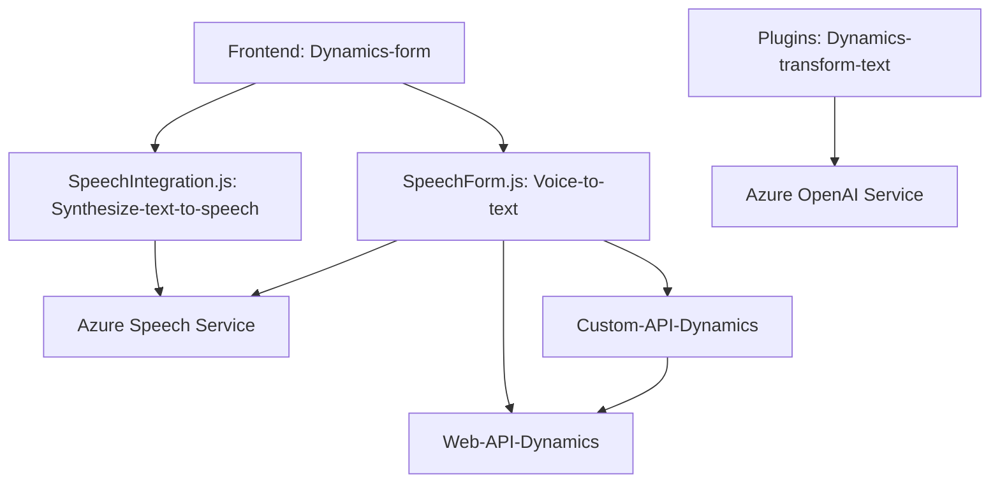

### **Análisis técnico de la solución**

**Breve resumen técnico:**
El repositorio incluye tres componentes:
1. **readForm.js:** Integra el **Azure Speech SDK** para sintetizar texto a voz dado datos extraídos dinámicamente de un formulario (estado visible).
2. **speechForm.js:** Procesa comandos hablados utilizando el **Azure Speech SDK**, convirtiéndolos en texto y mapeándolos en tiempo real a campos de un formulario en **Dynamics 365** mediante interacción con APIs personalizadas y la Web API de Dynamics.
3. **TransformTextWithAzureAI.cs:** Implementa un plugin de Dynamics CRM que utiliza **Azure OpenAI** para transformar texto en un formato JSON estructurado, según normas definidas.

---

### **Descripción de la arquitectura**
La solución presenta una **arquitectura híbrida** con los siguientes componentes:
1. **Microservicio:** Representado por el uso de Azure Speech SDK y APIs externas como **OpenAI**.
2. **Complemento orientado a eventos:** Expansión del modelo CRM mediante el plugin `TransformTextWithAzureAI.cs`. Asegura que los datos sean dinámicamente procesados y estructurados en función de las necesidades del usuario.
3. **Integración API dinámica:** La interacción con servicios como Azure Speech SDK y APIs personalizadas de Dynamics (y OpenAI) sugiere una arquitectura orientada a la integración.
4. **Modularidad funcional:** Cada archivo tiene una responsabilidad puntual y única en el flujo del sistema (según los principios de responsabilidad única).
5. **Aplicación en varias capas:** 
   - **Capas de presentación:** `Js/readForm.js` y `Js/speechForm.js` (interactúan con el frontend y Dynamics 365).
   - **Lógica de negocio:** Contenida en los componentes de interacción (e.g., Web API y la lógica del plugin en C#).

### **Tecnologías usadas**
1. **Frontend:** 
   - **JavaScript** para la manipulación del DOM y lógica client-side.
2. **Backend:**
   - **C# (.NET Framework)** para extender Dynamics CRM con plugins.
3. **Servicios externos:**
   - **Azure Speech SDK**: Para síntesis y reconocimiento de voz.
   - **Azure OpenAI API**: Para procesar y transformar texto según normas definidas.
4. **CRM Dynamics 365:** Integrado mediante `Custom API` y `Web API`.
5. **Bibliotecas:** 
   - `Newtonsoft.Json` y `System.Text.Json` para manipulación JSON en **TransformTextWithAzureAI.cs**.

### **Dependencias o componentes externos**
1. **Azure Speech SDK** (JS-based): Para reconocimiento y síntesis de voz.
2. **Azure OpenAI Services**: Procesamiento avanzado de texto (enrutado a través de HTTP POST).
3. **Microsoft Dynamics 365:** Entorno CRM para formularios, atributos y almacenamiento.
4. **Custom API en Dynamics 365:** Personalizaciones creadas para procesamiento de entradas mediante IA o lógica avanzada.
5. **Web APIs**: Usadas en Dynamics para obtener y manipular datos de entidades.
6. **DOM API**: Para manejo dinámico de scripts en frontend.

---

### **Diagrama Mermaid**

### **Conclusión final**
Esta solución es una **arquitectura modular híbrida** con integración de microservicios, donde:
1. El **frontend** (JavaScript) y la **lógica comercial personalizada** interactúan con formularios en Dynamics 365.
2. **Servicios externos:** Azure Speech SDK para reconocimiento y síntesis de voz; Azure OpenAI para transformación avanzada de texto.
3. **Los patrones de diseño** como integración API dinámica y responsabilidad única aseguran una alta cohesión y escalabilidad en la implementación.