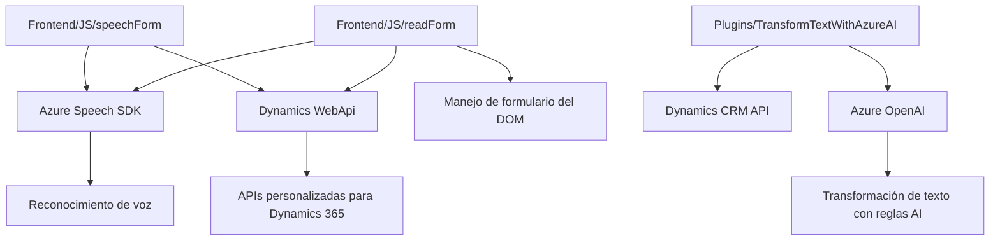

### Breve resumen técnico
El repositorio incluye tres componentes principales: 
1. **FRONTEND/JS/readForm.js** y **FRONTEND/JS/speechForm.js**: Scripts JavaScript que integran funcionalidad para reconocimiento de voz, síntesis de voz y manipulación de formularios, utilizando Azure Speech SDK y APIs personalizadas relacionadas a Dynamics 365.
2. **Plugins/TransformTextWithAzureAI.cs**: Plugin para Dynamics CRM que utiliza Azure OpenAI para transformar texto en un formato estructurado mediante reglas definidas.

El sistema está construido para facilitar interacción por voz y automatización de formularios en el contexto de CRM (Dynamics 365).

---

### Descripción de arquitectura
La solución presentada refleja una arquitectura **modular y orientada a servicios**, con interacción entre **frontend** basado en navegador (HTML/JavaScript), **APIs externas** (Azure Speech SDK, Dynamics CRM, Azure OpenAI), y un **backend extendido mediante plugins** en el CRM.

- **Frontend**: Divide las funcionalidades de síntesis de voz (`readForm.js`) y reconocimiento/formulario por voz (`speechForm.js`) en archivos JavaScript modulares con interacción con APIs externas.
- **Backend plugins**: Utilizan arquitectura orientada a eventos en Dynamics CRM con el patrón **plugin-based architecture**.

La combinación de tecnologías sugiere una arquitectura **n capas con integración de servicios externos**, en la que cada capa maneja una funcionalidad específica (Frontend, lógica del CRM, servicios IA).

---

### Tecnologías usadas
#### Frontend:
- **JavaScript**: Lógica de cliente para manejo de formularios.
- **Azure Speech SDK**: Reconocimiento y síntesis de voz.
- **Dynamics 365 WebApi**: Manipulación de datos del CRM.

#### Backend:
- **Dynamics CRM SDK**: Extensión mediante plugins.
- **C# (.NET)**: Programación de plugins.
- **Azure OpenAI**: Transformación avanzada de texto.
- **API REST**: Integración con servicios de Azure.

#### Patrones de diseño:
- **Modularidad**: Separación lógica de tareas en funciones o clases para mantener orden y claridad.
- **Uso de SDK externos**: Manejo dinámico de SDK, como el cargado del Speech SDK.
- **Asynchronous Programming**: Promesas en operaciones HTTP y asíncronas.
- **Plugin-based**: Extensiones programáticas para CRM mediante eventos.

---

### Diagrama Mermaid válido para GitHub

---

### Conclusión final
La solución presentada tiene un enfoque empresarial con integración íntima entre un sistema CRM (Dynamics 365), herramientas de reconocimiento y síntesis de voz (Azure Speech SDK), y un componente de procesamiento de texto avanzado mediante IA (Azure OpenAI).

La arquitectura n capas orientada a servicios asegura modularidad, escalabilidad y reusabilidad tanto en el frontend como en el backend. Es adecuada para aplicaciones que requieren automatización y accesibilidad, como la manipulación de formularios mediante voz en sistemas CRM empresariales.