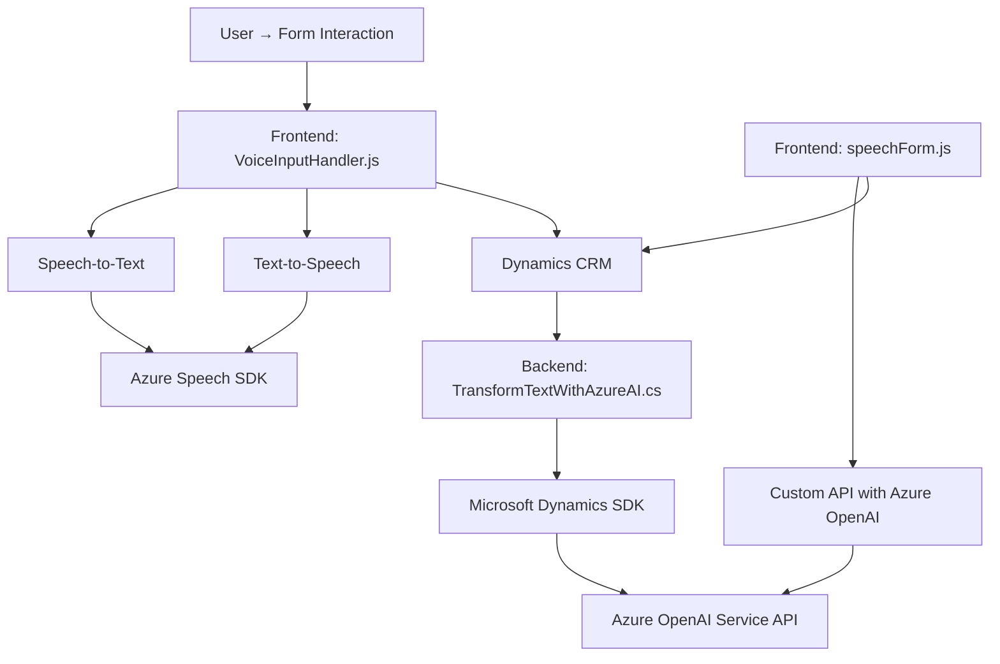

### Breve resumen técnico  
La estructura del repositorio indica que se trata de una solución híbrida con componentes frontend y backend, diseñada para integrar funcionalidades avanzadas en un sistema CRM (Dynamics CRM). Los componentes utilizan SDKs y APIs externas para mejorar accesibilidad (sintetización/habla) y procesamiento de texto (AI).

---

### Descripción de arquitectura  
La solución está configurada como un **ecosistema de integración híbrido**:
1. **Frontend**: Módulos de JavaScript para interacción con usuarios (voz y texto).
   - Acceso: Directo al DOM relacionado con formularios del CRM.
   - SDK externo: Azure Speech SDK.
2. **Backend**: Plugins de Dynamics CRM.
   - Componentes: `TransformTextWithAzureAI.cs` ejecuta lógica basada en eventos del CRM.
   - Servicios: Integración con Azure OpenAI Service para procesamiento de datos.

Patrón predominante: **Hexagonal (Ports and Adapters)**, dado que los módulos interactúan mediante APIs internas y externas en una arquitectura desacoplada.

---

### Tecnologías usadas  
1. **Frontend**: 
   - JavaScript nativo.
   - **Azure Speech SDK** (para interacción por voz y síntesis de texto).
   - Integración directa con Dynamics CRM para capturar datos y aplicar valores.
2. **Backend**: 
   - .NET Framework/C#.
   - **Microsoft Dynamics SDK (Xrm SDK)**.
   - REST API de Azure OpenAI Service.
   - JSON (Newtonsoft.Json.Linq y System.Text.Json).
3. **Patrones de diseño**:
   - Modularidad.
   - Integración de API externa (Azure Speech, Azure OpenAI).
   - Plugins para flujos CRM (Dynamics).

---

### Diagrama Mermaid válido para GitHub  

---

### Conclusión final  
La solución tiene un enfoque claro hacia **integración avanzada en sistemas CRM**. Ofrece:
1. Operaciones accesibles mediante voz y síntesis de texto.
2. Capacidad de interpretar y transformar datos con IA mediante Azure OpenAI.
3. Modularidad y extensibilidad, ideal para entornos corporativos donde Dynamics CRM es el eje central.

Aunque no es estrictamente un conjunto de **microservicios**, la arquitectura presenta elementos distribuidos entre el cliente (frontend) y el servidor (plugins del CRM). La integración bien gestionada con Azure Speech SDK y Azure OpenAI Service hace que sea escalable para aplicaciones modernas.