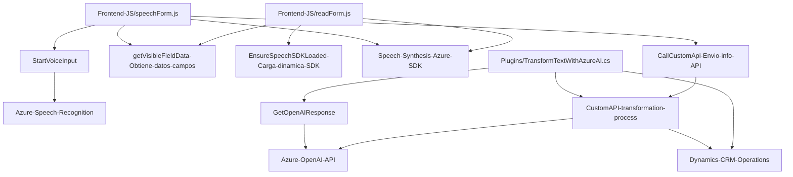

## Resumen técnico

El repositorio presenta una solución de software integrada para capturar, procesar y manipular datos de formularios mediante entrada y salida basada en voz, conectándose especialmente con sistemas de plataforma Microsoft Dynamics CRM y utilizando servicios en la nube como Azure Speech SDK y Azure OpenAI.

## Descripción de la arquitectura

### Tipo de solución
La solución es una **conjunto modular** que incluye dos componentes principales:
1. **Frontend**: Maneja la lógica de interacción con el usuario (lectura y reconocimiento de voz) y síntesis de voz.
2. **Backend (Plugins)**: Contiene lógica de negocio en forma de plugins para interactuar con Microsoft Dynamics CRM, así como integración con servicios de procesamiento de texto en la nube.

### Arquitectura general
**Distribuida en capas y basada en microservicios**:
1. **Capa de Presentación**:
   - Implementada en archivos JavaScript (e.g., `readForm.js` y `speechForm.js`).
   - Comunicación con la capa backend y con servicios externos (Azure Speech SDK).
2. **Capa de Aplicación/Business Logic**:
   - Utiliza plugins desarrollados en C# (e.g., `TransformTextWithAzureAI.cs`).
   - Responde a eventos dentro de Dynamics CRM y se comunica con la **Azure OpenAI API**.
3. **Servicios de Terceros**:
   - Uso de `SpeechSDK` para interacción con lenguaje natural.
   - Integración con la **Azure OpenAI API** para transformar texto con base en reglas de negocio específicas.

## Tecnologías utilizadas
### Frontend
- Javascript: Programación dinamizada de entrada/salida de voz e interacción con formularios en una interfaz basada en web.
- Azure Speech SDK: Utilizado para reconocimiento y síntesis de voz. Cargado dinámicamente.
- DOM API: Manipulación directa del DOM para carga de scripts y acceso dinámico a elementos visibles.

### Backend
- C#: Desarrollo de plugins para Dynamics CRM (Microsoft Dataverse).
- Microsoft.Xrm.Sdk: Interfaz para integrar Dynamics CRM con la solución.
- Newtonsoft.Json: Procesos de serialización y manejo de JSON en el plugin.
- System.Net.Http: Integración con servicios externos mediante conexiones HTTP.
- Azure OpenAI API: Encargado del proceso de transformación de texto.

### Patrones de diseño
1. **Modularidad**:
   - Separación de responsabilidades en funciones o métodos independientes.
   - Uso de clases específicas para realizar operaciones, tanto frontend como backend.
2. **Carga dinámica de dependencias**:
   - Administración eficiente de recursos con carga condicional de Azure Speech SDK.
3. **Event-driven Programming**:
   - Procesos asincrónicos en frontend (callbacks para eventos de carga y síntesis).
   - Gestión de eventos en Dynamics CRM mediante plugins.
4. **Integración API REST**:
   - Backend establece comunicación con Azure OpenAI API mediante REST, procesando peticiones y respuestas.
5. **Patrón de observador/Callbacks**:
   - Método `ensureSpeechSDKLoaded` en frontend y la supervisión personalizada en plugins de ejecución en CRM.

## Posibles dependencias externas:
1. Utilización del servicio **Azure Speech SDK**: requiere la suscripción, clave de API y región de configuración.
2. Dependencia directa de **Azure OpenAI API** para procesamiento de texto.
3. Integración explícita con **Microsoft Dynamics CRM**: desarrollo de plugins con Microsoft Dataverse.
4. Manejo de almacenamiento de credenciales: parece que algunos detalles sensibles están incrustados en el código en lugar de utilizar servicios de secret-management (puede representar un riesgo potencial).

## Diagrama Mermaid

## Conclusión final

Esta solución representa una arquitectura modular que combina un frontend para interacción visual y procesamiento de voz con un backend basado en plugins para Dynamics CRM, conectado a servicios avanzados como Azure Speech SDK y Azure OpenAI API. Utiliza patrones como Modularidad, Delegación, Event-driven programming y APIs REST para garantizar cohesión y flexibilidad en el diseño.

Aunque la arquitectura está bien estructurada, la presencia de credenciales directamente en el código implica riesgos de seguridad que deberían ser mitigados con herramientas de gestión de secretos.