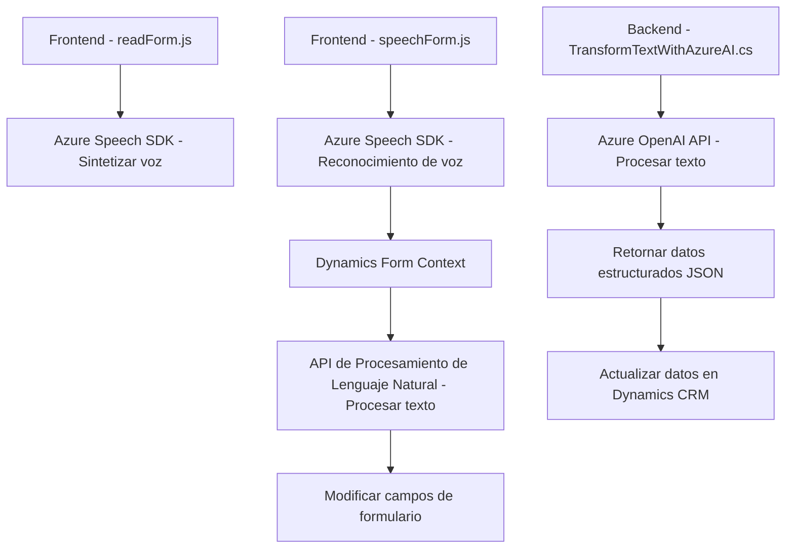

### Breve resumen técnico

El repositorio contiene los siguientes archivos:
1. **FRONTEND/JS/readForm.js**: Facilitador de síntesis de voz a través de Azure Speech SDK que lee información visible en un formulario.
2. **FRONTEND/JS/speechForm.js**: Implementación de reconocimiento de voz para introducir y procesar comandos en Dynamics 365 utilizando Azure Speech SDK y una API de procesamiento de lenguaje natural.
3. **Plugins/TransformTextWithAzureAI.cs**: Plugin para Microsoft Dynamics CRM que interactúa con Azure OpenAI para transformar texto según normas específicas, devolviendo resultados en formato JSON.

---

### Descripción de arquitectura

#### Tipo de solución:
- **Híbrida**: Combinación de frontend interactivo y componentes backend. Los archivos `readForm.js` y `speechForm.js` manejan interactividad con el reconocimiento y síntesis de voz en el cliente (Dynamics 365). Por otro lado, el plugin `TransformTextWithAzureAI.cs` opera en el backend del sistema CRM, proporcionando un procesamiento avanzado de texto mediante una API.

#### Arquitectura:
1. **Arquitectura de Plugins (Dynamics CRM)**: Los plugins se ejecutan dentro del entorno CRM cuando se dispara un evento asociado a entidades en el sistema.
2. **Integración con servicios de Azure**: Utilización de Azure Speech SDK en el cliente y la Azure OpenAI API en el backend para descentralizar procesos sofisticados.
3. **Patrón de repositorio**: Los comandos para consulta y manipulación de datos del formulario en Dynamics CRM son ejemplos de este patrón, encapsulando la lógica de acceso a datos en funciones dedicadas.
4. **Service-Oriented Architecture (SOA)**: El sistema utiliza APIs externas para reconocimiento y síntesis de voz (Azure Speech SDK) y procesamiento de texto (Azure OpenAI API).

---

### Tecnologías, frameworks y patrones utilizados:
1. **Frontend (readForm.js & speechForm.js)**:
   - Escrito en JavaScript.
   - Uso de Azure Speech SDK para reconocimiento y síntesis.
   - Mecanismos de interacción con formularios de Dynamics 365 (manipulación mediante `executionContext`).
   - Modularización del código con funciones específicas (e.g., extracción de datos visibles, manipulación con IA).

2. **Plugin Backend (TransformTextWithAzureAI.cs)**:
   - Uso del framework .NET para desarrollo de plugins en Dynamics CRM.
   - `Microsoft.Xrm.Sdk` para integración funcional con Dynamics CRM.
   - HTTP Client para realizar solicitudes a Azure OpenAI API.
   - Gestión de JSON incorporando las bibliotecas **System.Text.Json** y **Newtonsoft.Json**.

#### Patrones de desarrollo:
- Separación de Concerns: Cada componente tiene una responsabilidad específica, tanto en el frontend como en el backend.
- Modularización: Uso de funciones dedicadas y clases para implementar tareas específicas.
- Integración con servicios externos: Uso de APIs como Azure Speech SDK y Azure OpenAI.
- Abstracción: Interacciones con servicios externos y manipulación de datos en Dynamics están encapsuladas en funciones específicas.

---

### Dependencias o componentes externos

1. **Frontend**:
   - **Azure Speech SDK**: Para tareas de síntesis y reconocimiento de voz.
   - **Dynamics 365 API Tools**: A través del `executionContext` para manipulación del formulario.
   - **Azure key y region**: Credenciales necesarias para conectar al servicio de Azure Speech.

2. **Backend (Plugin)**:
   - **Microsoft.Xrm.Sdk**: Framework propio de Dynamics CRM.
   - **Azure OpenAI API**: Para procesar y estructurar los datos como respuesta JSON.
   - **Newtonsoft.Json** y **System.Text.Json**: Para procesar datos JSON provenientes de la API.
   - **HTTP Client**: Para fruncionar solicitudes REST.

---

### Diagrama Mermaid válido para GitHub Markdown

---

### Conclusión Final

El diseño presentado por este repositorio integra servicios avanzados de Azure (Speech SDK y OpenAI) con aplicaciones de Microsoft Dynamics CRM. La arquitectura combina una interfaz cliente para interactuar con usuarios vía comandos de voz y servicios de backend que realizan transformaciones complejas de datos. 

La solución representa una arquitectura híbrida que aprovecha plugins en Dynamics CRM y tecnologías modernas como Azure APIs para funcionalidades innovadoras como voz a texto, síntesis de voz y transformación avanzada mediante IA. Aunque está bien modularizada y sigue principios fundamentales de desarrollo, la alta dependencia de herramientas propietarias como Dynamics CRM y Azure puede limitar su escalabilidad y flexibilidad fuera de este ecosistema empresarial.