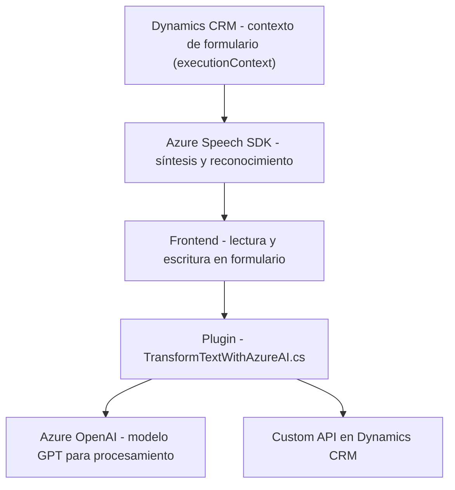

### Breve resumen técnico

El repositorio parece ser una solución que integra tecnologías de reconocimiento y síntesis de voz, inteligencia artificial para procesamiento avanzado de texto, y una aplicación de frontend en Dynamics 365 y plugins para la gestión de formularios. 

El núcleo funcional se basa en Microsoft Dynamics 365 para la gestión de datos, Azure Speech SDK para tareas de voz (reconocimiento y síntesis) y Azure OpenAI para transformación avanzada de texto.

---

### Descripción de arquitectura

La arquitectura tiene los siguientes componentes principales:

- **Frontend:** Archivos JavaScript dentro de la carpeta `FRONTEND/JS` se usan para trabajar con el DOM del sistema Dynamics 365, manipulando formularios y transmitiendo datos al servicio de transcripción y síntesis de voz. Se utiliza una arquitectura modular basada en funciones que encapsulan tareas específicas.
  
- **Plugin Backend:** Extiende las funcionalidades de Dynamics 365, implementando una solución basada en Microsoft's Plugin Pattern. Este plugin actúa como un microservicio interno para procesamiento con Azure OpenAI y devuelve respuestas JSON estructuradas.

- **Dependencia externa en la nube:** Integra Azure Speech SDK en el frontend y Azure OpenAI en el backend para proporcionar reconocimiento de voz, síntesis, y procesamiento avanzado del lenguaje natural. 

### Tecnologías usadas

1. **Frontend:**
   - **JavaScript**: Base del frontend para interacción dinámica con formularios en Dynamics 365.
   - **Azure Speech SDK**: Manejo de síntesis y transcripción de voz.
   - **Dynamics 365 Context API (executionContext, Xrm)**: Manipulación de formularios y datos en CRM.

2. **Backend Plugin:**
   - **C# (.NET Framework)**: Implementación del plugin `TransformTextWithAzureAI`.
   - **Microsoft Xrm SDK**: Interacción directa con Dynamics 365, acceso y manipulación de datos.
   - **Azure OpenAI**: Potenciado por modelos GPT-4 para procesar texto conforme a reglas predefinidas.
   - **HTTP Requests**: Manejadas por `System.Net.Http` para comunicación con servicios externos.

3. **Patrones arquitectónicos:**
   - Programación basada en eventos (Frontend: escuchar cambios en formulario, uso de callbacks).
   - Modularidad (separación clara por propósito entre funciones y métodos).
   - Integración API (Azure Speech SDK y Azure OpenAI).
   - Plugin Pattern (Dynamics CRM extensible mediante plugins).

---

### Diagrama **Mermaid**

---

### Conclusión final

La solución presenta una arquitectura híbrida que combina elementos de Frontend para interacción con formularios dinámicos, un plugin backend para extensibilidad en Dynamics 365, e integración intensiva con servicios en la nube de Azure. 

Aunque las interfaces del frontend y plugin están claramente separadas, su interdependencia requiere tener un entorno específico (Dynamics CRM y servicios Azure) configurado adecuadamente para garantizar una correcta ejecución. Si bien su estructura es modular, la alta dependencia de las APIs externas de Azure y el lenguaje específico de Dynamics CRM pueden limitar su flexibilidad para otros entornos.