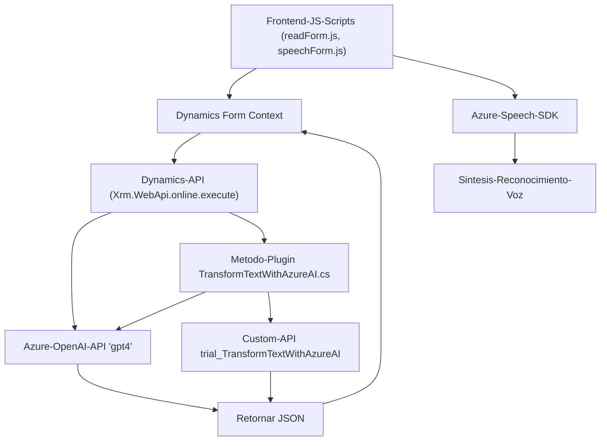

# Análisis e Informe Técnico

### Breve Resumen Técnico
El repositorio presenta una solución que integra múltiples tecnologías, incluyendo Microsoft Dynamics 365, Azure Speech SDK y Azure OpenAI API, para facilitar la interacción y procesamiento de datos mediante voz. La solución parece estar enfocada en proporcionar capacidad de reconocimiento y síntesis de voz en escenarios relacionados con formularios de Microsoft Dynamics CRM, donde los datos se capturan y transforman usando un plugin, SDKs y APIs externas.

---

## **Descripción de Arquitectura**

La solución implementa una arquitectura **basada en capas**, con una clara separación entre las diferentes responsabilidades de cada componente:

1. **Frontend** (Carpeta: `FRONTEND/JS`):
   - Scripts JavaScript (`readForm.js` y `speechForm.js`) utilizados en formularios de Dynamics para interactuar con usuarios mediante reconocimiento y síntesis de voz. Procesan datos desde y hacia el formulario visible.

2. **Backend (Plugins)**:
   - Contiene lógica para ejecutar operaciones en Dynamics CRM, como el plugin `TransformTextWithAzureAI.cs`. Este se comunica con la API de Azure OpenAI y transforma el texto en formato estructurado JSON basado en reglas predefinidas.

3. **Servicios Externos**:
   - Integración con herramientas de Microsoft como Dynamics CRM, Azure Speech SDK y Azure OpenAI.

La solución utiliza una arquitectura orientada a servicios al depender de APIs externas (como Azure Speech SDK y OpenAI), manteniendo la lógica de negocio y específica de usuario en módulos separados para facilitar la mantenibilidad.

El patrón **Hexagonal Architecture** puede ser identificado, dado que la solución depende de componentes externos modularizados, como el Azure Speech SDK, Dynamics CRM y OpenAI, mientras abstrae estas dependencias mediante interfaces.

---

## **Tecnologías Usadas**
1. **Frontend**:
   - HTML para formularios dentro de Dynamics.
   - JavaScript con una arquitectura de funciones modulares.
   - Microsoft Azure Speech SDK para reconocimiento y síntesis de voz.

2. **Backend**:
   - C# para construir el plugin de Dynamics CRM.
   - Microsoft.Xrm.Sdk para interacción entre el plugin y Dynamics CRM.
   - Azure OpenAI API.
   - JSON y librerías auxiliares (`System.Text.Json`, `Newtonsoft.Json.Linq`) para serialización y manipulación de datos.
   - `System.Net.Http` para solicitudes HTTP hacia API externas.

3. **Servicios Externos**:
   - Microsoft Azure Speech SDK.
   - Azure OpenAI API.
   - Dynamics WebAPI (`Xrm.WebApi.online.execute`).

---

## **Dependencias o Componentes Externos**
1. **Microsoft Azure Speech SDK**: Para la síntesis y reconocimiento de voz.
2. **Microsoft Dynamics SDK**: Uso de APIs internas de Dynamics CRM (`formContext` y `IOrganizationService`) para manipular y almacenar datos.
3. **Azure OpenAI API**: Procesamiento de texto utilizando modelos de lenguaje avanzados.
4. **Custom API - trial_TransformTextWithAzureAI**: API personalizada para realizar transformaciones específicas de texto.
5. **Librerías C#**:
   - `System.Net.Http`, `System.Text.Json` y `Newtonsoft.Json.Linq` para manejar datos en JSON y realizar peticiones HTTP.

---

## **Diagrama Mermaid**

### Explicación del Diagrama:
- **Nodo A** representa los scripts del frontend (`readForm.js` y `speechForm.js`) que interactúan con el SDK de Microsoft Azure Speech y los formularios de Dynamics (nodo B).
- **Nodo B** representa el contexto del formulario de Dynamics CRM.
- **Nodo C** es Microsoft Azure Speech SDK, que facilita la síntesis y el reconocimiento.
- **Nodo D** es la API de Dynamics (`Xrm.WebApi`) que interactúa con el plugin y el backend.
- **Nodo F** representa el plugin desarrollado en C# para transformar texto con Azure OpenAI.
- **Nodo E** muestra la conexión directa del backend con Azure OpenAI API.
- **Nodo G** es una API personalizada que también transforma texto basado en IA.
- **Nodo H** es la respuesta JSON generada por las APIs.
- **Nodo I** es el módulo de síntesis y reconocimiento de voz que interactúa con el frontend.

---

## **Conclusión Final**
La solución presentada está organizada en una arquitectura basada en capas con fuertes elementos de integración hacia APIs externas (Azure Speech y OpenAI). La modularidad del código y dependencia en servicios cloud permiten una alta escalabilidad y mantenibilidad de la solución. 

### Fortalezas:
- Usa SDKs y APIs robustas y probadas (Azure Speech & OpenAI).
- Buena separación de responsabilidades (Frontend, Backend, y APIs).
- Aprovechamiento de Dynamics CRM para facilidad de integración empresarial.

### Áreas de mejora:
1. **Pruebas unitarias** para evaluar a fondo la interacción entre el frontend, el plugin y las APIs externas.
2. **Mejora en la abstracción**: La ligereza de las funciones es positiva, pero puede aumentarse la calidad del código con patrones como Dependency Injection.

En general, la solución muestra un uso moderno de tecnologías de Microsoft en combinación con integraciones de IA, lo que la hace apta para sistemas que requieren interacción natural y procesamiento de datos en tiempo real.