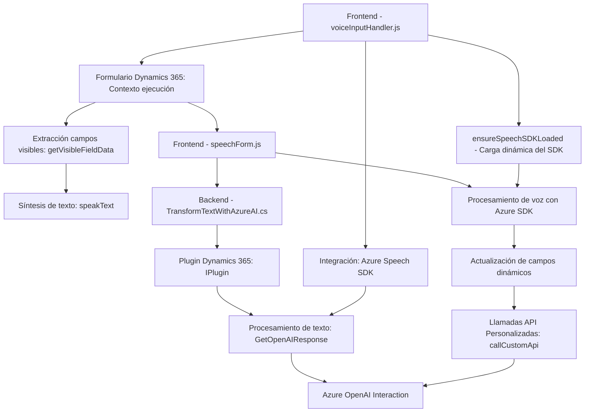

### Breve resumen técnico
Este repositorio contiene una solución híbrida destinada a integraciones avanzadas entre plataformas Dynamics 365 y servicios de Azure, enfocada principalmente en automatización de formularios mediante reconocimiento de voz y transformación de texto con Azure AI. Los archivos abarcan funcionalidad para frontend (manipulación e interacción de formularios) y plugins en backend (procesamiento avanzado de texto vía API externa).

---

### Descripción de arquitectura
La arquitectura es de tipo **n-capas** con las siguientes características:
- **Frontend:** Encapsulado en el directorio `FRONTEND/JS`. Implementa lógica de negocios del cliente, interactuando directamente con formularios en Dynamics 365 y conectándose al servicio de Azure Speech SDK.
- **Backend:** Basado en **plugins Dynamics/C#** dentro del directorio `Plugins`. Se encarga de automatización sever-side y transformación de texto con servicios de OpenAI integrados a través de Azure.

Ambos componentes presentan una integración fuertemente acoplada con el entorno Dynamics 365 y Microsoft Azure.

---

### Tecnologías usadas
1. **Frontend:**
   - **Azure Speech SDK:** Librería para reconocimiento de voz en tiempo real y síntesis de texto a voz.
   - **JavaScript:** Para manejo de eventos y lógica de interacción con formularios.
   - **Dynamics 365 Web Framework:** Utilización del API `Xrm.WebApi` para manipular datos y realizar operaciones CRUD.

2. **Backend:**
   - **C#/.NET:** Lenguaje principal para plugins de Dynamics 365.
   - **Azure OpenAI:** Servicios enfocados en transformación avanzada de texto.
   - **.NET SDK (Dynamics CRM):** Utilización de interfaces como `IServiceProvider` y `IPluginExecutionContext`.

3. **General:**
   - **HTTP y JSON:** Comunicación directa con APIs externas mediante HTTP y manipulación de datos estructurados en JSON.

---

### Diagrama Mermaid válido para GitHub

---

### Conclusión final
Esta solución utiliza una arquitectura basada en capas, donde el frontend orquesta la interacción del usuario con formularios en Dynamics 365 mediante reconocimiento y procesamiento de voz, mientras que el backend ejecuta transformaciones más sofisticadas de texto gracias a Azure OpenAI. El uso de tecnologías como JavaScript, Azure Speech SDK, y el ecosystem Dynamics 365 asegura un flujo integrado, pero el diseño aparece fuertemente acoplado a estas plataformas. Podría ser mejorado mediante la implementación de configuraciones más seguras o patrones adicionales para desacoplar los componentes y hacer la solución más modular.