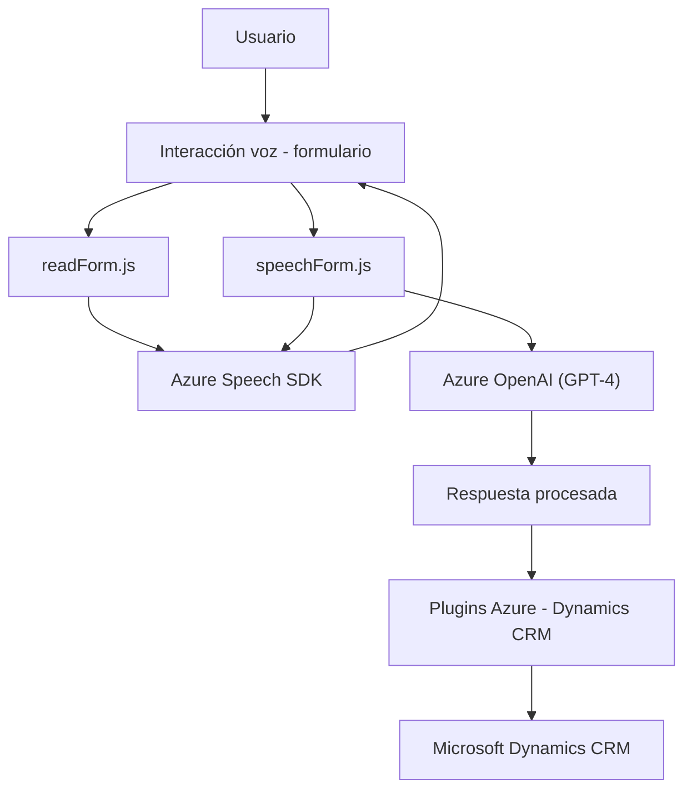

### Breve resumen técnico

El repositorio contiene varios archivos enfocados en la integración de funcionalidad avanzada para formularios y procesamiento de voz dentro de una aplicación Dynamics CRM (o plataforma similar). Los archivos `readForm.js` y `speechForm.js` están centrados en la gestión de entrada y salida de voz usando **Azure Speech SDK**, mientras que el archivo `.cs` implementa un plugin que utiliza **Azure OpenAI** (GPT-4) para transformación de texto.

---

### Descripción de arquitectura

- **Tipo de solución**: Módulos frontend con integración directa a un servicio externo y un plugin backend para CRM (Dynamics). La solución sería parte de una arquitectura global para sistemas empresariales que incorporan **Voice UX** y **Procesos de AI**.
- **Arquitectura global:**
  - **Frontend**: Usa capas funcionales y servicios externos (Azure Speech SDK), alineándose hacia un diseño modular y dinámico basado en **eventos y callbacks**.
  - **Backend Plugin**: Implementa **microservicio** con orientación a eventos para integrarse con Dynamics CRM y externalizar procesos hacia Azure OpenAI.

---

### Tecnologías usadas

1. **Frontend**:
   - **Azure Speech SDK** para reconocimiento de voz.
   - Manipulación del DOM con JavaScript.
   - APIs estándar de Dynamics CRM (`Xrm.WebApi`).

2. **Backend Plugin** (`TransformTextWithAzureAI.cs`):
   - CRM SDK (`Microsoft.Xrm.Sdk`) para extensibilidad en Dynamics.
   - Servicios externos con **Azure OpenAI** (GPT-4).
   - HTTP Client (`System.Net.Http`) para solicitudes externas.
   - JSON (`System.Text.Json` y `Newtonsoft.Json.Linq`) para serialización y deserialización.

3. **Patrones utilizados**:
   - **Event Driven Architecture** para integración con CRM.
   - **SDK Dependency Injection**: Uso modular de SDKs y servicios en frontend/backend.
   - **Microservicios**: Delegación de procesamiento avanzado a servicios externos (Speech y OpenAI).

---

### Dependencias o componentes externos que podrían estar presentes:

1. **Azure Speech SDK** (para reconocimiento/síntesis de voz en frontend).
2. **Azure OpenAI (GPT-4)**, utilizado por el plugin backend.
3. **Dynamics CRM**, como plataforma base tanto en frontend (`executionContext`) como en backend (`IPlugin`).
4. **Xrm.WebApi**: Dependencia nativa de Dynamics para integración de datos y acciones.
5. Bibliotecas para manipulación JSON (e.g., `Newtonsoft.Json.Linq`).
6. **HTML DOM**: Como contexto para la entrada y salida de datos del formulario.

---

### Diagrama Mermaid

Aquí se muestra la relación entre los módulos de frontend y backend, los servicios externos, y el CRM. El flujo de datos se aprecia desde el usuario hacia la plataforma y los servicios integrados.

---

### Conclusión final

La solución es eficiente en su propósito: mejora la experiencia en el uso de formularios en CRM al implementar accesibilidad mediante voz y al habilitar procesamiento avanzado de texto con IA aplicada (GPT-4). Combina dos módulos frontend basados en SDK y un plugin backend que aprovecha microservicios externos. La arquitectura está bien organizada con división de responsabilidades clara y adopta tecnologías modernas orientadas a servicios.